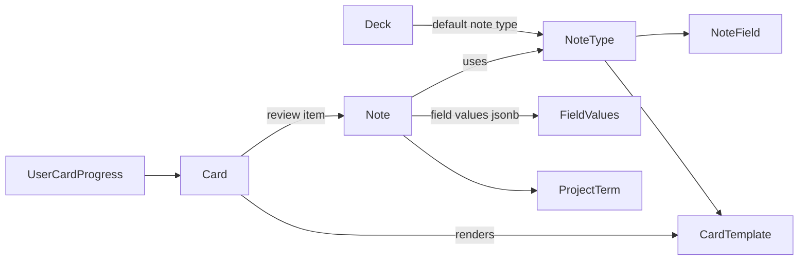

# Anki-Like Card Domain Model

## Target Model



Canonical content moves from fixed `Card.Sentence` / `Translation` / `Lexicon` / `Synonyms` into `Note.FieldValues`. `Card` remains the SRS/review identity so existing progress can survive, but content rendering comes from `Note + CardTemplate`.

## Backend Domain

Add new VocabularyService entities:

- `NoteType`: owner/project scope, name, version, CSS/settings, created/updated timestamps.
- `NoteField`: stable `Key`, label, type (`text`, `textarea`, `tags`, `image`, `audio`, `url`, etc.), order, required flag, config JSON, archived flag.
- `CardTemplate`: stable template key/name, front template, back template, order, enabled flag.
- `Note`: deck/project/user ownership, `NoteTypeId`, `FieldValues` JSONB, optional `ProjectTermId`, timestamps.

Keep `Card` but evolve it:

- Add `NoteId` and `CardTemplateId`.
- Keep `DeckId`, `CreatorId`, SRS/progress relations, timestamps.
- Mark fixed content columns (`Sentence`, `Translation`, `TargetWord`, `Lexicon`, `Synonyms`, `Media`, `SourceMeta`) as compatibility/legacy during migration.

Primary backend touch points:

- [`VocabularyService/Data/Entities/Card.cs`](VocabularyService/Data/Entities/Card.cs)
- [`VocabularyService/Data/VocabularyServiceContext.cs`](VocabularyService/Data/VocabularyServiceContext.cs)
- [`VocabularyService/Services/CardService.cs`](VocabularyService/Services/CardService.cs)
- [`VocabularyService/Protos/vocabulary.proto`](VocabularyService/Protos/vocabulary.proto)
- [`AggregatorService/Protos/vocabulary.proto`](AggregatorService/Protos/vocabulary.proto)
- [`VocabularyService/AutoMapperProfiles/AutoMappingProfile.cs`](VocabularyService/AutoMapperProfiles/AutoMappingProfile.cs)
- [`AggregatorService/AutoMapperProfiles/AutoMappingProfile.cs`](AggregatorService/AutoMapperProfiles/AutoMappingProfile.cs)

Current fixed shape to replace gradually:

```csharp
public string Sentence { get; set; } = null!;
public string Translation { get; set; } = null!;
public string TargetWord { get; set; } = null!;
public List<string>? Synonyms { get; set; }
public CardLexiconFields? Lexicon { get; set; }
```

## Default Note Type

Create a seed/default `Sentence Mining` note type with stable fields:

- `Expression`
- `Word`
- `Translation`
- `Transcription`
- `WordTypes`
- `Definition`
- `Example`
- `Synonyms`
- `Antonyms`
- `Notes`
- `SourceTitle`
- `SourceUrl`
- `Image`
- `Audio`

This gives you Anki-like add/remove/reorder field behavior without schema changes. `Synonyms` and `Antonyms` become symmetric fields, not special database columns.

## Contract Shape

Add versioned note APIs instead of expanding card DTOs forever:

- `NoteTypeResponse`, `NoteFieldDefinition`, `CardTemplateResponse`
- `NoteResponse` with `noteTypeId`, `fieldValues`, `projectTermId`, generated `cards`
- `CreateNoteRequest`, `UpdateNoteRequest`, `RenderNoteCardRequest`
- Keep old `CreateCardRequest` / `CardResponse` as compatibility wrappers for one migration phase.

Prefer typed JSON field values over `google.protobuf.Struct` if possible:

- `repeated NoteFieldValue { string field_key; string string_value; repeated string string_values; string media_id; }`
- Aggregator REST can expose this as a JSON object/map for frontend ergonomics.

## Migration Strategy

1. Add new nullable tables/columns only: `note_types`, `note_fields`, `card_templates`, `notes`, `cards.note_id`, `cards.card_template_id`.
2. Seed default `Sentence Mining` note type/template.
3. Backfill one `Note` per existing `Card`, mapping legacy columns into `FieldValues`.
4. Link each existing `Card` to its migrated `Note` and default `CardTemplate`.
5. Switch create/update paths to write `Note.FieldValues` as canonical.
6. Keep read compatibility by projecting old `CardResponse` from `Note.FieldValues` until frontend/study are migrated.
7. Only later, after tests and consumers are migrated, make legacy content columns nullable or obsolete; do not drop them in this plan.

## Frontend Model

Replace flat editor state with a note editor state:

- `noteType`: field definitions and templates
- `fieldValues: Record<string, NoteFieldValue>`
- selected `CardTemplate` for preview
- derived helpers for mining actions: selected `Expression`, selected `Word`, exact term link

Primary frontend touch points:

- [`polyraspad-frontend/src/contexts/editor-card-context.tsx`](polyraspad-frontend/src/contexts/editor-card-context.tsx)
- [`polyraspad-frontend/src/components/editor/editor-form.tsx`](polyraspad-frontend/src/components/editor/editor-form.tsx)
- [`polyraspad-frontend/src/components/editor/editor-card-hydrator.tsx`](polyraspad-frontend/src/components/editor/editor-card-hydrator.tsx)
- [`polyraspad-frontend/src/components/editor/card-preview.tsx`](polyraspad-frontend/src/components/editor/card-preview.tsx)
- [`polyraspad-frontend/src/lib/api/types.ts`](polyraspad-frontend/src/lib/api/types.ts)
- [`polyraspad-frontend/src/lib/api/card-client.ts`](polyraspad-frontend/src/lib/api/card-client.ts)

Preview should render templates with safe `{{FieldKey}}` substitution instead of hard-coded FRONT/BACK blocks.

## Study / Reader Compatibility

Do not break Reader or existing SRS:

- Keep `ProjectTermId` as a first-class link to real word/phrase forms.
- For Reader/mining, use default field roles: `expressionFieldKey`, `targetWordFieldKey`, `translationFieldKey`.
- Update study content DTOs only after create/edit is stable; initially project from default fields into existing study shape.
- No new lemma-based behavior.

## Tests

Backend:

- migration backfills old cards into notes and templates;
- note type can add/archive/reorder fields without DB schema changes;
- update note field clears/removes a field without touching other fields;
- generated cards preserve existing `UserCardProgress` identity;
- legacy card API projects from note fields.

Frontend:

- editor renders fields from note type definition;
- add/remove/archive fields changes UI without code changes;
- create/update round-trips `fieldValues`;
- template preview renders front/back from field values;
- old `?cardId=` hydration works via compatibility projection.

## Execution Order

1. Add backend entities, EF mappings, migration, and seed default `Sentence Mining` note type.
2. Add proto/DTO contracts for note types, notes, field values, and templates.
3. Implement backend note service and compatibility projection from `Note` to legacy card DTOs.
4. Refactor frontend editor state to note type + field values.
5. Replace card preview with template renderer.
6. Migrate create/update editor flow from card DTOs to note DTOs.
7. Extend study/sync/contribution contracts in a second pass once editor CRUD is green.
8. Mark legacy content columns/DTO fields obsolete; do not drop until all consumers are migrated.

## Risks

- This touches card CRUD, study, sync, contribution, and editor UI; it should be done as a staged migration, not a single broad rewrite.
- Existing `CardStudyContent`, `SyncCard`, and contribution contracts currently omit dynamic fields and must not be forgotten.
- Search currently indexes only `sentence`; dynamic fields need a new search document/index strategy.

## Verification

- `dotnet test --filter "FullyQualifiedName~CardService"`
- `dotnet test --filter "FullyQualifiedName~CardsController"`
- New migration/backfill tests for old card → note conversion.
- `npm test -- --testPathPattern=editor`
- Manual: create a default Sentence Mining note, add/remove a field from its note type, edit existing card via `?cardId=`, confirm study still opens existing review cards.
