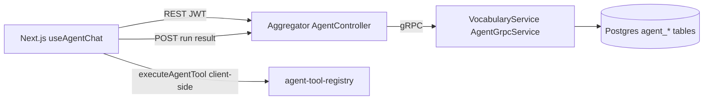

# Agent Persistence — Phase 4 (Server-Side)

Parent plan: [`language-agent-boundary_f38de417.plan.md`](../archive/language-agent-boundary_f38de417.plan.md) — Phases 1–3 and design docs are **done**. This plan implements **Phase 4** only.

Related decisions (already written):

- [`context/decisions/agent-persistence-model.md`](../../context/decisions/agent-persistence-model.md)
- [`context/decisions/agent-service-boundary.md`](../../context/decisions/agent-service-boundary.md)

## Goal

Replace browser-only PolyGuide chat history (`localStorage`, last 40 messages in [`use-agent-chat.ts`](../../polyraspad-frontend/src/lib/agent/use-agent-chat.ts)) with **backend-backed threads** scoped by authenticated user and project. Every agent interaction must be **auditable**: messages, runs, tool calls, and domain decisions (`allowed` / `out_of_scope`).

## Out of Scope

- **AgentService microservice** (Phase 5) — defer until multi-step async orchestration is required.
- **Server-side tool execution / LLM orchestration** — Phase 4 keeps existing client-side `executeAgentTool()`; backend **stores** outcomes only.
- **Streaming SSE** — follow-up after persistence is stable ([`agent-home-dashboard-followup.md`](../../context/decisions/agent-home-dashboard-followup.md)).
- **Cross-project agent memory / embeddings** — later tables in persistence model doc.
- Renaming legacy API fields (`matureCount`, etc.) — unrelated.

## Architecture Decision

Aggregator is a **stateless gateway** (no EF Core). Persistence lives in **VocabularyService Postgres** (same pattern as projects, terms, analytics). Aggregator exposes REST; VocabularyService owns data via gRPC.



**Orchestration boundary (Phase 4):**

1. Frontend loads thread/messages from backend.
2. User sends message → frontend runs domain gate + tools locally (unchanged).
3. Frontend POSTs user message, assistant message, run record, tool calls, domain decision to backend.
4. `localStorage` mirrors backend as **cache only** (offline/read-through fallback).

## Product Behavior

| Action | Behavior |
|--------|----------|
| Open `/dashboard` | Load latest active thread for `(userId, projectId)` or show empty state |
| Send message | Append user msg → run tools client-side → persist assistant msg + audit |
| Clear chat | Archive current thread server-side; create new thread on next send |
| Switch project | Load that project's thread (no cross-project leakage) |
| Refusal (`out_of_scope`) | Persist `AgentDomainDecision` with category + suggested prompts in message metadata |
| Offline / API error | Fall back to cached `localStorage` thread; show non-blocking sync warning |

Thread title: derive from first user prompt (truncate ~60 chars).

## Contracts To Lock

### REST (Aggregator)

Base route: `/api/agent`

| Method | Route | Request | Response |
|--------|-------|---------|----------|
| GET | `/threads?projectId={uuid}` | — | `AgentThreadListItemDto[]` |
| POST | `/threads` | `{ projectId }` | `AgentThreadDto` |
| GET | `/threads/{threadId}` | — | `AgentThreadDto` |
| GET | `/threads/{threadId}/messages?limit=100&before=` | cursor optional | `AgentMessageListDto` |
| POST | `/threads/{threadId}/messages` | `{ role, content, metadata? }` | `AgentMessageDto` |
| POST | `/threads/{threadId}/runs` | `CreateAgentRunDto` | `AgentRunDto` |
| POST | `/threads/{threadId}/archive` | — | `204` |

`CreateAgentRunDto` (client posts after local execution):

```typescript
{
  userMessage: AgentMessageDto
  assistantMessage: AgentMessageDto
  domainDecision: {
    allowed: boolean
    category: "language_learning" | "product_navigation" | "progress" | "out_of_scope"
    reason?: string
  }
  toolCalls: Array<{
    toolName: string
    inputJson: string
    outputJson: string
    status: "completed" | "failed"
  }>
  model?: string  // optional, e.g. provider id from client config
}
```

### gRPC (VocabularyService)

Add `AgentService` to [`VocabularyService/Protos/vocabulary.proto`](../../VocabularyService/Protos/vocabulary.proto) (mirror in Aggregator proto copy):

- `ListThreads`, `CreateThread`, `GetThread`, `ListMessages`, `AppendMessage`, `CreateRun`, `ArchiveThread`
- All requests include `user_id`; project-scoped ops include `project_id`
- Validate project ownership before any write/read

### Frontend types

Extend [`polyraspad-frontend/src/lib/api/types.ts`](../../polyraspad-frontend/src/lib/api/types.ts) with `AgentThreadDto`, `AgentMessageDto`, `AgentRunDto` aligned to REST camelCase.

Map existing [`AgentMessage`](../../polyraspad-frontend/src/lib/agent/agent-message.ts) fields:

- `intentCategory`, `refusal`, `suggestedPrompts`, `actions` → `metadataJson` on server

## Database (VocabularyService)

Tables per [`agent-persistence-model.md`](../../context/decisions/agent-persistence-model.md):

| Table | Notes |
|-------|-------|
| `AgentThreads` | `UserId`, `ProjectId`, `Title`, timestamps, `ArchivedAt` |
| `AgentMessages` | `ThreadId`, `Role`, `Content`, `MetadataJson` (jsonb) |
| `AgentRuns` | `ThreadId`, `Status`, `Model`, timestamps, `Error` |
| `AgentToolCalls` | `RunId`, `ToolName`, `InputJson`, `OutputJson`, `Status` |
| `AgentDomainDecisions` | `RunId`, `Allowed`, `Category`, `Reason`, `UserTextPreview` |
| `AgentArtifacts` | Optional in Phase 4 slice 1; include if editor draft persistence is trivial |

Indexes:

- `(UserId, ProjectId, UpdatedAt DESC)` on threads
- `(ThreadId, CreatedAt)` on messages
- `(RunId)` on tool calls and domain decisions

Migration: **non-destructive**, new tables only.

## Implementation Slices

### Slice 1 — Backend storage + gRPC

- Entities in `VocabularyService/Data/Entities/`
- `IAgentService` + `AgentService.cs`
- `AgentGrpcService.cs`
- FluentValidation for requests
- Unit/integration tests for scoping and ordering

### Slice 2 — Aggregator REST bridge

- `AgentController.cs`
- DTOs in `AggregatorService/Dtos/Agent/`
- `IVocabularyServiceClient` methods + AutoMapper profiles
- `AggregatorService.Tests/AgentControllerTests.cs`

### Slice 3 — Frontend migration

- `agent-client.ts` + `API_ENDPOINTS.AGENT`
- React Query: `useAgentThread`, `useAgentMessages`
- Refactor [`use-agent-chat.ts`](../../polyraspad-frontend/src/lib/agent/use-agent-chat.ts):
  - load from backend on mount
  - `sendMessage`: local tool exec → POST run bundle
  - `clearChat`: archive + reset state
  - keep localStorage as cache with `lastSyncedAt`

### Slice 4 — Audit completeness

- Ensure every `executeAgentTool` path returns tool name + I/O for persistence
- Store domain decision even on refusal (no LLM call)
- Backend tests: out-of-scope run creates `AgentDomainDecisions` row

## Agents

| Agent | Responsibility |
|-------|----------------|
| `product-agent` | Lock thread lifecycle UX, clear-chat semantics, offline fallback copy |
| `backend-agent` | Schema, gRPC, REST, tests, security scoping |
| `frontend-agent` | API client, hook migration, cache strategy, component wiring |
| `reviewer-agent` | Auth scoping, contract drift, no cross-user reads, migration safety |

## Tasks

Backlog folder: [`.cursor/tasks/backlog/agent-persistence-phase4/`](../../tasks/backlog/agent-persistence-phase4/)

- `product.md`
- `backend.md`
- `frontend.md`
- `review.md`

## Verification

### Backend

```bash
dotnet test VocabularyService.Tests --filter "FullyQualifiedName~Agent"
dotnet test AggregatorService.Tests --filter "FullyQualifiedName~Agent"
```

Manual:

- User A cannot read User B's thread (404/403)
- Messages return in `CreatedAt` order
- Archive thread → not returned in default list
- Refusal message persists with `out_of_scope` decision

### Frontend

```bash
cd polyraspad-frontend && npm test -- --run src/lib/agent
```

Manual `/dashboard`:

- Send message → refresh page → history restored from backend
- Clear chat → new thread on next send
- Switch project → separate thread

## Risks

| Risk | Mitigation |
|------|------------|
| Aggregator assumed to own DB | Document + implement storage in VocabularyService only |
| Double-write localStorage vs backend drift | Backend is source of truth; cache invalidated on successful sync |
| Large metadata payloads | Cap `MetadataJson` size; truncate tool I/O in audit if needed |
| Phase 4 scope creep into server orchestration | Explicit out-of-scope; `CreateRun` accepts client-computed results |

## Execution Order

1. `product-agent` — lock acceptance criteria and thread lifecycle
2. `backend-agent` — Slice 1 + 2 (schema, gRPC, REST, tests)
3. `frontend-agent` — Slice 3 + 4 after REST contract is stable
4. `reviewer-agent` — security + contract review
5. Verification + archive plan

## Cleanup

- [ ] Move plan `backlog/` → `active/` when execution starts
- [ ] All frontmatter todos `completed` or `cancelled`
- [ ] Move tasks to `archive/agent-persistence-phase4/`
- [ ] Move plan to `archive/agent-persistence-phase4.plan.md`
- [ ] Update `language-agent-boundary` archive note or link if needed (do not edit parent plan todos)
