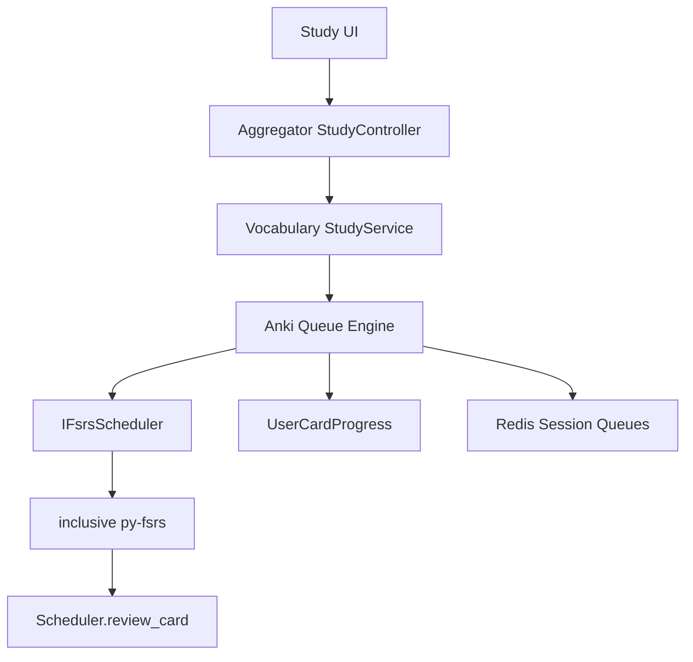

# План: Study Mode как Anki FSRS через inclusive

## Цель

Сделать Study mode максимально близким к Anki FSRS, не реализуя FSRS в .NET. Микросервис [`inclusive/main.py`](inclusive/main.py) остаётся единственным адаптером к official `py-fsrs`: он создаёт `Scheduler(...)`, мапит `Card`, вызывает `scheduler.review_card(...)` и возвращает обновлённые `state`, `step`, `stability`, `difficulty`, `due`.

`VocabularyService` должен стать Anki-подобной оболочкой вокруг FSRS:

- строить очереди `learning`, `review`, `new`, `relearning` по времени и лимитам;
- не показывать learning-карты раньше `due`, кроме learn-ahead при пустой due-очереди;
- показывать кнопочные интервалы из того же scheduler preview, но без fuzz;
- корректно хранить `Step`, `ScheduledDays`, `ElapsedDays`, `LastReview`, `ReviewLog`;
- поддерживать undo/burying/session state без искажения FSRS.



## Текущее состояние и риски

- [`VocabularyService/Services/StudyService.cs`](VocabularyService/Services/StudyService.cs) сейчас смешивает запуск сессии, Redis-очередь, sibling burying, learn-ahead, DTO сборку, submit review и undo. Это затрудняет точное повторение Anki.
- [`VocabularyService/Services/InclusiveFsrsScheduler.cs`](VocabularyService/Services/InclusiveFsrsScheduler.cs) уже передаёт `learning_steps_seconds`, `relearning_steps_seconds`, `enable_fuzzing`, `request_retention`, `maximum_interval`, `w` в inclusive. Это правильная граница.
- [`inclusive/main.py`](inclusive/main.py) использует `Scheduler.review_card(...)`, но нужно закрепить контракт тестами: state/step/due должны совпадать с official `py-fsrs` на learning/review/relearning сценариях.
- [`UserCardProgress`](VocabularyService/Data/Entities/UserCardProgress.cs) уже содержит `ElapsedDays` и `ScheduledDays`, но текущий review-путь фактически обновляет только state/step/S/D/due/lastReview/reps/lapses. Для Anki-паритета эти поля надо вести явно.
- Frontend [`polyraspad-frontend/src/components/study/study-controls.tsx`](polyraspad-frontend/src/components/study/study-controls.tsx) просто отображает `nextIntervals`; основная корректность должна быть на backend.

## Фаза 1: Зафиксировать спецификацию Anki-поведения тестами

Добавить regression/integration тесты в [`VocabularyService.Tests`](VocabularyService.Tests/) до рефакторинга:

- New card + Good: первый learning step должен показывать около `1m`, затем `10m`, затем graduation в Review около `1d` при дефолтных шагах `[60, 600]`.
- Learning card due через 10 минут не показывается, пока есть due review/new cards; показывается через learn-ahead только когда других due-карт нет.
- Review card + Good/Easy/Hard получает day-level interval от inclusive FSRS, а не ручной .NET-логики.
- Again на Review переводит в Relearning, использует `relearning_steps_seconds`, увеличивает `Lapses` и возвращает карту в intraday queue.
- Undo восстанавливает `State`, `Step`, `Due`, `Stability`, `Difficulty`, `ScheduledDays`, `ElapsedDays`, `Lapses`, `Reps`.
- Preview labels на кнопках должны рассчитываться тем же inclusive scheduler с `EnableFuzzing=false`, а фактический submit может использовать fuzz согласно настройкам проекта.

## Фаза 2: Выделить Anki Queue Engine из StudyService

Создать отдельный сервис, например [`VocabularyService/Services/Study/AnkiStudyQueueService.cs`](VocabularyService/Services/Study/AnkiStudyQueueService.cs), и перенести туда правила очередей:

- `learning/relearning`: сортировка по `Due`, показывать только `Due <= now`;
- `review`: сортировка по overdue, с daily review limit;
- `new`: после due learning/review, с daily new limit;
- learn-ahead: брать learning/relearning `now < Due <= now + LearnAheadLimit`, только если нет due learning/review/new;
- requeue после submit: если next state learning/relearning и due в пределах session/learn-ahead окна, класть в timed learning queue, а не просто в общий Redis list;
- защита от дублей: не добавлять один `cardId` несколько раз в Redis-очереди.

Предпочтительная структура Redis:

- `study:session:{id}:due` — обычная FIFO/priority snapshot для due cards;
- `study:session:{id}:learning` — sorted set `cardId -> dueTicks` для intraday learning/relearning;
- `study:session:{id}:seen_terms` — term-first burying вместо legacy `seen_lemmas` названия;
- оставить старые ключи как временную совместимость только на период миграции кода.

## Фаза 3: Сделать inclusive FSRS contract-first

Усилить контракт между .NET и inclusive:

- В [`VocabularyService/Protos/Inclusive/vocab.proto`](VocabularyService/Protos/Inclusive/vocab.proto) и [`inclusive/proto/vocab.proto`](inclusive/proto/vocab.proto) явно задокументировать mapping:
  - internal `State=0` означает new card, но в py-fsrs отправляется как `State.Learning` для первого review;
  - `step` обязателен для learning/relearning progression;
  - `review_at` всегда UTC и задаётся backend.
- В [`inclusive/main.py`](inclusive/main.py) добавить/обновить тесты Python на official `fsrs.Scheduler`:
  - new + Good при `[1m,10m]`;
  - learning step progression;
  - relearning after Again;
  - fuzz on/off.
- В [`VocabularyService/Services/InclusiveCardMapper.cs`](VocabularyService/Services/InclusiveCardMapper.cs) убрать неявности: new-card mapping сделать явным методом/комментарием, чтобы не потерять смысл `State=0`.

## Фаза 4: Правильно вести Card Progress и ReviewLog

Обновить submit review в [`StudyService.cs`](VocabularyService/Services/StudyService.cs) или новом `AnkiReviewService`:

- перед вызовом inclusive вычислять `ElapsedDays` из `LastReview` и `reviewAt`;
- после ответа inclusive сохранять:
  - `State`, `Step`, `Stability`, `Difficulty`, `Due`;
  - `LastReview = reviewAt`;
  - `ElapsedDays`;
  - `ScheduledDays` по `Due - reviewAt` для review-state и `0` для intraday learning;
  - `Reps += 1`;
  - `Lapses += 1` только для Again на review/relearning согласно выбранной Anki-семантике;
- расширить `ReviewLog`, если текущих полей недостаточно для полного undo `ElapsedDays/ScheduledDays/Reps/Lapses/Step`.

## Фаза 5: Preview intervals как Anki/FSRS

Сделать отдельный preview service, например [`VocabularyService/Services/Study/FsrsPreviewService.cs`](VocabularyService/Services/Study/FsrsPreviewService.cs):

- Для кнопок `Again/Hard/Good/Easy` вызывать inclusive 4 раза на копии card progress.
- Всегда ставить `EnableFuzzing=false` для preview, даже если фактический submit использует fuzz.
- Форматировать sub-day как `1m`, `10m`, day-level как `1d`, `4d`, `2.5mo` по единой функции.
- Не мутировать реальный `UserCardProgress` при preview.
- Добавить tests, что preview для текущей learning-карты соответствует следующему step, а не пересчитывается как new-card.

## Фаза 6: Frontend Study UX без домыслов

Фронт в основном оставить тонким:

- [`polyraspad-frontend/src/app/study/[deckId]/session/page.tsx`](polyraspad-frontend/src/app/study/[deckId]/session/page.tsx) продолжает брать `currentCard.nextIntervals`.
- [`polyraspad-frontend/src/components/study/study-controls.tsx`](polyraspad-frontend/src/components/study/study-controls.tsx) отображает интервалы backend как есть.
- Добавить debug/dev-only подпись по желанию: `state`, `step`, `due` для диагностики learning issues.
- Не вычислять FSRS или Anki-логику на клиенте.

## Фаза 7: Acceptance Criteria

Считать работу завершённой, когда проходят проверки:

- New card при Good: `1m -> 10m -> 1d/review` с дефолтными шагами.
- Review card при Good не возвращается в этой же session, если due завтра/позже.
- Again на review становится relearning и возвращается по relearning step.
- Learning due в будущем не обгоняет due review/new cards.
- Learn-ahead срабатывает только при пустой due-очереди.
- Undo полностью восстанавливает предыдущее состояние и возвращает карточку в корректную очередь.
- Fuzz влияет только на фактический scheduled interval, не на preview labels.
- `sleep`/`slept` и term-first card identity не смешиваются с legacy lemma burying.

## Проверка

Минимальные команды после реализации:

```powershell
dotnet test "VocabularyService.Tests/VocabularyService.Tests.csproj" --filter "FullyQualifiedName~StudyService|FullyQualifiedName~Fsrs"
dotnet test "AggregatorService.Tests/AggregatorService.Tests.csproj" --filter "FullyQualifiedName~Study"
docker compose up --build -d inclusive vocabulary-service aggregator-service polyraspad-frontend
```

Ручная проверка в UI:

- создать новую карточку;
- открыть study session;
- нажимать Good на одной и той же learning-карте через learn-ahead;
- убедиться, что цепочка шагов соответствует Anki: `1m`, затем `10m`, затем review/day interval;
- проверить mixed deck: learning due через 10m не должна появиться перед due review/new, пока очередь не пустая.
