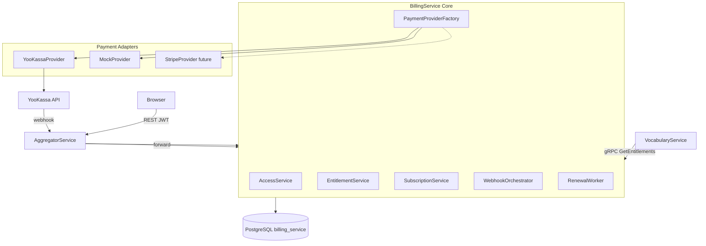

# BillingService — скорректированный план реализации

> **Статус:** реализовано (v1). План в archive; продуктовые решения зафиксированы в seed (free/pro) и AGENTS.md.

## Контекст и решения

| Решение | Выбор | Пояснение |
|---------|-------|-----------|
| Архитектура провайдеров | **Provider-agnostic ядро** + адаптеры (`IPaymentProvider`) | ЮKassa — первая реализация, не единственная. Stripe/Paddle добавляются новым адаптером без изменения домена. |
| Субъект биллинга | **`user_id` (Guid)** из authorization-module | Без tenant. Один `Customer` на пользователя. |
| Публичный API | **AggregatorService** (REST + JWT) | Внешний трафик идёт только через aggregator/api.polyraspad.online. |
| Межсервисный API | **BillingService** (gRPC h2c, порт `5127`) | Другие сервисы читают access/entitlements через gRPC. |
| Webhooks | **REST endpoint в AggregatorService** (`POST /api/billing/webhooks/{provider}`) → forward в BillingService по gRPC | Не открываем BillingService наружу; nginx не меняется. |
| Источник истины | Платёжный провайдер — для платежей; **наша БД — проекция** для access-check и entitlements | Webhook events нормализуются и применяются к БД. |
| Free plan | **Обязательный** (`plan.Code = "free"`) | Без активной paid-подписки пользователь считается на free plan с базовыми лимитами. |
| Trial | **Рекомендуется** для paid планов | `trialing` статус + `TrialEndsAt`. |

**Ключевой принцип:** доменная логика (подписки, access-check, entitlements, инвойсы, идемпотентность) **не знает** про ЮKassa/Stripe. Провайдер — replaceable adapter.

**Разделение с marketplace:** в VocabularyService уже есть `SubscriptionService` (подписки на колоды) и `UserEntitlement`/`Product`. BillingService отвечает **только** за SaaS-тарифы платформы. Имена сущностей в BillingService должны избегать неоднозначности: `BillingSubscription`, `SaaSPlan`, `Customer` (в namespace `BillingService`).

## Out of Scope (для v1)

- Stripe/Paddle адаптеры (архитектура готова, реализация — отдельный PR).
- Metered billing / usage-based цены (таблица `usage_records` — заготовка, но не используется).
- Налоговые ставки, НДС, мультивалютность (все цены — в минимальных единицах одной валюты; для ЮKassa — копейки, RUB).
- Партнёрские/реферальные программы.
- In-app purchases (App Store / Google Play).
- Частичный возврат (refund) — только отмена подписки.

## Open Questions (уточнить перед стартом)

1. **Тарифы и лимиты:** Какие планы нужны (free/pro/premium)? Какие лимиты на проекты/карточки/AI-запросы у каждого плана?
2. **Регионы:** Только РФ/ЮKassa или сразу нужен Stripe для международных пользователей?
3. **Trial:** Есть ли trial для paid планов? Сколько дней? Требуется ли карта?
4. **Free plan лимиты:** Какие функции доступны бесплатно без подписки?
5. **Frontend:** Нужна ли отдельная страница `/billing` или модальное окно? Какой дизайн?
6. **Уведомления:** Email-уведомления об успешной оплате/неуспехе/окончании подписки — нужны ли в v1?

## Архитектура



**Типичный access-check:**

```
GET /api/billing/access
  → AggregatorController (JWT → user_id)
  → gRPC CheckAccess(user_id)
  → SELECT subscriptions WHERE status IN (active, trialing) AND current_period_end > now()
  → fallback to free plan if no paid subscription
```

**Типичный entitlement-check из VocabularyService:**

```
VocabularyService action
  → gRPC GetEntitlements(user_id)
  → BillingService returns { plan: "pro", maxProjects: 50, maxCards: 10000, aiRequestsPerDay: 100, ... }
```

## Два режима управления подписками

| Режим | Провайдеры | Как работает |
|-------|-----------|--------------|
| **ProviderManaged** | Stripe, Paddle (будущее) | `provider_subscription_id` синхронизируется через webhooks; renewal worker **не нужен**. |
| **LocallyManaged** | ЮKassa (нет native subscription) | Подписка в нашей БД; **RenewalWorker** вызывает `CreateRecurringPaymentAsync` по `current_period_end`. |

Поле `subscriptions.management_mode` enum: `ProviderManaged` | `LocallyManaged`.

## Фаза 1: Репозиторий и scaffold

### 1.1 Git submodule

Все крупные компоненты Polyraspad — submodules ([AGENTS.md](../../../AGENTS.md)). BillingService не должен быть исключением:

1. Создать репозиторий `https://github.com/Kamil-Zuki/BillingService.git`.
2. Зарегистрировать submodule:
   ```bash
   git submodule add -b master https://github.com/Kamil-Zuki/BillingService.git BillingService
   ```
3. Обновить [`.gitmodules`](../../../.gitmodules):
   ```ini
   [submodule "BillingService"]
       path = BillingService
       url = https://github.com/Kamil-Zuki/BillingService.git
       branch = master
   ```

### 1.2 Scaffold

Шаблон `ZukoSun.Grpc.Service.Template` уже установлен (`dotnet new grpcservice` → `Author: ZukoSun`):

```bash
cd BillingService
dotnet new grpcservice -n BillingService -o .
```

Привести к паттернам репозитория:
- TargetFramework: `net8.0` (как `VocabularyService`/`MediaService`).
- HTTP/2 порт: `5127` (Kestrel config в `Program.cs`, как в `VocabularyService`).
- `healthz` endpoint.
- Папки: `Grpc/`, `Services/`, `Providers/`, `Data/`, `Options/`, `Migrations/`, `Protos/`, `Dtos/`.
- Dockerfile адаптировать под порт `5127` и args `DOTNET_8_*_IMAGE`.

## Фаза 2: Инфраструктура

### 2.1 PostgreSQL

Добавить в [docker/postgres/init/01-create-dbs.sql](../../../docker/postgres/init/01-create-dbs.sql):

```sql
CREATE DATABASE billing_service;
```

> **Примечание:** в текущем скрипте `CREATE DATABASE vocabulary_service;` указан дважды — это баг, который стоит исправить в том же PR.

### 2.2 Docker Compose

Добавить сервис `billing-service` в [docker-compose.yml](../../../docker-compose.yml):

```yaml
  billing-service:
    container_name: billing-service
    build:
      context: ./BillingService
      dockerfile: Dockerfile
      args:
        DOTNET_ASPNET_IMAGE: ${DOTNET_8_ASPNET_IMAGE:-mcr.microsoft.com/dotnet/aspnet:8.0}
        DOTNET_SDK_IMAGE: ${DOTNET_8_SDK_IMAGE:-mcr.microsoft.com/dotnet/sdk:8.0}
    restart: unless-stopped
    networks:
      - backend
    expose:
      - "5127"
    depends_on:
      postgres:
        condition: service_healthy
    environment:
      APP_UID: "0"
      DOTNET_RUNNING_IN_CONTAINER: "true"
      ASPNETCORE_URLS: "http://0.0.0.0:5127"
      ConnectionStrings__DefaultConnection: "Server=postgres;Port=5432;Database=billing_service;User Id=${POSTGRES_USER:-postgres};Password=${POSTGRES_PASSWORD:-change-me-postgres-password}"
      Billing__DefaultProvider: "${BILLING_DEFAULT_PROVIDER:-mock}"
      Billing__GracePeriodDays: "${BILLING_GRACE_PERIOD_DAYS:-3}"
      Billing__RenewalPollIntervalMinutes: "${BILLING_RENEWAL_POLL_INTERVAL_MINUTES:-15}"
      Billing__WebhookApiKey: "${BILLING_WEBHOOK_API_KEY:-}"
      PaymentProviders__YooKassa__ShopId: "${YOOKASSA_SHOP_ID:-}"
      PaymentProviders__YooKassa__SecretKey: "${YOOKASSA_SECRET_KEY:-}"
      PaymentProviders__YooKassa__ReturnUrl: "${YOOKASSA_RETURN_URL:-http://localhost:3000/billing/success}"
      PaymentProviders__YooKassa__UseSandbox: "${YOOKASSA_USE_SANDBOX:-true}"
```

В `aggregator-service` добавить:
- `depends_on.billing-service: condition: service_started`
- `AggregatorService__BillingServiceBaseUrl: "http://billing-service:5127"`

### 2.3 Environment variables

Добавить в [`.env.example`](../../../.env.example):

```ini
# BillingService
BILLING_DEFAULT_PROVIDER=mock
BILLING_GRACE_PERIOD_DAYS=3
BILLING_RENEWAL_POLL_INTERVAL_MINUTES=15
BILLING_WEBHOOK_API_KEY=

YOOKASSA_SHOP_ID=
YOOKASSA_SECRET_KEY=
YOOKASSA_RETURN_URL=http://localhost:3000/billing/success
YOOKASSA_USE_SANDBOX=true
```

> `BILLING_WEBHOOK_API_KEY` — дополнительный shared secret для валидации webhook запросов, передаваемых через Aggregator (опционально, но рекомендуется для v1).

## Фаза 3: Схема БД (provider-agnostic)

**Схема:** `billing`. **Суммы:** int в минимальных единицах. **PK:** Guid.

### Таблицы

**1. `customers`**
- `UserId` (Guid, unique), `Email`
- `Provider` (enum/string: `mock`, `yookassa`, `stripe`)
- `ProviderCustomerId` (nullable)
- `CreatedAt`, `DeletedAt` (soft delete)

**2. `plans`** — провайдер-независимый каталог
- `Code` (unique, e.g. `free`, `pro`), `Name`, `Description`
- `Price`, `Currency`, `Interval` (`month`, `year`), `IsActive`, `IsDefault`
- `TrialDays`
- `Entitlements` (jsonb): `{ "maxProjects": 10, "maxCards": 1000, "aiRequestsPerDay": 10 }`

**2b. `plan_provider_prices`** — маппинг плана на провайдера
- `PlanId`, `Provider`, `ProviderProductId`, `ProviderPriceId`
- Unique composite `(PlanId, Provider)`

**3. `billing_subscriptions`**
- `CustomerId`, `PlanId`, `Provider`
- `ProviderSubscriptionId` (nullable)
- `ManagementMode` (`ProviderManaged` | `LocallyManaged`)
- `Status` (`incomplete`, `trialing`, `active`, `past_due`, `canceled`, `unpaid`)
- `CurrentPeriodStart/End`, `TrialStart/End`
- `CancelAtPeriodEnd`, `CanceledAt`
- `CreatedAt`, `UpdatedAt`

**4. `invoices`**
- `SubscriptionId`, `Provider`, `ProviderInvoiceId` (unique composite)
- `AmountDue`, `AmountPaid`, `Currency`, `Status`, `InvoicePdfUrl`, `PaidAt`

**5. `payment_methods`**
- `CustomerId`, `Provider`, `ProviderPaymentMethodId` (unique composite)
- `Type`, `Brand`, `Last4`, `ExpMonth`, `ExpYear`, `IsDefault`

**6. `processed_webhooks`**
- `Provider`, `EventId` (composite PK)
- `EventType`, `ProcessedAt`, `PayloadHash`

**7. `usage_records`** — metered billing (заготовка, не используется в v1)

### Seed

Миграция должна создавать планы:
- `free` — `Price = 0`, базовые entitlements.
- `pro` — paid план с trial.

## Фаза 4: gRPC контракт

`BillingService/Protos/billing.proto` — без упоминания провайдера в RPC. Провайдер выбирается конфигом (`Billing:DefaultProvider`) или per-request override.

```protobuf
service BillingService {
  rpc CheckAccess (CheckAccessRequest) returns (CheckAccessResponse);
  rpc GetEntitlements (GetEntitlementsRequest) returns (GetEntitlementsResponse);
  rpc GetSubscription (GetSubscriptionRequest) returns (GetSubscriptionResponse);
  rpc ListPlans (ListPlansRequest) returns (ListPlansResponse);
  rpc CreateCheckout (CreateCheckoutRequest) returns (CreateCheckoutResponse);
  rpc CancelSubscription (CancelSubscriptionRequest) returns (CancelSubscriptionResponse);
  rpc ListInvoices (ListInvoicesRequest) returns (ListInvoicesResponse);
  rpc EnsureCustomer (EnsureCustomerRequest) returns (EnsureCustomerResponse);
  rpc ProcessWebhook (ProcessWebhookRequest) returns (ProcessWebhookResponse);
}
```

**Важно:** имена не должны конфликтовать с `SubscriptionService` в `VocabularyService`. Proto-файл называется `billing.proto`, сервис — `BillingService`, сгенерированный C# класс — `BillingServiceGrpc.BillingServiceClient`.

## Фаза 5: Абстракция провайдера (ядро)

### 5.1 Интерфейс `IPaymentProvider`

```csharp
public interface IPaymentProvider
{
    string ProviderCode { get; }  // "yookassa", "stripe", "mock"

    Task<CheckoutSessionResult> CreateCheckoutAsync(CheckoutRequest request, CancellationToken ct);
    Task<RecurringPaymentResult> CreateRecurringPaymentAsync(RecurringPaymentRequest request, CancellationToken ct);
    Task<PaymentStatusResult> GetPaymentStatusAsync(string providerPaymentId, CancellationToken ct);
    Task<WebhookHandleResult> HandleWebhookAsync(WebhookPayload payload, CancellationToken ct);
    bool VerifyWebhookSignature(WebhookPayload payload, string? secret);
}
```

**Нормализованные DTO** (`Providers/Models/`):
- `CheckoutSessionResult` — `ConfirmationUrl`, `ProviderPaymentId`, `ProviderSubscriptionId`
- `RecurringPaymentResult` — `ProviderPaymentId`, `Status`
- `PaymentStatusResult` — `Status`, `PaidAt`
- `WebhookHandleResult` — список доменных событий:
  - `PaymentSucceeded`, `PaymentFailed`, `SubscriptionUpdated`, `PaymentMethodSaved`, `CustomerDeleted`
- `WebhookOrchestrator` обрабатывает события **одинаково** для всех провайдеров.

### 5.2 Factory + DI

```csharp
public interface IPaymentProviderFactory
{
    IPaymentProvider GetProvider(string providerCode);
    IPaymentProvider GetDefaultProvider();
}
```

Регистрация в `Program.cs`:
```csharp
builder.Services.AddSingleton<IPaymentProvider, YooKassaPaymentProvider>();
builder.Services.AddSingleton<IPaymentProvider, MockPaymentProvider>();
builder.Services.AddSingleton<IPaymentProviderFactory, PaymentProviderFactory>();
```

Config: `Billing:DefaultProvider = "yookassa"`. Dev fallback: `"mock"`, если credentials не заданы.

### 5.3 Доменные сервисы

| Сервис | Ответственность |
|--------|-----------------|
| `IAccessService` | `CheckAccess` по нашей БД + fallback на free plan |
| `IEntitlementService` | `GetEntitlements` — лимиты текущего плана |
| `ISubscriptionService` | lifecycle подписок, cancel, upgrade/downgrade (v1 — cancel + new checkout) |
| `IInvoiceService` | upsert инвойсов из нормализованных событий |
| `IWebhookOrchestrator` | idempotency → dispatch events → update DB |
| `IRenewalWorker` | только для `ManagementMode = LocallyManaged` |

### 5.4 Webhook endpoint (в AggregatorService)

```
POST /api/billing/webhooks/{provider}
  → BillingController (no JWT)
  → forward via gRPC ProcessWebhook(provider, payload, signature)
  → BillingService:
    → factory.GetProvider(provider)
    → VerifyWebhookSignature
    → INSERT processed_webhooks (provider, event_id) ON CONFLICT skip
    → provider.HandleWebhookAsync → normalized events
    → WebhookOrchestrator.ApplyEvents(events)
  → 200 OK
```

Преимущества:
- BillingService не торчит наружу.
- nginx конфиг не меняется.
- Единая точка валидации входящих запросов.

### 5.5 Первая реализация: `YooKassaPaymentProvider`

- Typed HttpClient, Basic Auth (`ShopId:SecretKey`), `Idempotence-Key`.
- `CreateCheckoutAsync`: `save_payment_method=true`, `capture=true`, `return_url`.
- `CreateRecurringPaymentAsync`: `payment_method_id`, `merchant_customer_id`.
- Webhook mapping: `payment.succeeded` → `PaymentSucceeded` + `PaymentMethodSaved`; `payment.canceled` → `PaymentFailed`; `refund.succeeded` → игнорировать в v1.

### 5.6 `MockPaymentProvider`

- Для unit/integration tests и local dev без credentials.
- `CreateCheckoutAsync` возвращает фиктивный URL.
- Позволяет программно эмулировать успешный платёж (для тестов).

## Фаза 6: AggregatorService (BFF)

1. Добавить `Protos/billing.proto` с `GrpcServices="Client"`.
2. Зарегистрировать gRPC клиент:
   ```csharp
   builder.Services.AddGrpcClient<BillingServiceGrpc.BillingServiceClient>(x =>
       x.Address = new Uri(adresses["BillingServiceBaseUrl"]!))
       .ConfigurePrimaryHttpMessageHandler(GrpcClientConfiguration.CreateSocketsHandler);
   ```
3. Добавить `BillingServiceBaseUrl` в `AggregatorServiceOptions`.
4. Создать `IBillingServiceClient` / `BillingServiceClient` wrapper.
5. Создать `BillingController`:
   - `GET /api/billing/access` → `CheckAccess`
   - `GET /api/billing/entitlements` → `GetEntitlements`
   - `GET /api/billing/subscription` → `GetSubscription`
   - `GET /api/billing/plans` → `ListPlans`
   - `POST /api/billing/checkout` → `CreateCheckout` (optional `provider`)
   - `POST /api/billing/subscription/cancel` → `CancelSubscription`
   - `GET /api/billing/invoices` → `ListInvoices`
   - `POST /api/billing/webhooks/{provider}` → forward to BillingService

## Фаза 7: Интеграция с VocabularyService

VocabularyService должен уметь получать entitlements пользователя из BillingService:

1. Добавить gRPC клиент `BillingServiceGrpc.BillingServiceClient` в `VocabularyService/Program.cs`.
2. Добавить `IBillingEntitlementClient` / `BillingEntitlementClient`.
3. В `IEntitlementService` (VocabularyService) добавить fallback: если BillingService недоступен — разрешать действие или применять самый строгий free лимит (решение продукта).
4. Применять лимиты в:
   - создании проекта (`maxProjects`)
   - создании карточек (`maxCards`)
   - AI-запросах (`aiRequestsPerDay`)

> **Важно:** не ломать существующий функционал при недоступности BillingService. Рекомендуется "fail open" с free-лимитами + логирование на старте.

## Фаза 8: Frontend

Страницы/компоненты в `polyraspad-frontend`:
- `/billing` — список планов, текущая подписка, CTA "Upgrade".
- `/billing/success` и `/billing/cancel` — return URLs от провайдера.
- `/billing/invoices` — история платежей.
- Компонент `SubscriptionBadge` — показывать текущий план в UI.
- API клиенты в `lib/api/billing.ts`.
- React Query hooks в `lib/react-query/billing.ts`.

## Фаза 9: Тесты

| Тест | Уровень |
|------|---------|
| Access-check, free plan fallback, period semantics | Unit |
| Entitlements mapping | Unit |
| Webhook idempotency | Integration + MockProvider |
| Normalized event → subscription activation | Unit WebhookOrchestrator |
| YooKassa webhook payload mapping | Unit YooKassaPaymentProvider |
| Full checkout flow | Integration + MockProvider |
| Aggregator BillingController | Integration (`WebApplicationFactory<Program>`) |
| VocabularyService entitlement fallback | Unit |

**TDD:** сначала тесты на `WebhookOrchestrator`, `AccessService`, `EntitlementService` с `MockPaymentProvider`, затем YooKassa adapter.

## Фаза 10: CI/CD

Обновить [`.github/workflows/ci.yml`](../../../.github/workflows/ci.yml):
- Добавить шаги restore/build/test для `BillingService` и `BillingService.Tests`.
- `docker compose build` автоматически подхватит новый сервис.

Обновить [`.github/workflows/deploy.yml`](../../../.github/workflows/deploy.yml) (если есть ручные шаги для submodule update) — добавить `BillingService`.

## Конфигурация

```json
{
  "Billing": {
    "DefaultProvider": "yookassa",
    "GracePeriodDays": 3,
    "RenewalPollIntervalMinutes": 15,
    "WebhookApiKey": ""
  },
  "PaymentProviders": {
    "YooKassa": {
      "ShopId": "",
      "SecretKey": "",
      "ReturnUrl": "http://localhost:3000/billing/success",
      "UseSandbox": true
    },
    "Stripe": {
      "SecretKey": "",
      "WebhookSecret": "",
      "Enabled": false
    }
  }
}
```

Dev fallback: если `YooKassa:ShopId` или `SecretKey` пустые, `DefaultProvider` принудительно `"mock"` (с логированием).

## Порядок реализации

1. Создать репозиторий и submodule.
2. Scaffold + Docker + postgres init + .env.example.
3. Provider-agnostic EF schema + migration + seed plans.
4. `IPaymentProvider` + `MockPaymentProvider` + `PaymentProviderFactory`.
5. gRPC read APIs (`CheckAccess`, `GetEntitlements`, `ListPlans`) — работают без реального провайдера.
6. `WebhookOrchestrator` + normalized events + tests.
7. `YooKassaPaymentProvider` + Aggregator webhook proxy.
8. `RenewalWorker` (LocallyManaged).
9. AggregatorService BFF.
10. VocabularyService entitlement integration.
11. Frontend billing UI.
12. CI/CD + runbook.
13. (Будущее) `StripePaymentProvider` — отдельный PR без изменений ядра.

## Риски и mitigation

| Риск | Mitigation |
|------|------------|
| **LocallyManaged vs ProviderManaged** | Renewal worker запускается **только** для `LocallyManaged`; статус явно хранится в БД. |
| **Multi-provider per user** | v1: один `Provider` на customer; смена провайдера = новый customer record. Documented limitation. |
| **PCI DSS** | Храним только токены и маски карт; полные данные — только у провайдера. |
| **ЮKassa autopayments** | Требуют активации; в dev используем `MockProvider`. |
| **BillingService недоступен** | VocabularyService использует fail-open fallback на free entitlements + логирование. |
| **Webhook replay / duplicate events** | `processed_webhooks` с composite PK `(Provider, EventId)` + ранний return 200. |
| **Naming конфликт с VocabularyService SubscriptionService** | Использовать `BillingSubscription`/`SaaSPlan` в BillingService; gRPC сервис — `BillingService`. |
| **Потеря submodule history** | Не коммитить BillingService напрямую в корневой репозиторий; использовать отдельный submodule repo. |

## Связанные файлы

- [`.cursor/plans/README.md`](../README.md) — правила работы с планами.
- [`AGENTS.md`](../../../AGENTS.md) — репозиторий-level conventions, submodules, stack.
- [`docker-compose.yml`](../../../docker-compose.yml)
- [`docker/postgres/init/01-create-dbs.sql`](../../../docker/postgres/init/01-create-dbs.sql)
- [`.env.example`](../../../.env.example)
- [`.github/workflows/ci.yml`](../../../.github/workflows/ci.yml)
- [`VocabularyService/Protos/vocabulary.proto`](../../../VocabularyService/Protos/vocabulary.proto) — существующий `SubscriptionService` (deck subscriptions).
