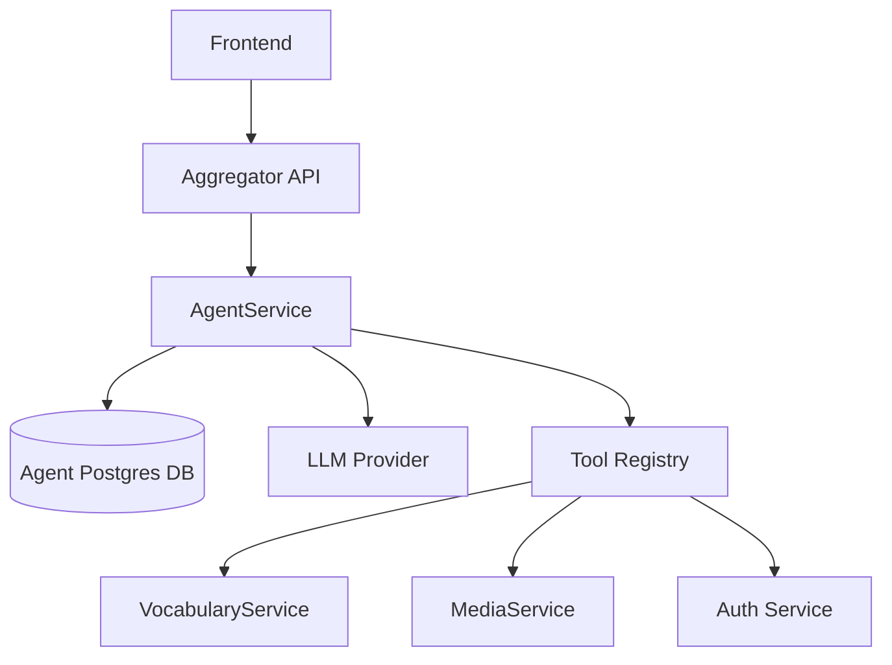

# Language-Learning Agent Boundary Plan

## Goal

PolyGuide must be a language-learning agent, not a general-purpose assistant. It should help with vocabulary, grammar, reading, card creation, study planning, project progress, imports, and app navigation. It should refuse unrelated requests like “write C# code”, generic programming help, math homework, business plans, or general research unless they are explicitly used as language-learning content.

Current issue: unknown intents fall through to `general_answer` in [`polyraspad-frontend/src/lib/agent/agent-intent-router.ts`](polyraspad-frontend/src/lib/agent/agent-intent-router.ts), then [`handleGeneralAnswer`](polyraspad-frontend/src/lib/agent/agent-tool-registry.ts) asks the model to answer. This allows non-language requests such as C# code generation.

```81:132:polyraspad-frontend/src/lib/agent/agent-intent-router.ts
export function routeAgentIntent(userText: string): RoutedAgentIntent {
  // ... known language/product intents
  return { toolId: "general_answer" }
}
```

## Product Rules

Allowed:

- Explain a word or phrase in context.
- Translate, define, compare usage, grammar, pronunciation.
- Generate example sentences for target language terms.
- Create card drafts from sentences/terms.
- Help read/import language content.
- Review progress, vocabulary stats, streaks, decks, study sessions.
- Navigate Polyraspad learning areas.
- Use arbitrary content as language-learning material, e.g. “translate this C# error message into Russian” or “make English vocabulary cards from this paragraph”.

Disallowed:

- Writing code as the main task.
- General programming explanations unrelated to language learning.
- Generic chat, trivia, business, legal, medical, or homework answers.
- Any answer that does not connect back to language learning or Polyraspad actions.

Refusal style:

- Short and helpful.
- Do not lecture.
- Redirect to allowed use.
- Example: “I can’t write C# code here. I can help you learn English from that code snippet: explain vocabulary, translate comments/errors, or create cards from terms like `class`, `method`, and `Console.WriteLine`.”

## Phase 1: Frontend Domain Gate

Add a domain classifier layer before tool execution.

Files:

- [`polyraspad-frontend/src/lib/agent/agent-intent-router.ts`](polyraspad-frontend/src/lib/agent/agent-intent-router.ts)
- [`polyraspad-frontend/src/lib/agent/agent-tool-registry.ts`](polyraspad-frontend/src/lib/agent/agent-tool-registry.ts)
- [`polyraspad-frontend/src/lib/agent/agent-intent-router.test.ts`](polyraspad-frontend/src/lib/agent/agent-intent-router.test.ts)

Implementation shape:

- Add `AgentDomainDecision`:
  - `allowed: boolean`
  - `category: "language_learning" | "product_navigation" | "progress" | "out_of_scope"`
  - `reason?: string`
- Add `classifyAgentDomain(userText)`.
- Add a new `toolId`: `out_of_scope`.
- Route unrelated prompts to `out_of_scope`, not `general_answer`.
- Keep `general_answer` only for language-learning questions that do not map to a specific tool.

Examples to test:

- Allowed: “Explain the word `slept`.”
- Allowed: “Translate this sentence into Russian.”
- Allowed: “Create cards from this article.”
- Allowed: “What does `class` mean in this C# snippet?” if framed as vocabulary/translation.
- Refused: “Напиши код на C#.”
- Refused: “Implement binary search in Python.”
- Refused: “Write a business plan.”

## Phase 2: Prompt Boundary

Strengthen prompts so the model cannot silently become general-purpose.

Files:

- [`polyraspad-frontend/src/lib/agent/agent-tool-registry.ts`](polyraspad-frontend/src/lib/agent/agent-tool-registry.ts)
- [`polyraspad-frontend/src/lib/editor/polyguide-agent.ts`](polyraspad-frontend/src/lib/editor/polyguide-agent.ts)

Changes:

- Replace generic fallback prompt with a language-learning-only system boundary.
- In fallback answers, require one of:
  - language explanation,
  - vocabulary extraction,
  - translation/grammar help,
  - study/card/reader next step.
- Add explicit instruction: refuse non-language-learning tasks.
- Preserve term-first guardrails: no lemma labels as status or identity.

## Phase 3: UX for Refusals

Make refusals feel useful, not broken.

Files:

- [`polyraspad-frontend/src/components/dashboard/agent-chat/agent-chat-thread.tsx`](polyraspad-frontend/src/components/dashboard/agent-chat/agent-chat-thread.tsx)
- [`polyraspad-frontend/src/components/dashboard/agent-chat/agent-action-card.tsx`](polyraspad-frontend/src/components/dashboard/agent-chat/agent-action-card.tsx)
- [`polyraspad-frontend/src/lib/agent/agent-message.ts`](polyraspad-frontend/src/lib/agent/agent-message.ts)

Add optional message metadata:

- `intentCategory`
- `refusal?: boolean`
- `suggestedPrompts?: string[]`

For out-of-scope requests, show:

- short refusal text;
- chips like “Explain vocabulary from this text”, “Translate this sentence”, “Create a card”.

## Phase 4: Server-Side Persistence Roadmap

Current chat history is local-only in [`use-agent-chat.ts`](polyraspad-frontend/src/lib/agent/use-agent-chat.ts): it stores the last 40 messages in `localStorage`. This is acceptable for MVP but not enough for real agents.

Next backend step before a full microservice:

- Add backend-backed threads via Aggregator route first:
  - `GET /api/agent/threads?projectId=...`
  - `POST /api/agent/threads`
  - `GET /api/agent/threads/{threadId}/messages`
  - `POST /api/agent/threads/{threadId}/messages`
  - `POST /api/agent/threads/{threadId}/runs`
- Store messages, runs, tool calls, and refusal/domain decisions.
- Keep frontend localStorage only as temporary cache/offline fallback.

## Phase 5: AgentService Design

Create a separate `AgentService` when agents become orchestration, not just chat UI.

Trigger conditions:

- multi-step workflows: import text → analyze → suggest terms → create card drafts;
- async jobs and resumable runs;
- tool execution requiring audit logs;
- cross-device chat history;
- agent memory/preferences;
- evaluation and observability.

Recommended service boundary:



Initial Agent DB tables:

- `AgentThreads`
- `AgentMessages`
- `AgentRuns`
- `AgentToolCalls`
- `AgentArtifacts`
- `AgentDomainDecisions`

Later:

- `AgentMemories`
- `AgentPreferences`
- `AgentEvaluationEvents`
- `AgentEmbeddings` with Postgres + `pgvector` if needed.

## Phase 6: Tests and Verification

Frontend tests:

- router classifies language-learning prompts as allowed;
- router refuses programming/code prompts;
- fallback answers are only called for allowed language-learning prompts;
- refusal message includes language-learning alternatives;
- C# example regression: “Напиши код на C#” must not call LLM general answer.

Backend tests, when persistence is added:

- thread is scoped by `UserId` and `ProjectId`;
- messages persist in order;
- tool calls are auditable;
- out-of-scope decisions are stored;
- user cannot read another user’s thread.

## Acceptance Criteria

- PolyGuide never answers unrelated general-purpose prompts directly.
- A coding prompt is refused unless framed as language-learning material.
- The user gets useful learning alternatives after refusal.
- Chat history roadmap moves from localStorage to backend persistence.
- AgentService boundary is documented before implementation.
