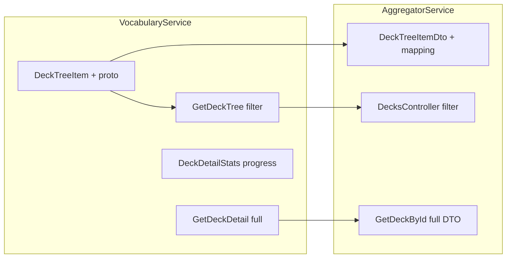

# Бэкенд: доработки для полной поддержки Library

Цель — реализовать на бэкенде то, чего не хватает фронту для завершения Library по IA: фильтры «Мои / Скачанные / Публичные», обложки и признак «куплено» в дереве, полный ответ GET колоды (в т.ч. для настроек и карточек), при необходимости — прогресс по колоде в статистике.

---

## 1. Расширение дерева колод (DeckTreeItem)

**Зачем:** фронт сможет показывать обложку и бейдж «Purchased» без N запросов `GET /api/Decks/:id` и получит поля для фильтрации «Мои / Скачанные / Публичные».

**Текущее состояние:**

- [VocabularyService/Services/DeckService.cs](VocabularyService/Services/DeckService.cs): `BuildTreeItem` заполняет только `Id`, `Title`, `CardCount`; сущность [Deck](VocabularyService/Data/Entities/Deck.cs) уже содержит `OwnerId`, `IsPublic`, `CoverImageUrl`, `ForkedFromId`.
- [VocabularyService/Protos/vocabulary.proto](VocabularyService/Protos/vocabulary.proto): `DeckTreeItem` — только `id`, `title`, `card_count`, `children`.
- [AggregatorService/Dtos/DeckTreeItemDto.cs](AggregatorService/Dtos/DeckTreeItemDto.cs): только `Id`, `Title`, `CardCount`, `Children`.

**Шаги:**

1. **VocabularyService**

- В [Services/IDeckService.cs](VocabularyService/Services/IDeckService.cs) класс `DeckTreeItem`: добавить свойства `OwnerId`, `IsPublic`, `ForkedFromId` (nullable), `CoverImageUrl` (nullable).
- В [DeckService.cs](VocabularyService/Services/DeckService.cs) в `BuildTreeItem`: присваивать эти поля из `deck`.
- В proto `DeckTreeItem`: добавить опциональные поля `owner_id`, `is_public`, `forked_from_id`, `cover_image_url` (типы string / bool).
- Обновить маппинг в [VocabularyService/AutoMapperProfiles](VocabularyService/AutoMapperProfiles) между внутренним `DeckTreeItem` и gRPC `DeckTreeItem`.

1. **AggregatorService**

- Скопировать/синхронизировать proto с VocabularyService (если proto общий — только один раз в VocabularyService).
- В [Dtos/DeckTreeItemDto.cs](AggregatorService/Dtos/DeckTreeItemDto.cs): добавить `OwnerId`, `IsPublic`, `ForkedFromId?`, `CoverImageUrl?`.
- В [AutoMappingProfile.cs](AggregatorService/AutoMapperProfiles/AutoMappingProfile.cs): маппинг gRPC `DeckTreeItem` -> `DeckTreeItemDto` с новыми полями.

После этого фронт может убрать вызовы `useDeck` для обложки/purchased с карточек и брать данные из дерева; и задействовать фильтры по `ownerId` / `isPublic` / `forkedFromId` на клиенте (или по п.2 — фильтрация на бэкенде).

---

## 2. Фильтр «Мои / Скачанные / Публичные» в GetDeckTree

**Зачем:** соответствие IA — фильтры (Мои / Скачанные / Публичные). Сейчас дерево возвращает все колоды проекта без фильтра.

**Варианты:**

- **A)** Фильтр на бэкенде: в запрос дерева передаётся параметр (например `libraryFilter=Mine|Downloaded|Public`), бэкенд возвращает только подходящие узлы.
- **B)** Только расширение дерева (п.1): фронт фильтрует уже полученное дерево по `OwnerId`, `ForkedFromId`, `IsPublic`.

Рекомендация: **A** — меньше данных по сети и единый источник правил (в т.ч. учёт подписок/entitlements для «Скачанные»).

**Шаги (вариант A):**

1. **VocabularyService**

- В proto `GetDeckTreeRequest`: добавить опциональное поле `library_filter` (enum: `Mine = 0`, `Downloaded = 1`, `Public = 2`).
- В [IDeckService.cs](VocabularyService/Services/IDeckService.cs): сигнатура `GetDeckTreeAsync(projectId, userId, libraryFilter?, cancellationToken)`.
- В [DeckService.cs](VocabularyService/Services/DeckService.cs) в `GetDeckTreeAsync`:
  - Загружать колоды проекта как сейчас.
  - Если передан `libraryFilter`: оставить только колоды, удовлетворяющие условию: **Mine** — `OwnerId == userId`; **Downloaded** — `ForkedFromId != null` (при необходимости сузить по `UserEntitlements`/подпискам); **Public** — `IsPublic == true`.
  - Строить дерево только из отфильтрованного набора (корневые и вложенные узлы должны быть из этого набора; если родитель отфильтрован — дети не показывать, либо оставить логику «включать родителя, если включён хотя бы один потомок» — уточнить по продукту).
- В [ContentService.cs](VocabularyService/Grpc/ContentService.cs) GetDeckTree: читать `request.LibraryFilter`, передавать в `GetDeckTreeAsync`.

1. **AggregatorService**

- В [DecksController.cs](AggregatorService/Controllers/DecksController.cs) и, при наличии, в ProjectsController: endpoint дерева — добавить query-параметр `libraryFilter` (Mine | Downloaded | Public).
- Формировать gRPC `GetDeckTreeRequest` с полем `library_filter`.
- В [VocabularyServiceClient.cs](AggregatorService/Services/VocabularyServiceClient.cs): передавать новый параметр в запросе.

Фронт переключателем «Мои | Скачанные | Публичные» будет вызывать `GET /api/Decks/tree/{projectId}?libraryFilter=...` и подставлять результат в дерево.

---

## 3. GET /api/Decks/:id — полные метаданные колоды (DeckResponseDto)

**Зачем:** страница Library и диалог «Настройки колоды» ожидают [DeckResponseDto](polyraspad-frontend/src/lib/api/types.ts): `projectId`, `ownerId`, `coverImageUrl`, `isPublic`, `contributionPolicy`, `licenseType`, `forkedFromId`, `createdAt` и т.д. Сейчас GET по id возвращает только [DeckDetailDto](AggregatorService/Dtos/DeckDetailDto.cs) (id, title, description, parentDeckId, stats) — без полей для обложки, публичности и «куплено».

**Текущее состояние:**

- [VocabularyService/Dtos/DeckDetailDto.cs](VocabularyService/Dtos/DeckDetailDto.cs): Id, Title, Description, ParentDeckId, Stats.
- [VocabularyService/Services/DeckService.cs](VocabularyService/Services/DeckService.cs) `GetDeckDetailAsync`: уже загружает `Deck`, но в DTO отдаёт только часть полей; статистика считается отдельно.
- gRPC [GetDeckDetailResponse](VocabularyService/Protos/vocabulary.proto): id, title, description, parent_deck_id, stats.

**Шаги:**

1. **VocabularyService**

- В [Dtos/DeckDetailDto.cs](VocabularyService/Dtos/DeckDetailDto.cs) (или в отдельном DTO для «полной колоды»): добавить поля `ProjectId`, `OwnerId`, `CoverImageUrl`, `IsPublic`, `ContributionPolicy`, `LicenseType`, `ForkedFromId`, `CreatedAt`, `CardCount` (и при необходимости другие, совпадающие с Deck).
- В proto `GetDeckDetailResponse`: добавить эти поля (типы string / bool / timestamp).
- В `GetDeckDetailAsync`: заполнять все поля из `deck` (и по необходимости маппинг enum строк ContributionPolicy/LicenseType в числа для API).
- В [ContentService.cs](VocabularyService/Grpc/ContentService.cs) GetDeckDetail: маппировать новые поля в ответ.

1. **AggregatorService**

- Обновить proto (если используется копия).
- Расширить [DeckDetailDto](AggregatorService/Dtos/DeckDetailDto.cs) (или ввести единый ответ «колода + детали»): добавить поля, соответствующие DeckResponseDto на фронте: `ProjectId`, `OwnerId`, `CoverImageUrl`, `IsPublic`, `ContributionPolicy`, `LicenseType`, `ForkedFromId`, `CreatedAt`, `CardCount`.
- В [DecksController.cs](AggregatorService/Controllers/DecksController.cs) GetDeckById: маппировать gRPC-ответ в расширенный DTO (включая Stats и все метаданные).

Итог: GET `/api/Decks/:id` возвращает один объект с полными метаданными колоды и блоком `Stats`, совместимый с ожиданием фронта (DeckResponseDto + stats для прогресса и due).

---

## 4. Статистика по колоде: due и прогресс

**Зачем:** на карточках колод во Library отображаются «X due» и прогресс-бар. Сейчас в ответе деталей колоды уже есть [DeckDetailStatsDto](VocabularyService/Dtos/DeckDetailDto.cs): `NewCardsCount`, `LearningCardsCount`, `DueCardsCount`, `TotalCardsCount`. Фронт может вычислить прогресс как `(Total - New) / Total` или «mature / total».

**Рекомендация:** не менять контракт, если достаточно текущих полей. При желании единообразия:

- В [DeckDetailStatsDto](VocabularyService/Dtos/DeckDetailDto.cs) и в proto `DeckDetailStats` добавить опциональное поле `ProgressPercent` (0–100), считаемое в VocabularyService (например, доля карточек с «mature» состоянием или с интервалом >= 21 день).
- В [DeckService.GetDeckDetailAsync](VocabularyService/Services/DeckService.cs): при расчёте статистики добавить вычисление `ProgressPercent` и заполнение DTO/proto.

Опционально: если решите отдавать в дереве краткую статистику по колоде (due, progress) без отдельного GET — можно позже расширить `DeckTreeItem` полями `due_count` и `progress_percent` и считать их в VocabularyService при построении дерева (учёт нагрузки на БД).

---

## 5. Порядок внедрения и зависимости

Рекомендуемый порядок:

1. Расширить дерево (п.1) в VocabularyService и AggregatorService — сразу даст фронту обложки и purchased из дерева и основу для фильтров.
2. Добавить фильтр GetDeckTree (п.2) — включить параметр в proto и реализовать фильтрацию в VocabularyService и проброс в AggregatorService.
3. Расширить GET deck (п.3) — полные метаданные в GetDeckDetail/GetDeckById для настроек и для совместимости с DeckResponseDto.
4. При необходимости добавить прогресс в статистику (п.4) или в дерево — по продукту.

---

## 6. Документация

- Обновить [Docs/DTO Description.md](Docs/DTO Description.md): описать новые поля в DeckTreeItemDto и в ответе GET колоды (и при необходимости enum фильтра Library).
- Указать в описании API query-параметр `libraryFilter` для эндпоинта дерева колод.

После выполнения п.1–3 функционал Library на фронте будет полностью подкреплён бэкендом: фильтры, обложки и purchased из дерева, полные настройки колоды и статистика из одного GET.
