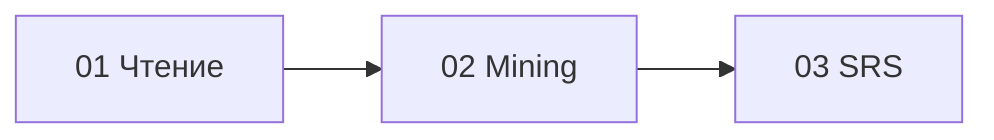

# 00 — Reader / Library — coordination hub (split plans)

Plan ID: `00-reader-lingq-hub-2026-05-14`
Priority: **00** (индекс; не «спринтовый» план сам по себе)
Status: backlog
Created: 2026-05-14
Owner: `lead-agent`

Дочерние планы пронумерованы **01–04** по приоритету MVP и пост-MVP (см. таблицу ниже).

## Goal

Синхронизировать реализацию с [Docs/reader-library-lingq-roadmap.md](../../../Docs/reader-library-lingq-roadmap.md): закрыть разрывы до LingQ-style UX. Монолитный план **`reader-library-lingq-roadmap-2026-05-13`** (ранее в `active/`) **разбит** на дочерние планы в **backlog**; при старте работы переносите выбранный план в `active/` по правилам [`.cursor/plans/README.md`](../README.md).

## Child plans (backlog, по приоритету)

| Приор | MVP / тема | Plan ID | Файл |
|-------|--------------|---------|------|
| **01** | Шаг 1 — Чтение (форматы, reader, подсветка) | `01-reader-mvp-read-2026-05-14` | [`01-reader-mvp-read-2026-05-14.md`](./01-reader-mvp-read-2026-05-14.md) |
| **02** | Шаг 2 — Mining (pop-up, Mine, term actions) | `02-reader-mvp-mining-2026-05-14` | [`02-reader-mvp-mining-2026-05-14.md`](./02-reader-mvp-mining-2026-05-14.md) |
| **03** | Шаг 3 — SRS (review-from-context, FSRS, inclusive) | `03-reader-mvp-srs-review-2026-05-14` | [`03-reader-mvp-srs-review-2026-05-14.md`](./03-reader-mvp-srs-review-2026-05-14.md) |
| **04** | Phase 3–4 — library IA, polish | `04-reader-library-phases34-2026-05-14` | [`04-reader-library-phases34-2026-05-14.md`](./04-reader-library-phases34-2026-05-14.md) |

## Core Learning Loop (сводка)

| Приор | Шаг | Plan ID |
|-------|-----|---------|
| **01** | Чтение | `01-reader-mvp-read-2026-05-14` |
| **02** | Mining | `02-reader-mvp-mining-2026-05-14` |
| **03** | SRS | `03-reader-mvp-srs-review-2026-05-14` |

## Progress (перенесено с 2026-05-13 — 2026-05-14)

- **Phase 0 (REST bridge):** `TextController` (`POST /api/text/analyze`), `TermsController`, `MediaServiceClientImpl`, маппинги; `MediaControllerTests` зелёные. Детали контрактов — в дочерних планах (read / mining / srs).
- **Frontend:** восстановлены `text-client.ts`, `term-client.ts`.
- **SRS:** FSRS через **`inclusive/`**; UI review-сессии (оценки, интервалы) уже в продукте; дожать **review-from-context** — план **`03-reader-mvp-srs-review-2026-05-14`**.

## Verification (сквозное)

- Три MVP-гейта — по критериям в планах **01–03**.
- Phase 0 гейт: endpoints из `constants.ts` не 404 — при работах по Aggregator bridge.
- Детальные чеклисты — внутри каждого дочернего плана.

## References

- `Docs/reader-library-lingq-roadmap.md`
- `Docs/ux/lingq-style-acceptance-criteria.md`
- `Docs/testing/reader-library-tdd-matrix.md`
- `context/plans/active/lingq-reader-implementation-plan.md` (если есть в ветке)

## Cleanup

- [ ] При взятии плана в работу: `backlog/<id>.md` → `active/<id>.md`, `Status: active` (см. README).
- [ ] При закрытии: `active/` → `archive/`, решения при необходимости в `context/decisions/` или `Docs/`.
