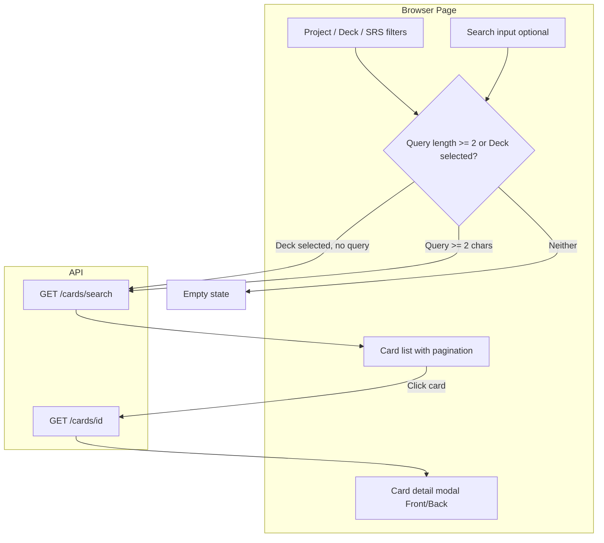

# План: страница просмотра карточек (Card Browser) в стиле Anki

## Текущее состояние

- **Страница:** [polyraspad-frontend/src/app/browser/page.tsx](polyraspad-frontend/src/app/browser/page.tsx) — форма поиска (минимум 2 символа), фильтры по проекту/колоде/SRS, результаты списком. Просмотр только в виде плоских карточек (sentence, translation, target, SRS), без переворота и без изображений.
- **Ограничения:**
  - Результаты показываются только при `searchQuery.length >= 2`; нет режима «просто просмотреть все карточки в колоде» без ввода запроса.
  - Нет детального просмотра одной карточки (front/back как в Anki).
  - В ответах API у медиа нет URL для отображения: в [CardMediaDto](polyraspad-frontend/src/lib/api/types.ts) только `imageId`/`audioId`; бэкенд заполняет `ImageUrl` в сущности ([S3MediaStorageService.FillCardMediaUrlsAsync](VocabularyService/Services/S3MediaStorageService.cs)), но в gRPC [CardMedia](AggregatorService/Protos/vocabulary.proto) полей `image_url`/`audio_url` нет, поэтому фронт их не получает.
- **Бэкенд:** [CardService.SearchCardsAsync](VocabularyService/Services/CardService.cs) допускает пустой `query` (при пустом запросе просто не применяется полнотекстовый фильтр). [GetCardsByDeck](VocabularyService/Services/CardService.cs) реализован в VocabularyService по gRPC, но в AggregatorService **не экспонирован** в REST — в [CardsController](AggregatorService/Controllers/CardsController.cs) есть только `GET .../search`.

## Целевое поведение (только просмотр, не обучение)

1. **Просмотр по колоде:** выбор проекта → выбор колоды → список карточек колоды без обязательного ввода поискового запроса (как в Anki: открыл колоду — видишь все карточки).
2. **Поиск:** текущий сценарий сохраняется: ввод запроса (≥2 символа) + фильтры по проекту/колоде/SRS.
3. **Детальный просмотр карточки (как в Anki):** по клику на карточку — экран/модалка с лицевой стороной (предложение, целевое слово, изображение при наличии) и оборотной (перевод, целевое слово); переключение Front/Back по кнопке или клику; без кнопок оценки (Study).

---

## 1. Бэкенд и API

### 1.1 Медиа: отдача URL картинки/аудио в карточках

- **Проблема:** фронт не получает `imageUrl`/`audioUrl` для отображения в браузере.
- **Вариант A (рекомендуется):** расширить gRPC и REST:
  - В [vocabulary.proto](AggregatorService/Protos/vocabulary.proto) в `message CardMedia` добавить `string image_url = 3;` и `string audio_url = 4;`.
  - В VocabularyService при маппинге Card → CardResponse после `FillCardMediaUrlsAsync` заполнять в gRPC `CardMedia` поля `image_url`/`audio_url`.
  - В Aggregator [CardMediaDto](AggregatorService/Dtos/CardResponseDto.cs) добавить `ImageUrl` и `AudioUrl`; в AutoMapper [CardMedia → CardMediaDto](AggregatorService/AutoMapperProfiles/AutoMappingProfile.cs) маппить эти поля.
- **Вариант B (минимальный):** не менять proto; на фронте для превью изображения вызывать отдельный endpoint «получить URL по media id» (если такой есть или будет добавлен) и подставлять URL только в режиме просмотра одной карточки. Менее удобно и больше запросов.

### 1.2 Просмотр карточек колоды без поиска

- **Вариант A (без изменений Aggregator):** использовать существующий `GET /api/Cards/search` с пустым `query` и заданным `deckId`. Бэкенд уже это поддерживает; на фронте нужно разрешить запрос при «пустой строке + выбранная колода» (см. п. 2.1).
- **Вариант B (явный endpoint):** в Aggregator добавить REST для списка по колоде, например `GET /api/Decks/{deckId}/cards?pageNumber=1&pageSize=20`, реализованный через существующий gRPC `GetCardsByDeck`. Тогда на фронте для режима «только колода» вызывать этот endpoint, а для поиска — по-прежнему `search`.

В плане можно опереться на **вариант A** для списка (меньше изменений) и **вариант A** для медиа (единообразно и нужно для превью карточки).

---

## 2. Фронтенд

### 2.1 Данные: когда показывать список карточек

- **Текущее:** [useSearchCards](polyraspad-frontend/src/lib/react-query/card-queries.ts) вызывается с `enabled: enabled && !!query` — при пустом `query` запрос не уходит.
- **Нужно:** показывать карточки в двух случаях:
  - Есть поисковый запрос (≥2 символов) — как сейчас, с фильтрами.
  - Нет запроса, но выбрана колода — загружать карточки колоды (тот же `searchCards("", { deckId, projectId, pageNumber, pageSize })` или, при реализации п. 1.2 B — отдельный метод `getCardsByDeck`).
- **Шаги:**
  - Ввести на странице Browser явный режим или единую логику: «источник данных» = (query ≥ 2) ? search : (selectedDeckId ? deck cards : пусто).
  - Для «deck cards» вызывать `searchCards("", { deckId: selectedDeckId, projectId: selectedProjectId, pageNumber, pageSize })` с `enabled: !!selectedDeckId` (и при необходимости поправить контракт на бэкенде, если там есть проверка «query не пустой» — в VocabularyService такой проверки нет; в REST описание в Doc указано «пуст или слишком короток» — стоит проверить, возвращает ли Aggregator 400 при пустом query, и при необходимости разрешить пустой query при переданном deckId).
  - Либо добавить/использовать хук вроде `useCardsByDeck(deckId, pageNumber, pageSize)` при выбранной колоде и без поиска, а при вводе запроса — `useSearchCards` как сейчас.

### 2.2 Редизайн страницы Browser

- **Верхний блок:** заголовок «Card Browser», краткое описание (просмотр и поиск карточек).
- **Фильтры и поиск:**
  - Проект (обязателен для выбора колоды) и Колода (опционально).
  - Поле поиска: опционально; подсказка вроде «Поиск по карточкам или оставьте пустым и выберите колоду».
  - При выбранной колоде и пустом поиске — показывать список карточек колоды с пагинацией.
  - При вводе запроса (≥2 символа) — поиск с учётом project/deck/SRS (как сейчас).
- **Список карточек:**
  - Таблица или карточный список: колонки/поля — превью предложения (обрезанное), перевод (обрезанный), целевое слово, колода (название по `deckId` из дерева колод или из ответа, если появится `deckTitle`), SRS. Клик по строке/карточке открывает детальный просмотр.
  - Пагинация (номер страницы, размер страницы, «Назад»/«Вперёд»).
- **Пустые состояния:**
  - «Выберите колоду или введите поисковый запрос (минимум 2 символа)».
  - «В колоде нет карточек» / «По запросу ничего не найдено».

### 2.3 Детальный просмотр одной карточки (Anki-style)

- **Компонент:** например `CardViewModal` или `CardDetailView` (модальное окно или панель справа).
- **Вход:** `cardId` (и при необходимости уже загруженный объект карточки из списка).
- **Данные:** `useCard(cardId)` — существующий [GET /api/Cards/{id}](polyraspad-frontend/src/lib/api/card-client.ts); после п. 1.1 в `card.media` будут доступны `imageUrl`/`audioUrl` для отображения.
- **UI:**
  - Переключатель «Front» / «Back» (как в [CardPreview](polyraspad-frontend/src/components/editor/card-preview.tsx) в редакторе).
  - **Front:** предложение (с подсветкой целевого слова), изображение (если есть `media?.imageUrl`).
  - **Back:** перевод, целевое слово; при желании дублировать предложение.
  - Кнопки: «Закрыть», опционально «Редактировать» (переход на страницу редактора с `cardId`).
- **Поведение:** только просмотр, без кнопок оценки и без логики сессии обучения.

### 2.4 Типы и API-клиент

- В [CardMediaDto](polyraspad-frontend/src/lib/api/types.ts) добавить `imageUrl?: string | null` и `audioUrl?: string | null` (после появления полей в REST).
- Если в п. 1.2 выбран вариант B (отдельный endpoint по колоде): в [card-client](polyraspad-frontend/src/lib/api/card-client.ts) добавить метод `getCardsByDeck(deckId, pageNumber, pageSize)`, в [card-queries](polyraspad-frontend/src/lib/react-query/card-queries.ts) — хук с пагинацией и использовать его на странице Browser для режима «только колода».

---

## 3. Порядок внедрения

1. **Бэкенд (медиа):** proto CardMedia + VocabularyService маппинг + Aggregator CardMediaDto и AutoMapper → чтобы в ответах карточек приходили `media.imageUrl` и `media.audioUrl`.
2. **Фронт типы и данные:** обновить `CardMediaDto` на фронте; поправить логику Browser: разрешить показ списка при выбранной колоде и пустом поиске (через `searchCards("", { deckId })` или через новый endpoint).
3. **Страница Browser:** редизайн блока фильтров/поиска и списка; пагинация; пустые состояния.
4. **Компонент просмотра карточки:** модалка/панель с Front/Back и отображением изображения по `media.imageUrl`; подключение к списку по клику.
5. **Опционально:** REST `GET /api/Decks/{deckId}/cards` и отдельный хук для «просмотра по колоде» — если решите не использовать пустой query в search.

---

## 4. Диаграмма потока (Browser)

---

## 5. Важные файлы

| Назначение                    | Файлы                                                                                                                                                                                                                                                                                      |
| ----------------------------- | ------------------------------------------------------------------------------------------------------------------------------------------------------------------------------------------------------------------------------------------------------------------------------------------ |
| Страница браузера             | [polyraspad-frontend/src/app/browser/page.tsx](polyraspad-frontend/src/app/browser/page.tsx)                                                                                                                                                                                               |
| Запросы карточек              | [polyraspad-frontend/src/lib/react-query/card-queries.ts](polyraspad-frontend/src/lib/react-query/card-queries.ts), [polyraspad-frontend/src/lib/api/card-client.ts](polyraspad-frontend/src/lib/api/card-client.ts)                                                                       |
| Типы карточки/медиа           | [polyraspad-frontend/src/lib/api/types.ts](polyraspad-frontend/src/lib/api/types.ts)                                                                                                                                                                                                       |
| Превью карточки (референс)    | [polyraspad-frontend/src/components/editor/card-preview.tsx](polyraspad-frontend/src/components/editor/card-preview.tsx)                                                                                                                                                                   |
| Бэкенд поиск/список по колоде | [VocabularyService/Services/CardService.cs](VocabularyService/Services/CardService.cs), [AggregatorService/Controllers/CardsController.cs](AggregatorService/Controllers/CardsController.cs)                                                                                               |
| Медиа URL                     | [VocabularyService/Services/S3MediaStorageService.cs](VocabularyService/Services/S3MediaStorageService.cs), [AggregatorService/Protos/vocabulary.proto](AggregatorService/Protos/vocabulary.proto), [AggregatorService/Dtos/CardResponseDto.cs](AggregatorService/Dtos/CardResponseDto.cs) |

После выполнения плана пользователь сможет просматривать карточки по колоде без поиска, искать с фильтрами и открывать карточку в режиме просмотра «как в Anki» (лицевая/оборотная сторона с изображением при наличии).
