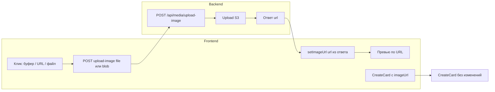

# Вставка изображения из буфера на странице Editor

## Цель

В блоке **Media Attachments** при клике на зону изображения предлагать **три способа** добавления картинки: **вставить из буфера обмена** (Ctrl+V), **вставить URL** или **выбрать файл на устройстве**. Реализация по [IA](<Docs/Информационную%20Архитектуру%20(IA).md>): «Image Zone: поддержка вставки из буфера (Ctrl+V)» и сценарий «Вставляет картинку из буфера обмена (Ctrl+V). Картинка прикрепилась.» Выбор с устройства дополняет сценарий для пользователей, у которых изображение сохранено в файл.

## Текущее состояние

- **Страница редактора:** [polyraspad-frontend/src/app/editor/page.tsx](polyraspad-frontend/src/app/editor/page.tsx) — обёртка; форма в [polyraspad-frontend/src/components/editor/editor-form.tsx](polyraspad-frontend/src/components/editor/editor-form.tsx).
- **Секция медиа (изображение):** зона с подписью «Drop image or Paste», по клику показывается только поле «Paste URL». Вставки из буфера (Clipboard API) нет.
- **Бэкенд:** CreateCard принимает только `imageUrl` в виде http(s)-URL; валидатор [VocabularyService/Validations/CreateCardRequestValidator.cs](VocabularyService/Validations/CreateCardRequestValidator.cs) явно требует http/https. Захват скриншота в CaptureCard уже реализует декодирование base64 и загрузку в S3 ([CardService.cs](VocabularyService/Services/CardService.cs) — `DecodeBase64Image`, `UploadImageAsync`).

## Паттерн как в похожих приложениях

В **Anki** и **Quizlet** используется один и тот же подход: сначала загрузить медиа (отдельный endpoint), получить URL, затем при создании карточки передать только этот URL. CreateCard не принимает бинарные данные — только ссылку.

- **Quizlet:** загрузка в `/images` (multipart/form-data) → возврат URL → создание карточки с этим URL.
- **Anki:** storeMediaFile (файл/URL/base64) → затем addNote с ссылкой на сохранённый файл.

Итог: **отдельный endpoint загрузки изображения**, ответ — URL. Редактор при «вставке из буфера» или «выборе файла» сначала вызывает upload, подставляет полученный URL в форму; CreateCard остаётся без изменений (только `imageUrl`).

## Архитектура решения

## План работ

### 1. Бэкенд: отдельный endpoint загрузки изображения

Контракт **CreateCard не меняется** — по-прежнему только `imageUrl` (http/https). Вся загрузка бинарных данных выносится в отдельный endpoint по образцу Quizlet/Anki.

**Новый endpoint (REST):** `POST /api/media/upload-image`

- **Тело:** `multipart/form-data`, поле `file` — файл изображения (или одно поле с бинарными данными). Либо альтернатива для вставки из буфера: `application/json` с полем `imageDataUrl` (data URL) — тогда бэкенд декодирует и загружает в S3; оба варианта возвращают один и тот же ответ.
- **Ответ:** `201 Created` + JSON `{ "url": "https://..." }` (публичный или presigned URL изображения в S3).

**Шаги:**

- **VocabularyService**
  - В proto добавить RPC, например: `rpc UploadImage(UploadImageRequest) returns (UploadImageResponse);` с сообщениями `UploadImageRequest` (поле `bytes image_data` или `string image_data_url`) и `UploadImageResponse` (поле `string url`). Либо один запрос с `bytes image_data` + `string content_type`.
  - Реализация: сервис принимает байты (или декодирует data URL через существующий `DecodeBase64Image`), вызывает `IMediaStorageService.UploadImageAsync`, затем получает URL через `GetMediaUrlAsync` (или формирует из `PublicBaseUrl`) и возвращает его в ответе.
  - Ограничение размера на уровне gRPC/сервиса (например, макс. 5 MB).
- **AggregatorService**
  - Новый контроллер или действие, например `MediaController` с методом `POST [Route("upload-image")]`.
  - Приём: `IFormFile file` (multipart) — читать в поток/байты и отправлять в VocabularyService по gRPC. Либо принять JSON с `imageDataUrl` и передать в VocabularyService для декодирования и загрузки (если решим не дублировать логику декодирования в Aggregator).
  - Ответ: `{ "url": "<значение из VocabularyService>" }`.
  - Аутентификация: тот же Bearer, что и для остального API.

После этого любой клиент (в т.ч. редактор) может: загрузить файл/вставку из буфера → получить URL → подставить в форму и отправить CreateCard с `imageUrl`.

### 2. Фронтенд: UX при клике на зону изображения

**Файл:** [polyraspad-frontend/src/components/editor/editor-form.tsx](polyraspad-frontend/src/components/editor/editor-form.tsx)

- При клике по **Image Dropzone** (когда ещё не открыт ввод URL) показывать **три варианта**:
  - **«Вставить из буфера» (Ctrl+V)** — Clipboard API → получить Blob изображения → вызвать `POST /api/media/upload-image` (multipart с этим файлом или FormData с blob) → в ответе взять `url` → `setImageUrl(url)`, показать превью по URL.
  - **«Вставить URL»** — как сейчас: показать поле ввода URL.
  - **«Выбрать на устройстве»** — скрытый `<input type="file" accept="image/*">` → пользователь выбирает файл → отправить файл на `POST /api/media/upload-image` (multipart) → получить `url` → `setImageUrl(url)`, превью.
- Для вставки из буфера: `navigator.clipboard.read()` с проверкой типа `image/`, конвертация в Blob/File и отправка тем же multipart-endpoint’ом. Обработка отказа в доступе к буферу и отсутствия изображения — тост/сообщение.
- Глобальный **Ctrl+V** в редакторе: если в буфере изображение и фокус не в поле URL — выполнить тот же сценарий «вставить из буфера» (upload → setImageUrl).
- Состояние загрузки: пока идёт upload, показывать индикатор (спиннер/overlay) на зоне изображения; после успеха — превью по URL.

Итог: буфер и выбор файла всегда проходят через один и тот же endpoint загрузки; в state хранится только итоговый `imageUrl`; CreateCard вызывается без изменений, только с `imageUrl`.

### 3. Типы и API на фронтенде

- Добавить вызов загрузки: метод `uploadImage(file: File | Blob): Promise<{ url: string }>` в API-клиенте (например, новый [polyraspad-frontend/src/lib/api/media-client.ts](polyraspad-frontend/src/lib/api/media-client.ts) или в существующем клиенте), вызывающий `POST /api/media/upload-image` с `FormData` и возвращающий URL из ответа.
- CreateCardDto и вызов createCard **не меняются** — по-прежнему передаётся только `imageUrl` (строка с URL после загрузки).

### 4. Документация

- В [Docs/Описание REST API.md](Docs/Описание%20REST%20API.md) добавить описание `POST /api/media/upload-image`: назначение (загрузка изображения для карточек/обложек), формат (multipart/form-data, поле `file`), ответ `{ "url": "..." }`, лимиты размера.
- При необходимости обновить [Docs/DTO Description.md](Docs/DTO%20Description.md) или раздел про медиа — указать, что изображение для карточки задаётся через загрузку на upload-image и подстановку полученного URL в `imageUrl` при CreateCard.

## Порядок внедрения

1. **Бэкенд:** VocabularyService — новый gRPC UploadImage (proto + сервис, используя существующие `UploadImageAsync` и `GetMediaUrlAsync`); ограничение размера. AggregatorService — контроллер `POST /api/media/upload-image` (multipart), вызов gRPC, возврат URL.
2. **Фронтенд:** API-клиент для upload-image (FormData, возврат url). В editor-form — три действия при клике на зону изображения (буфер / URL / файл), для буфера и файла — вызов upload → setImageUrl(url), превью, индикатор загрузки; глобальный Ctrl+V в редакторе.
3. **Документация:** описание нового endpoint в REST API.

## Важные детали

- **Безопасность:** лимит размера загружаемого файла (например, 5 MB) на уровне endpoint и VocabularyService; проверка content-type (только image/).
- **CreateCard не меняется:** контракт остаётся с одним полем `imageUrl`; никаких base64/data URL в теле создания карточки — только после загрузки через upload-image.
- Drag-and-drop на зону изображения можно поддержать тем же сценарием: сброшенный файл → upload → setImageUrl (опционально в рамках той же задачи).
