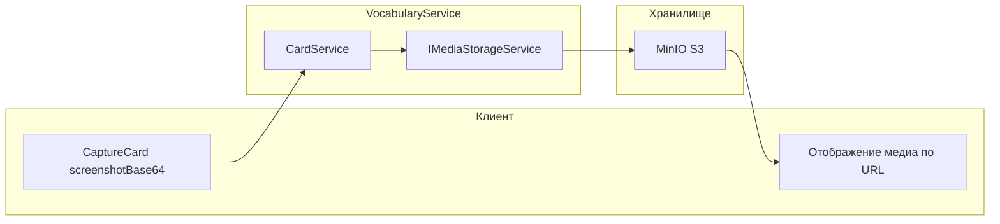

# Локальный S3 и интеграция с VocabularyService

## Текущее состояние

- В [VocabularyService/Services/CardService.cs](VocabularyService/Services/CardService.cs) в `CaptureCardAsync` есть TODO: загрузка скриншота в S3 и получение `imageId` (строка 108). Медиа карточки уже поддерживаются: [VocabularyService/Data/Entities/JsonTypes.cs](VocabularyService/Data/Entities/JsonTypes.cs) — `CardMedia` с полями `ImageId`, `AudioId` (Guid?) и `ImageUrl`, `AudioUrl` (string?).
- В [docker-compose.yml](docker-compose.yml) S3/MinIO не описан; в VocabularyService нет пакетов для работы с S3.
- Документация ([Docs/Описание REST API.md](Docs/Описание REST API.md), [Docs/Основные возможности.md](Docs/Основные возможности.md)) предполагает «Media Service (S3)»: загрузка файла → возврат media ID → сохранение ID в карточке; отдача URL по ID (presigned или постоянный).

## Архитектура решения

VocabularyService сам обращается к S3 (без отдельного микросервиса Media Service): абстракция `IMediaStorageService` позволит позже заменить реализацию на вызов внешнего Media Service.

## Шаги реализации

### 1. MinIO в docker-compose

- Добавить сервис **minio** (образ `minio/minio`) в [docker-compose.yml](docker-compose.yml):
  - Порт API: `9000`, Console (опционально): `9001`
  - Переменные: `MINIO_ROOT_USER`, `MINIO_ROOT_PASSWORD`
  - Volume для данных
  - Сеть `backend`
- Добавить **volume** `minio-data`.
- Сервисы `vocabulary-service` и при необходимости `aggregator-service` должны иметь доступ к MinIO по имени хоста `minio` и порту `9000`.

### 2. Конфигурация хранилища в VocabularyService

- Секция конфигурации (например `Storage` или `MediaStorage`):
  - **Endpoint** — URL MinIO (в контейнере: `http://minio:9000`, локально: `http://localhost:9000`)
  - **Bucket** — имя бакета (например `polyraspad-media`)
  - **AccessKey** / **SecretKey** — совпадают с `MINIO_ROOT_USER` / `MINIO_ROOT_PASSWORD`
  - **UsePathStyle** — `true` для MinIO
  - **PublicBaseUrl** (опционально) — базовый URL для публичного доступа к объектам (если бакет public-read), либо оставить пустым и использовать presigned URL
- Добавить эти переменные в `environment` сервиса `vocabulary-service` в docker-compose и значения по умолчанию в [VocabularyService/appsettings.json](VocabularyService/appsettings.json) или `appsettings.Development.json` для локального запуска.

### 3. Пакет S3 и абстракция в VocabularyService

- Подключить **AWSSDK.S3** (официальный SDK, совместим с MinIO при задании `ServiceURL` и `ForcePathStyle`) в [VocabularyService/VocabularyService.csproj](VocabularyService/VocabularyService.csproj).
- Ввести интерфейс **IMediaStorageService**:
  - `Task<Guid> UploadImageAsync(Stream data, string contentType, CancellationToken ct)` — загружает изображение, возвращает новый media ID (Guid), объект в S3 сохранять по ключу вида `images/{guid}` или `images/{guid}.jpg`.
  - `Task<Guid> UploadAudioAsync(Stream data, string contentType, CancellationToken ct)` — то же для аудио, ключ `audio/{guid}`.
  - `Task<string> GetMediaUrlAsync(Guid mediaId, string? contentType = null, CancellationToken ct)` — возвращает URL для отображения/воспроизведения: либо presigned URL (если PublicBaseUrl не задан), либо `PublicBaseUrl + path`.
- Реализация **S3MediaStorageService** (или **MinioMediaStorageService**):
  - Использовать `AmazonS3Client` с endpoint от конфига и path-style.
  - При старте приложения проверять существование бакета и создавать его при необходимости (или отдельный init-скрипт/Job в docker).
  - Upload: генерировать Guid, формировать ключ по типу (image/audio), загружать через `PutObjectAsync`, возвращать Guid.
  - GetMediaUrl: либо собирать URL из PublicBaseUrl + ключ, либо генерировать presigned GET (например, на 1 час).

### 4. Регистрация и создание бакета

- Зарегистрировать `IMediaStorageService` → `S3MediaStorageService` в [VocabularyService/Program.cs](VocabularyService/Program.cs) (Scoped или Singleton в зависимости от жизненного цикла `IAmazonS3`).
- Зарегистрировать `IAmazonS3` с конфигом из секции Storage (через `Options`).
- Создание бакета: либо в конструкторе/методе инициализации `S3MediaStorageService` при первом вызове (проверка + создание), либо в `Program.cs` после `Build()` однократным вызовом EnsureBucketExists.

### 5. Интеграция в CardService

- Внедрить **IMediaStorageService** в **CardService**.
- В **CaptureCardAsync** при наличии `dto.ScreenshotBase64`:
  - Декодировать base64 в поток/байты, определить content-type (например image/jpeg/png по заголовку data URL).
  - Вызвать `_mediaStorage.UploadImageAsync(...)`.
  - В создаваемой карточке задать `Media = new CardMedia { ImageId = uploadedId }` (и при необходимости потом подставлять URL в ImageUrl при отдаче через GetMediaUrl, либо сохранять URL в ImageUrl при создании — в зависимости от выбранной стратегии отдачи URL).
- Для единообразия с документацией и фронтом: сохранять в БД **ImageId** (и при необходимости AudioId); URL клиенту отдавать через отдельный эндпоинт «получить URL по mediaId» или подставлять в DTO при сериализации карточки (например в gRPC/REST маппере добавлять ImageUrl из `GetMediaUrlAsync(media.ImageId)` если ImageUrl пустой). Это нужно учесть в плане и в реализации.

### 6. Доступ к медиа по ID (URL для клиента)

- Вариант A: эндпоинт в VocabularyService или Aggregator — `GET /media/{mediaId}/url` (или `GET /media/{mediaId}` с редиректом на presigned URL), возвращающий JSON с `url` или редирект.
- Вариант B: при отдаче карточки (CardDto, gRPC) подставлять в `ImageUrl`/`AudioUrl` значение из `GetMediaUrlAsync(mediaId)` (presigned или public URL). Вариант B проще для фронта (в DTO уже есть URL).
- Рекомендация: вариант B с подстановкой URL в маппере/сервисе при отдаче карточки; для этого нужен доступ к IMediaStorageService в слое, где формируется DTO (например в CardService при возврате карточки или в маппере через кастомную логику после маппинга). Ограничение: presigned URL имеют TTL — если карточка кэшируется надолго, URL истечёт; для локального MinIO с public bucket можно использовать постоянный PublicBaseUrl.

### 7. Документация и тесты

- В **Docs** (например в «Описание REST API» или отдельный файл по развёртыванию) кратко описать: переменные окружения для MinIO, секция конфига Storage, что VocabularyService при старте создаёт бакет при необходимости.
- Существующие тесты [VocabularyService.Tests/CardServiceMediaTests.cs](VocabularyService.Tests/CardServiceMediaTests.cs) работают с ImageUrl/AudioUrl; после внедрения загрузки в S3 добавить тест CaptureCard с ScreenshotBase64 можно с моком IMediaStorageService, чтобы не зависеть от реального MinIO в CI.

## Важные файлы

| Назначение         | Файл                                                                                                                                                              |
| ------------------ | ----------------------------------------------------------------------------------------------------------------------------------------------------------------- |
| Инфраструктура     | [docker-compose.yml](docker-compose.yml)                                                                                                                          |
| Конфиг сервиса     | [VocabularyService/appsettings.json](VocabularyService/appsettings.json), appsettings.Development.json                                                            |
| Контракт хранилища | Новый: VocabularyService/Services/IMediaStorageService.cs                                                                                                         |
| Реализация S3      | Новый: VocabularyService/Services/S3MediaStorageService.cs (или MinioMediaStorageService.cs)                                                                      |
| Опции              | Новый: VocabularyService/Options/StorageOptions.cs (или MediaStorageOptions)                                                                                      |
| Использование      | [VocabularyService/Services/CardService.cs](VocabularyService/Services/CardService.cs) — CaptureCardAsync, при необходимости возврат карточки с подставленным URL |
| DI и бакет         | [VocabularyService/Program.cs](VocabularyService/Program.cs)                                                                                                      |

## Стратегия URL для медиа

- **Локальная разработка:** MinIO с public bucket и PublicBaseUrl (например `http://localhost:9000/polyraspad-media`) — в CardMedia можно сохранять только ImageId/AudioId, а при отдаче карточки подставлять `PublicBaseUrl + "/images/" + imageId` без срока действия.
- **Продакшен (позже):** либо presigned URL при каждом запросе карточки, либо CDN перед S3 с постоянными URL — та же абстракция `GetMediaUrlAsync` позволит подменить реализацию.

В плане заложено использование **только VocabularyService** для доступа к S3 (без отдельного Media Service), чтобы быстрее получить работающее сохранение изображений и аудио при минимальных изменениях архитектуры.
