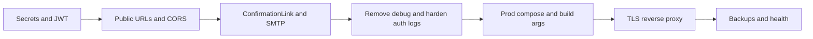

# Чеклист: MVP на VPS

Ниже — **полный список работ**, сгруппированный по областям. Он опирается на текущий код: [docker-compose.yml](docker-compose.yml), [AggregatorService/Program.cs](AggregatorService/Program.cs), [authorization-module/authorization-module.API/appsettings.json](authorization-module/authorization-module.API/appsettings.json), [VocabularyService/Services/SyncService.cs](VocabularyService/Services/SyncService.cs), [polyraspad-frontend/Dockerfile](polyraspad-frontend/Dockerfile).

---

## 1. Безопасность и секреты (блокер для VPS)

- **Убрать реальные секреты из репозитория.** В [authorization-module/authorization-module.API/appsettings.json](authorization-module/authorization-module.API/appsettings.json) сейчас лежат учётные данные почты и прочее — это нужно заменить на плейсхолдеры, а значения задавать **только через переменные окружения** или секрет-хранилище на VPS; при необходимости **ротировать скомпрометированные пароли SMTP**.
- **Сильный общий JWT-секрет.** [AggregatorService/appsettings.json](AggregatorService/appsettings.json) и модуль авторизации должны использовать **одинаковые** `Jwt:Secret`, `Jwt:Issuer`, `Jwt:Audience` (длинная случайная строка, не дефолт из репозра).
- **Не коммитить `.env` с прод-значениями.** Убедиться, что [polyraspad-frontend/.env](polyraspad-frontend/.env) не попадает в git (если уже закоммичен — убрать из истории/индекса и ротировать токены при необходимости).

---

## 2. Публичные URL, CORS и ссылки в письмах

- **Переменные для прод-доменов.** Минимум три канонических URL:
  - публичный **API (Aggregator)** — то, что попадёт в `NEXT_PUBLIC_API_URL` при **сборке** фронта;
  - публичный **фронт** — `NEXT_PUBLIC_APP_URL` / metadata;
  - публичный **MinIO (медиа)** — сейчас в compose зашито `http://localhost:9000/polyraspad-media` ([docker-compose.yml](docker-compose.yml) → `Storage__PublicBaseUrl`), из-за чего с VPS картинки **не откроются у пользователей**. Нужен URL вида `https://media.<домен>/polyraspad-media` или проксирование `/media` через тот же reverse proxy с правильным `Storage__PublicBaseUrl` / `Storage__ServerFetchBaseUrl` по роли (браузер vs сервер).
- **CORS Aggregator.** В [AggregatorService/Program.cs](AggregatorService/Program.cs) по умолчанию `http://localhost:3000`. Для VPS задать `Cors:AllowedOrigins` списком с **точным** origin фронта (HTTPS), без wildcard при `AllowCredentials`.
- **Ссылка подтверждения email.** [AuthService](authorization-module/authorization-module.API/Services/AuthService.cs) собирает URL из `ConfirmationLink`. Сейчас в [appsettings.Production.json](authorization-module/authorization-module.API/appsettings.Production.json) указан устаревший IP/порт, а в Development — прямой вызов модуля на `:5027` с путём `api/v1/...`, тогда как BFF даёт `**GET /api/Auth/confirm-email`** ([AuthController](AggregatorService/Controllers/AuthController.cs)). Нужно единое решение: `**ConfirmationLink`= публичный базовый URL Aggregator +`/api/Auth/confirm-email?userId\*\` (через env на VPS).

---

## 3. Правки кода под продакшен

- **Удалить отладочную запись в файл на диске** в [VocabularyService/Services/SyncService.cs](VocabularyService/Services/SyncService.cs) (блок `#region agent log` с `AppendAllText` на локальный Windows-путь) — на Linux VPS это бессмысленно или ломает контейнер/права.
- **authorization-module — логирование Authorization header и всегда включённый Swagger.** В [authorization-module.API/Program.cs](authorization-module/authorization-module.API/Program.cs) middleware логирует сырой заголовок авторизации (риск утечки токенов в логи); Swagger UI включён без проверки окружения. Для MVP на VPS: **отключить либо сильно понизить уровень**, Swagger — **только Development** или за закрытый VPN/BasicAuth.
- **Сообщение об ошибке на странице логина** в [polyraspad-frontend/src/app/auth/page.tsx](polyraspad-frontend/src/app/auth/page.tsx) жёстко ссылается на `localhost:5206` — заменить на нейтральное сообщение или подставлять `NEXT_PUBLIC_API_URL`.
- **HTTPS redirect без TLS в контейнере.** [VocabularyService/Program.cs](VocabularyService/Program.cs) и [AggregatorService/Program.cs](AggregatorService/Program.cs) вызывают `UseHttpsRedirection()`. За reverse proxy с TLS на краю часто используют `ForwardedHeaders` или отключают redirect во внутреннем HTTP — проверить поведение и зафиксировать в конфиге (иначе возможны редирект-петли или 307 на неправильный хост).

---

## 4. Docker / Compose для VPS

- **Отдельный прод-профиль или override-файл** (например `docker-compose.prod.yml`): вынести пароли Postgres/MinIO/JWT/почту в `.env` на сервере; не пробрасывать наружу внутренние порты (Redis, gRPC vocabulary), если не нужны; при желании **не публиковать** порты PostgreSQL/MinIO наружу, оставить только 80/443 через proxy.
- **Сборка фронта с правильными ARG:** [polyraspad-frontend/Dockerfile](polyraspad-frontend/Dockerfile) вшивает `NEXT_PUBLIC_` на этапе `npm run build` — на VPS пайплайн сборки **обязан** передавать реальные `NEXT_PUBLIC_API_URL` и `NEXT_PUBLIC_APP_URL`; иначе клиент будет билдиться с localhost.
- **Ollama:** в compose поднят тяжёлый сервис; для узкого MVP «только учёба + карточки» можно **отключить** или вынести в опциональный профиль; выставить `Ollama__Enabled=false` в Aggregator, если копилот не нужен, чтобы не ждать таймаутов.
- **Ресурс VPS:** оценить RAM/CPU под Postgres + Redis + 4 .NET сервиса + inclusive + Next + (опционально) Ollama; при нехватке — убрать Ollama/снизить параллелизм.

---

## 5. Reverse proxy и TLS

- **Nginx или Caddy** на хосте: HTTPS (Let’s Encrypt), проксирование:
  - `https://app.example.com` → контейнер фронта `3000`;
  - `https://api.example.com` → Aggregator `5206` (внутренний порт контейнера согласовать с `ASPNETCORE_URLS`);
  - при необходимости поддомен или путь для MinIO с **правильными** заголовками и CORS для медиа.
- Зафиксировать в документации **один** рекомендуемый вариант (два поддомена vs path-based), чтобы не путать `PublicBaseUrl`.

---

## 6. База данных и миграции

- **VocabularyService:** на старте вызывается `Database.Migrate()` ([Program.cs](VocabularyService/Program.cs)) — ок для первого деплоя; на проде обычно дополняют **резервным планом** (бэкап перед миграцией).
- **authorization-module:** используется `EnsureCreated` в [DataContext](authorization-module/authorization-module.API/Data/DataContext.cs) — для долгосрочного MVP лучше **перейти на те же EF Migrations**, что и vocabulary, чтобы схема не расходилась; как минимум зафиксировать процедуру «первый деплой / обновление».
- **Инициализация БД:** [docker/postgres/init/01-create-dbs.sql](docker/postgres/init/01-create-dbs.sql) создаёт `auth-module` и `vocabulary_service` — убедиться, что connection strings на VPS совпадают.

---

## 7. Наблюдаемость и эксплуатация

- Добавить (хотя бы минимально): **health-check эндпоинты** или использование `docker compose` healthcheck для Aggregator; простые **бэкапы Postgres** (cron + `pg_dump`), описание в README.
- Логи: не писать PII/токены; ротация логов Docker.

---

## 8. CI/CD и репозиторий

- [.github/workflows/ci.yml](.github/workflows/ci.yml): билд/тесты есть; **деплоя на VPS нет** — добавить по выбору: SSH + `docker compose pull/up`, или registry + watchtower, или отдельный скрипт.
- Клонирование: фронт — **submodule**; на VPS/CI везде `git clone --recursive`.

---

## 9. Продуктовый scope MVP (что можно не делать в первой итерации)

Отложить без блокировки «учёба + колоды + карточки + FSRS»:

- импорт `.apkg` (в Docs как будущее; в коде есть только bulk JSON, лимит 100);
- маркетплейс/подписки, если не нужны для первых пользователей;
- полноценный офлайн sync (SR-SNC) — по необходимости после стабилизации веб-MVP;
- расширенный NLP ([TextService.cs](VocabularyService/Services/TextService.cs) помечен TODO по лемматизации).

---

## 10. Рекомендуемый порядок прохождения списка

---

## Итог

**Критический минимум перед открытием VPS:** п.1–3 (секреты, URL, CORS, ссылка в письме, удаление debug в `SyncService`, смягчение логов/Swagger auth). **Без п.2 (особенно `Storage__PublicBaseUrl` и rebuild фронта)** медиа и клиент API будут вести себя некорректно. Остальное — надёжность, удобство сопровождения и сужение scope MVP.
