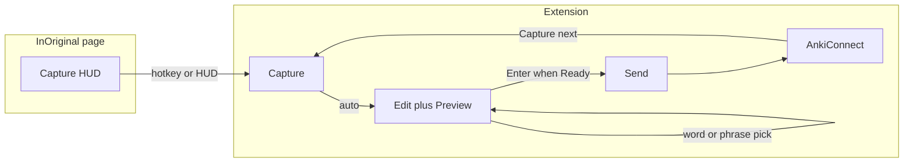

# Sentence mining improvements — full roadmap

## Current baseline (already shipped)

- 3-step side panel: Capture → Edit → Send ([`CaptureApp.tsx`](inoriginal-capture-extension/src/ui/CaptureApp.tsx))
- Persistent **Final Preview** on Edit + Send tabs
- Smart footer CTA via [`buildCardQuality`](inoriginal-capture-extension/src/ui/CaptureApp.tsx)
- Word click → dictionary fill ([`chooseWordFromExpression`](inoriginal-capture-extension/src/ui/CaptureApp.tsx))
- Quality presets in Options including **Fast capture** ([`options.tsx`](inoriginal-capture-extension/src/ui/options.tsx) lines 12–20)
- Hotkey `capture-subtitle-clip` opens side panel ([`background.js`](inoriginal-capture-extension/background.js) lines 64–66)
- Auto-trim **range** already applied silently on waveform analysis (CaptureApp `useEffect` ~193–197); UI still exposes full editor by default

## Target mining loop

---

## Phase 1 — Loop speed (highest ROI)

### 1.1 Capture next (one action after send)

**Problem:** [`makeAnother`](inoriginal-capture-extension/src/ui/CaptureApp.tsx) only calls `clearCapture()` — user must click Capture again.

**Change:**

- Add `captureNext()` = `await clearCapture()` then `await captureSubtitleClip()` + stay on Capture tab (or auto-land Edit after `review-ready` as today).
- Footer post-send row: replace **Make another** with **Capture next** (keep **Undo** / **Open in Anki**).
- Optional secondary **Clear only** in overflow if needed (Discard draft already exists).

**Files:** [`CaptureApp.tsx`](inoriginal-capture-extension/src/ui/CaptureApp.tsx), [`styles.css`](inoriginal-capture-extension/styles.css)

### 1.2 Popup parity with hotkey

**Problem:** Background hotkey opens side panel after capture; popup [`onCapture`](inoriginal-capture-extension/src/ui/studio/PopupLauncher.tsx) does not.

**Change:** After successful `captureSubtitleClip()` in popup mode, call existing `openSidePanel()` (same as [`openSidePanelForActiveWindow`](inoriginal-capture-extension/background.js) behavior).

**Files:** [`CaptureApp.tsx`](inoriginal-capture-extension/src/ui/CaptureApp.tsx) (`captureSubtitleClip` success path when `mode === "popup"`)

### 1.3 Keyboard shortcuts in side panel

Add `useEffect` keydown handler in CaptureApp (ignore when focus in textarea/input):

| Key                | Action                                                                    |
| ------------------ | ------------------------------------------------------------------------- |
| `Enter` (no Shift) | `runSmartAction(cardQuality.nextAction)` if not recording and CTA enabled |
| `Escape`           | Cancel capture while recording; close overflow menu otherwise             |
| `1` / `2` / `3`    | Switch Capture / Edit / Send tabs                                         |

Show hint line in sticky footer: `Enter · send/next step`.

**Files:** [`CaptureApp.tsx`](inoriginal-capture-extension/src/ui/CaptureApp.tsx), [`styles.css`](inoriginal-capture-extension/styles.css)

### 1.4 Fast miner discoverability

**Problem:** Fast capture preset exists but is buried in Options.

**Change:**

- Rename preset label to **Fast miner** (keep same rules: no required word/definition/translation).
- Add one-line link on Edit tab footer: “Using Balanced mining · switch to Fast miner in Settings”.
- Optional: default new installs to Fast miner (bump `settingsVersion` in [`background.js`](inoriginal-capture-extension/background.js) defaults only for fresh storage).

**Files:** [`options.tsx`](inoriginal-capture-extension/src/ui/options.tsx), [`CaptureApp.tsx`](inoriginal-capture-extension/src/ui/CaptureApp.tsx)

---

## Phase 2 — Edit/Send simplification

### 2.1 Compact Edit layout

Move mining controls closer to preview (user’s stated priority):

- Render **WordPicker** directly under [`StudioCardPreview`](inoriginal-capture-extension/src/ui/CaptureApp.tsx) (above expression textarea).
- Single-line **Translation** field under WordPicker; keep Definition in collapsed **Advanced fields** unless word pick filled it.
- Expression textarea: 2 rows default, labeled “Sentence (editable)”.

**Files:** [`CaptureApp.tsx`](inoriginal-capture-extension/src/ui/CaptureApp.tsx), [`styles.css`](inoriginal-capture-extension/styles.css)

### 2.2 Audio UI: show only when broken

**Problem:** Waveform/range editor visible on every good capture.

**Change:**

- Add setting `showAudioTools: "on-error" | "always"` (default `on-error`) to [`AnkiSettings`](inoriginal-capture-extension/src/shared/types.ts).
- Show [`range-editor`](inoriginal-capture-extension/src/ui/CaptureApp.tsx) block only when `blockingAudioIssue`, `audioTooShort`, `audioTooLong`, or user toggles “Adjust audio”.
- When trim applied and no errors: one-line status “Audio OK · N.Ns”.

Existing silent range apply (analysis `useEffect`) stays; optional setting `autoApplyTrim: boolean` (default true) documents current behavior.

**Files:** [`types.ts`](inoriginal-capture-extension/src/shared/types.ts), [`options.tsx`](inoriginal-capture-extension/src/ui/options.tsx), [`CaptureApp.tsx`](inoriginal-capture-extension/src/ui/CaptureApp.tsx), [`background.js`](inoriginal-capture-extension/background.js) (defaults merge)

### 2.3 Reduce Send tab duplication

- Remove standalone [`Checklist`](inoriginal-capture-extension/src/ui/CaptureApp.tsx) from Send tab (quality panel + footer CTA already cover it).
- Move deck/note type selectors into preview header chip row (compact toolbar under `CardPreview` deck/model span) OR keep on Send but collapse quality panel when status is Ready.
- Auto-switch to **Send** tab once when `cardQuality.status === "Ready"` and user has not manually changed tabs this session (track `userPickedStep` ref; don’t fight manual tab clicks).

**Files:** [`CaptureApp.tsx`](inoriginal-capture-extension/src/ui/CaptureApp.tsx)

---

## Phase 3 — Phrase mining

### 3.1 Range selection in WordPicker

**Interaction:**

- First word click = anchor token index.
- Shift+click second word = select inclusive range; highlight all tokens in range.
- Click without Shift on new word = single-word pick (current behavior).
- Escape clears selection.

**Data:**

- `word` field = joined phrase with spaces (`"take off"`), matching LingQ term-first model (exact form, not lemma).
- `chooseWordFromExpression` extended to accept `string | string[]`; join with space for phrase.

### 3.2 Dictionary lookup for phrases

[`lookupWord`](inoriginal-capture-extension/background.js) is single-token. For phrases:

1. Try lookup on full normalized phrase.
2. Fallback: lookup first content word only; set `word` to full phrase text; fill definition from fallback with prefix `"Phrase: take off"`.
3. If lookup fails: set word phrase only; message “Phrase saved — add definition manually or pick a single word.”

**Files:** [`CaptureApp.tsx`](inoriginal-capture-extension/src/ui/CaptureApp.tsx) (`WordPicker`, `chooseWordFromExpression`), [`background.js`](inoriginal-capture-extension/background.js) (`lookupWord`), [`styles.css`](inoriginal-capture-extension/styles.css) (`.word-token--range`)

---

## Phase 4 — Duplicates

**Current:** [`findDuplicateExpression`](inoriginal-capture-extension/background.js) returns `{ count, noteIds }`; UI only shows text warning ([`warnIfDuplicateExpression`](inoriginal-capture-extension/src/ui/CaptureApp.tsx)).

**Changes:**

- Add `duplicatePolicy: "warn" | "block" | "ignore"` to settings (default `warn`).
- Warning banner lists up to 3 note IDs as **Open in Anki** buttons via existing `open-anki-note` message.
- `block`: disable Send until user opens existing note or explicitly “Send anyway”.
- `ignore`: skip duplicate query on send.

**Files:** [`types.ts`](inoriginal-capture-extension/src/shared/types.ts), [`options.tsx`](inoriginal-capture-extension/src/ui/options.tsx), [`CaptureApp.tsx`](inoriginal-capture-extension/src/ui/CaptureApp.tsx), [`background.js`](inoriginal-capture-extension/background.js)

---

## Phase 5 — In-page Capture HUD

Minimal overlay on `inoriginal.cc` without opening side panel for every card.

**Implementation in [`content.js`](inoriginal-capture-extension/content.js):**

- Inject fixed bottom-right panel (shadow DOM or isolated div): status pill, current subtitle one-liner, **Capture** button.
- Listen for capture state via existing storage/events or new `get-capture-hud-state` message from background.
- Capture button → `chrome.runtime.sendMessage({ type: "capture-subtitle-clip" })` (same as hotkey).
- Setting `hudEnabled: boolean` in Options (default on for inoriginal.cc).

**Files:** [`content.js`](inoriginal-capture-extension/content.js), [`background.js`](inoriginal-capture-extension/background.js), [`options.tsx`](inoriginal-capture-extension/src/ui/options.tsx), new [`styles` block in content or shared CSS injected]

---

## Phase 6 — Onboarding and post-send feedback

### 6.1 Setup wizard

When AnkiConnect ping fails OR deck/mapping empty, show banner in side panel + Options:

1. Test AnkiConnect
2. Pick deck + note type
3. Auto-suggest field mapping from model fields
4. **Send test card** (create + immediate undo)

Store `onboardingComplete` in settings after successful test.

**Files:** [`options.tsx`](inoriginal-capture-extension/src/ui/options.tsx), [`CaptureApp.tsx`](inoriginal-capture-extension/src/ui/CaptureApp.tsx), [`background.js`](inoriginal-capture-extension/background.js) (new `send-test-card` message)

### 6.2 Notifications when panel closed

After [`createAnkiCardFromActiveTab`](inoriginal-capture-extension/background.js) succeeds:

- `chrome.notifications.create` (add `notifications` permission to [`manifest.json`](inoriginal-capture-extension/manifest.json)) with note ID + **Undo** action (10s window, reuse `undo-last-anki-card`).
- Set extension badge `✓` for 3s.

**Files:** [`manifest.json`](inoriginal-capture-extension/manifest.json), [`background.js`](inoriginal-capture-extension/background.js)

---

## Testing checklist (per phase)

| Phase | Manual verify                                                                             |
| ----- | ----------------------------------------------------------------------------------------- |
| 1     | Capture next clears and starts new clip; popup opens side panel; Enter triggers smart CTA |
| 2     | Good audio hides waveform; Edit shows word picker under preview                           |
| 3     | Shift+click selects “take off”; word field stores phrase                                  |
| 4     | Duplicate shows Open links; block policy prevents send                                    |
| 5     | HUD captures without opening panel                                                        |
| 6     | Wizard completes; hotkey send shows notification + undo                                   |

Run `npm run build` from [`inoriginal-capture-extension/`](inoriginal-capture-extension/) after each phase; reload `dist/`.

---

## Suggested implementation order

Ship in order **1 → 2 → 3 → 4 → 5 → 6** — each phase is independently useful. Phase 1–2 are small UI changes; Phase 3 touches WordPicker + lookup; Phase 5 is the largest new surface (content overlay).

Optional follow-up (out of scope): word-level translation gloss, compact preview toggle, sync mined terms to Polyraspad VocabularyService.
