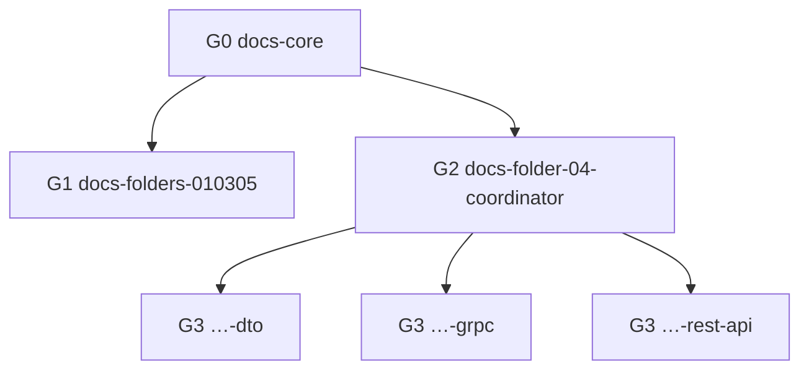

# Cursor Rules — naming convention (microservice documentation)

Все правила генерации markdown-документации микросервисов используют префикс **`docs-`**.

## Паттерн имени файла

```
docs-{scope}[-{section}].mdc
```

| Часть | Значение | Пример |
| :--- | :--- | :--- |
| `docs-` | фиксированный префикс репозитория | — |
| `{scope}` | область: `core`, `folders-010305`, `folder-04-coordinator`, `folder-04-{section}` | `folder-04-grpc` |
| `{section}` | slug подпапки 04 (kebab-case, англ.) | `dto`, `rest-api`, `rabbitmq` |

**Frontmatter `description`:** `[G{n} · …]` — группа для сортировки в rule picker Cursor.

## Группы

### G0 — Core (alwaysApply)

| Файл | glob | Назначение |
| :--- | :--- | :--- |
| [`docs-core.mdc`](docs-core.mdc) | `alwaysApply: true` | Порядок `03→01→02→04`, BFF, anti-hallucination, staging |

### G1 — Папки 01, 02, 03, 05

| Файл | glob | Назначение |
| :--- | :--- | :--- |
| [`docs-folders-010305.mdc`](docs-folders-010305.mdc) | `01/`, `02/`, `03/`, `05/` | SR-блоки, КАР, TOC, Obsidian |
| [`docs-staging-0103.mdc`](docs-staging-0103.mdc) | **`01/` + `03/` only** | **ОБЯЗАТЕЛЬНО:** сверка 01↔03 → запись ISSUE в `99` на диск |
| [`docs-staging-issues.mdc`](docs-staging-issues.mdc) | **`99 - Staging …/`** | Стиль ISSUE: язык для человека, якорь SR/entity/RPC |

### G2 — Папка 04, координатор

| Файл | glob | Назначение |
| :--- | :--- | :--- |
| [`docs-folder-04-coordinator.mdc`](docs-folder-04-coordinator.mdc) | `04 - Бекенд, API и Контракты/**` | Дерево, Contract Layers, alignment, consistency, skills |

Координатор **без slug подпапки** — суффикс `-coordinator`, не `-backend-api`.

### G3 — Папка 04, подпапки (block templates)

Срабатывают **дополнительно** к G2 при открытии файла в соответствующей подпапке.

| Файл | Подпапка 04 | Block template |
| :--- | :--- | :--- |
| [`docs-folder-04-dto.mdc`](docs-folder-04-dto.mdc) | `Методы API/DTO/` | DTO, `#dto-*` |
| [`docs-folder-04-grpc.mdc`](docs-folder-04-grpc.mdc) | `Методы API/gRPC/` + `.proto` | RPC, proto, `#grpc-*` |
| [`docs-folder-04-rest-api.mdc`](docs-folder-04-rest-api.mdc) | `Методы API/REST API/` | REST endpoint |
| [`docs-folder-04-socket.mdc`](docs-folder-04-socket.mdc) | `Методы API/Socket/` | WebSocket event |
| [`docs-folder-04-integrations.mdc`](docs-folder-04-integrations.mdc) | `Интеграции со сторонними сервисами/` | HTTP/gRPC outward |
| [`docs-folder-04-rabbitmq.mdc`](docs-folder-04-rabbitmq.mdc) | `Работа с Rabbit MQ/` | RabbitMQ message |
| [`docs-folder-04-redis.mdc`](docs-folder-04-redis.mdc) | `Работа с Redis/` | Redis operation |
| [`docs-folder-04-algorithms.mdc`](docs-folder-04-algorithms.mdc) | `Алгоритмы и методы бекенда/` | Algorithm |



## Правила добавления нового rule

1. Выбрать группу **G0–G3**; для новой подпапки 04 — **G3**, slug = kebab-case от имени папки.
2. Имя: `docs-folder-04-{slug}.mdc` (или `docs-folders-…` для других папок документации).
3. `description`: `[G{n} · …] краткое назначение`.
4. `globs`: полный путь от корня сервиса, как в эталоне Auth.
5. Обновить таблицу в [`AGENTS.md`](../../AGENTS.md) и при необходимости G2 coordinator (таблица Specialized Rules).

## Skills (workflow 04)

Пакетная генерация `04` — [`.cursor/skills/README.md`](../skills/README.md). Block templates **не** дублировать в skills.

## Вне группы правил документации

Прочие `.mdc` в этой папке (billing, clockwork и т.д.) **не** используют префикс `docs-` и не входят в G0–G3.
