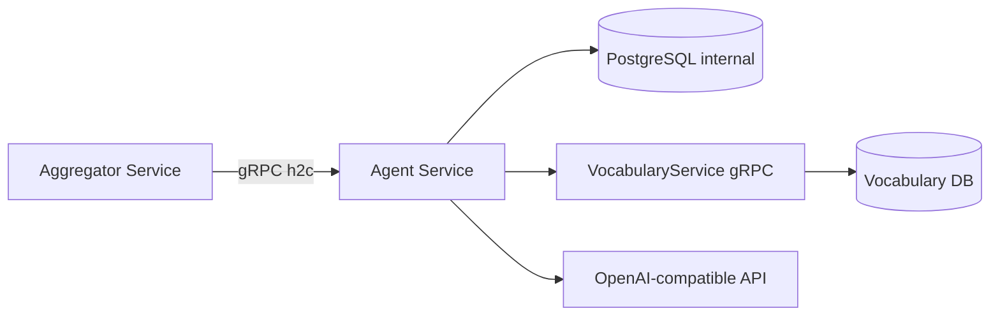

# Обзор высокого уровня

**Agent Service** — gRPC-микросервис AI-ассистента PolyGuide (.NET 10, port **5131**). Хранит threads/messages/runs в **PostgreSQL** (schema `internal`), оркестрирует language-learning tools и делегирует project/analytics/AI-mining в **VocabularyService**.

Ключевые паттерны:

- **gRPC-only server:** нет REST controllers; клиент — Aggregator Service
- **ExecuteRun pipeline:** domain classify → intent route → tool → atomic persist
- **Term-first responses:** sanitize lemma labels; exact surface forms in prompts
- **Project-scoped isolation:** Vocabulary ContentService gate + user_id ownership

# 1. Назначение документа

## 1.1 Цель документа

Объяснить архитектуру Agent Service: слои, интеграции, КАР и границы ответственности для backend и DevOps.

# 2. Внутренняя структура и компоненты

* **gRPC Layer:** `AgentGrpcService` — validation (FluentValidation), mapping (AutoMapper), error → RpcException.
* **Thread Service:** `AgentThreadService` — CRUD threads/messages/runs/artifacts; EF Core transactions.
* **Orchestrator:** `AgentOrchestrator` — ExecuteRun tool dispatch, LLM + Vocabulary calls.
* **Routing & Policy:** `AgentIntentRouter`, `AgentDomainPolicy` — regex classification.
* **Integration Clients:** `VocabularyProjectAccessValidator`, `VocabularyGrpcClient` — gRPC to VocabularyService.
* **LLM Provider:** `OpenAiCompatibleAgentLlmProvider` — HttpClient to OpenAI-compatible API.
* **Data:** `AgentServiceContext` — Npgsql, schema `internal`.

# 3. Ключевые архитектурные решения (КАР)

| КАР | Краткое описание |
| :--- | :--- |
| [[02 - КАР-1 - gRPC-only микросервис и project scope]] | Только gRPC; threads привязаны к project; access через Vocabulary. |
| [[02 - КАР-2 - ExecuteRun orchestration pipeline]] | Classify → route → tool → CreateRun transaction. |
| [[02 - КАР-3 - Domain policy gate для LLM tools]] | Out-of-scope блок до LLM; refusal templates. |
| [[02 - КАР-4 - Regex intent router]] | Predictable tool selection без ML. |
| [[02 - КАР-5 - Term-first LLM и Vocabulary delegation]] | Exact forms; grammar/examples via Vocabulary AIService. |

## Topology

| Integration | Client | Methods used |
| :--- | :--- | :--- |
| Vocabulary Content | `ContentServiceClient` | GetProjectDetails |
| Vocabulary Analytics | `AnalyticsServiceClient` | GetVocabularyStats, GetDailySummary |
| Vocabulary AI | `AIServiceClient` | ExplainGrammar, GenerateContext |
| LLM | HttpClient | chat/completions |

Public REST для agent UI: **Aggregator** `AgentController` → gRPC `AgentService` (см. Aggregator docs SR-AGG-AGENT-01).
