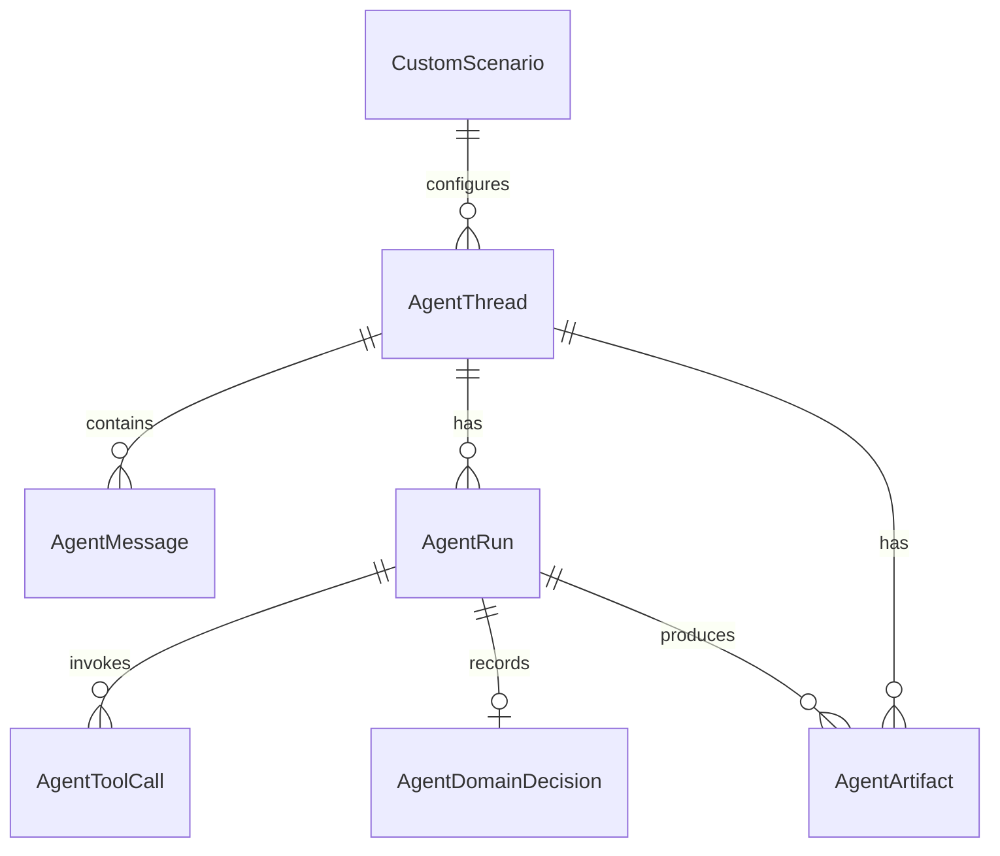

# Введение

**Agent Service** владеет персистентной моделью AI-диалогов в PostgreSQL (schema **`internal`**). Все сущности привязаны к паре **user + project** и изолированы по `user_id` на уровне запросов.

## Группы сущностей

| Группа | Сущности | Файл |
| :--- | :--- | :--- |
| Треды и сообщения | `AgentThread`, `AgentMessage` | [[Entity - Треды и сообщения - Threads Messages]] |
| Запуски и аудит | `AgentRun`, `AgentToolCall`, `AgentDomainDecision` | [[Entity - Запуски и аудит - Runs Audit]] |
| Артефакты | `AgentArtifact` | [[Entity - Артефакты - Artifacts]] |
| Кастомные сценарии | `CustomScenario` | [[Entity - Кастомные Сценарии - Custom Scenarios]] |

## Связи (обзор)

## Индексы и ограничения

| Таблица | Индекс / ограничение | Назначение |
| :--- | :--- | :--- |
| `agent_threads` | `(user_id, project_id, updated_at DESC)` | Список тредов пользователя в проекте |
| `agent_threads` | `custom_scenario_id` (FK index) | Optional link to `custom_scenarios` |
| `agent_messages` | `(thread_id, created_at)` | Пагинация истории |
| `agent_runs` | `(thread_id)` | Запуски по треду |
| `agent_tool_calls` | `(run_id, created_at)` | Tool calls run |
| `agent_domain_decisions` | `(run_id)` UNIQUE | Одно решение на run |
| `agent_artifacts` | `(thread_id, created_at)` | Артефакты треда |
| `custom_scenarios` | `(user_id, created_at)` | Сценарии пользователя |

Миграции: `AgentService/Migrations/`; применяются при старте контейнера (`db.Database.Migrate()`).
