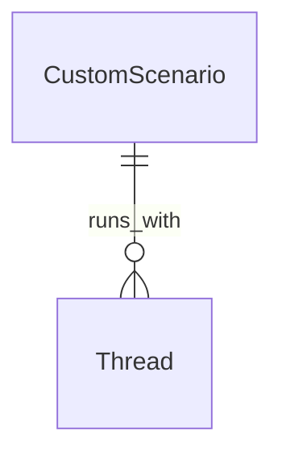

# Группа 4: Кастомные Сценарии (Custom Scenarios)

Этот раздел описывает сущности ИИ-сценариев для интерактивных ролевых игр и симуляций диалогов в `Agent Service`.

---

## 1. CustomScenario

`CustomScenario` — пользовательский или системный шаблон диалогового сценария для проведения ролевых игр с ИИ-тьютором.

**Поля:**
- `Id` (Guid, PK)
- `UserId` (Guid?) — автор сценария. Если NULL — сценарий является глобальным/системным.
- `Title` (string) — название сценария (например, "В аэропорту").
- `Description` (string?) — краткое описание ситуации.
- `TargetSkill` (string) — целевой навык для тренировки (по умолчанию `"Speaking"`).
- `SystemPromptTemplate` (string) — системный prompt для ИИ, задающий роль, правила поведения и цели общения.
- `Difficulty` (string) — сложность по шкале CEFR (A1..C2).
- `Goals` (List<string> / JSONB) — список целей, которые пользователь должен достичь для завершения диалога.
- `ContextConfiguration` (JSONB?) — дополнительные настройки окружения (например, тональность ответов, режим подсказок).
- `CreatedAt` (DateTime)
- `UpdatedAt` (DateTime)

---

## Связи сущностей сценариев

