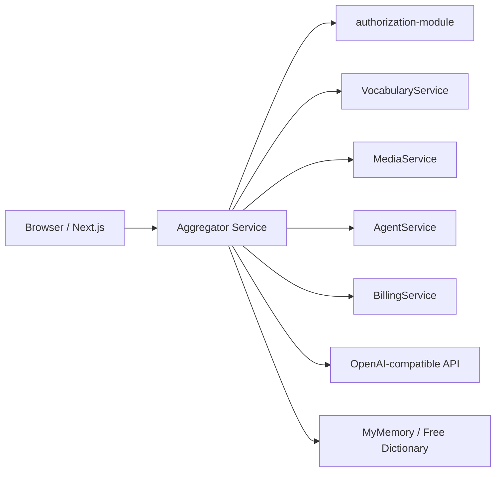

# Обзор высокого уровня

**Aggregator Service** — публичный **Backend-for-Frontend (BFF)** и **API Gateway** платформы Polyraspad. Единственная точка входа REST-трафика от `polyraspad-frontend` и внешних клиентов (`api.polyraspad.online`).

Сервис **stateless**: не хранит доменные данные, не подключается к PostgreSQL, Redis или RabbitMQ. Вся бизнес-логика делегируется downstream-микросервисам по **gRPC over h2c** (plaintext HTTP/2 внутри Docker-сети).

Ключевые паттерны:

- **Thin BFF:** parse HTTP → map DTO → gRPC call → map response → JSON
- **Local JWT validation:** токены выданы `authorization-module`; шлюз проверяет подпись без вызова auth на каждый запрос
- **Identity propagation:** `user_id` и `roles` передаются в gRPC metadata
- **Dual auth:** JWT для пользовательских маршрутов; shared secrets для AI proxy и billing webhooks

# 1. Назначение документа

## 1.1 Цель документа

Объяснить архитектуру Aggregator Service: слои, интеграции, КАР и ограничения BFF для разработчиков frontend/backend и DevOps.

# 2. Внутренняя структура и компоненты

* **REST API Layer:** ASP.NET Core controllers (`api/*`). JWT `[Authorize]`, rate limit, CORS.
* **Mapping Layer:** AutoMapper, `MappingHelper`, domain mappers (`TermGrpcMapper`, `ReaderTextMapper`).
* **gRPC Client Layer:** typed clients к Auth, Vocabulary (8 services), Media, Agent, Billing.
* **Edge Services (на BFF):** `OpenAiChatCompletionClient`, `TtsAudioService`, `DocumentTextExtractor`, HTTP proxy для media URLs.
* **Cross-cutting:** JWT Bearer middleware, `AiProxyApiKeyFilter`, production config guard, Swagger (dev).

# 3. Ключевые архитектурные решения (КАР)

| КАР | Краткое описание |
| :--- | :--- |
| [[02 - КАР-1 - Thin BFF и REST-to-gRPC маршрутизация]] | Делегирование домена downstream; BFF только трансляция контрактов. |
| [[02 - КАР-2 - Локальная валидация JWT]] | Symmetric key shared с authorization-module. |
| [[02 - КАР-3 - Двойная модель аутентификации]] | JWT vs `X-Ai-Proxy-Key` / `X-Billing-Webhook-Key`. |
| [[02 - КАР-4 - HTTP-прокси медиа]] | serve-image/serve-document для CORS и Bearer. |
| [[02 - КАР-5 - Rate Limiting публичной аутентификации]] | Fixed window 10/min/IP на auth-public. |
| [[02 - КАР-6 - Production Configuration Guard]] | Fail-fast при placeholder secrets в non-Development. |

## Downstream topology

| Backend | Config key | gRPC / HTTP |
| :--- | :--- | :--- |
| authorization-module | `AuthorizationModuleBaseUrl` | `AuthService` |
| VocabularyService | `VocabularyServiceBaseUrl` | Content, Card, Term, Text, Study, Analytics, Community, Subscription |
| MediaService | `MediaServiceBaseUrl` | `MediaService` |
| AgentService | `AgentServiceBaseUrl` | `AgentService` |
| BillingService | `BillingServiceBaseUrl` | `BillingService` |
| LLM provider | `Ai:BaseUrl`, `Ai:ApiKey` | HTTPS |
| TTS | `Ai:TtsProvider` | OpenAI / Mistral / espeak |
