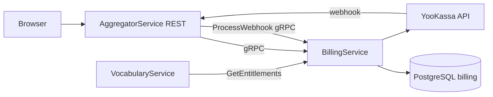

# Обзор высокого уровня

**Billing Service** — микросервис **SaaS-биллинга** Polyraspad. Владеет PostgreSQL schema `billing`, каталогом планов, подписками, entitlements projection и webhook processing.

**Не** обрабатывает deck subscriptions/marketplace — это `VocabularyService`.

Ключевые паттерны:

- **Provider-agnostic core** — `IPaymentProvider` adapters
- **gRPC-only API** — REST через Aggregator BFF
- **LocallyManaged renewal** — RenewalWorker для ЮKassa
- **Free plan fallback** — default entitlements без paid subscription
- **Webhook idempotency** — `processed_webhooks`

# 1. Назначение документа

## 1.1 Цель документа

Объяснить архитектуру Billing Service: слои, интеграции, КАР и границы с Aggregator/Vocabulary.

# 2. Внутренняя структура и компоненты

* **gRPC Layer:** `BillingGrpcService` — thin mapping to domain services.
* **Domain Services:** `AccessService`, `EntitlementService`, `SubscriptionService`, `InvoiceService`, `WebhookOrchestrator`.
* **Providers:** `YooKassaPaymentProvider`, `MockPaymentProvider`, `PaymentProviderFactory`.
* **Background:** `RenewalWorker` (LocallyManaged only).
* **Data:** EF Core `BillingServiceContext`, migrations, seed plans.
* **Cross-cutting:** health checks, options pattern (`BillingOptions`).

# 3. Ключевые архитектурные решения (КАР)

| КАР | Краткое описание |
| :--- | :--- |
| [[02 - КАР-1 - Provider-agnostic ядро]] | Домен не зависит от ЮKassa/Stripe. |
| [[02 - КАР-2 - LocallyManaged vs ProviderManaged]] | Два режима renewal подписок. |
| [[02 - КАР-3 - Нормализованные webhook-события]] | Adapter → DomainEvent → Orchestrator. |
| [[02 - КАР-4 - Free plan fallback]] | Access/entitlements без paid row. |
| [[02 - КАР-5 - gRPC-only perimeter]] | REST BFF на Aggregator; Billing internal. |

## Topology

| Consumer | RPC / path |
| :--- | :--- |
| AggregatorService | All user billing REST → gRPC |
| VocabularyService | `GetEntitlements` (limits) |
| ЮKassa | Webhook → Aggregator → `ProcessWebhook` |
