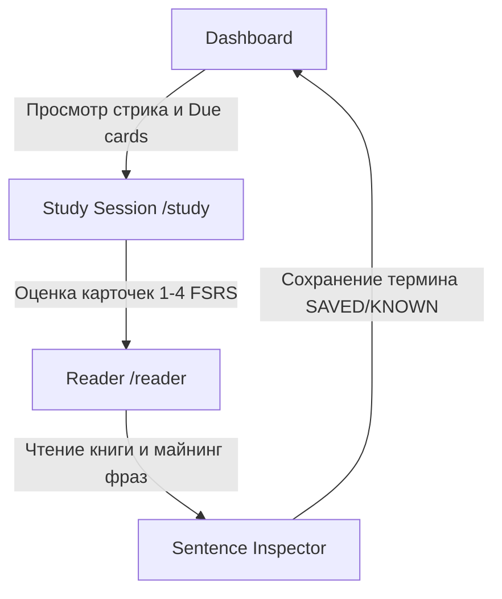

# User Flows (UX-Сценарии Пользователя)

Настоящий документ описывает ключевые пользовательские пути (User Journeys) в приложении Polyraspad.

---

## 1. Onboarding Flow (Первичная настройка и создание проекта)

Этот сценарий описывает путь нового пользователя от регистрации до создания первого словаря.

* **Шаг 1: Авторизация**
  * Пользователь проходит регистрацию / вход на `/auth/login` или `/auth/register`.
  * После подтверждения email или OAuth входа создается JWT-сессия в `AuthContext`.
* **Шаг 2: Создание первого языкового Проекта**
  * При отсутствии активных проектов модальное окно перенаправляет на создание `Project`.
  * Пользователь выбирает родной язык (`SourceLang`, например "ru") и изучаемый язык (`TargetLang`, например "en").
* **Шаг 3: Выбор первоначальной стратегии**
  * На выбор предлагается: добавить книгу в Library, выбрать готовый CEFR-курс в Lessons или скачать публичную колоду из Marketplace.

---

## 2. Daily Learning Routine (Ежедневный сценарий)

Типичный ежедневный цикл активного пользователя (LingQ + Anki FSRS подход).

* **Шаг 1: Dashboard (`/dashboard`)**
  * Просмотр активности: стрик (Streak), дневные нормы New/Review, активный проект.
  * Нажатие кнопки **"Start Study Session"**.
* **Шаг 2: FSRS Повторение (`/study`)**
  * Отображается лицевая сторона карточки.
  * Пользователь вспоминает значение/контекст флипает карточку (`Space` / клик).
  * Нажимает кнопку ответа: **Again (1)**, **Hard (2)**, **Good (3)**, **Easy (4)**. При ошибке возможен откат (`UndoReview`).
* **Шаг 3: Чтение и Майнинг (`/reader`)**
  * Переход в читальный зал. Выбор книги из Library.
  * Слова подсвечиваются по статусам:
    - **Синий (NEW):** Новое незнакомое слово.
    - **Желтый (SAVED / LINGQ):** Изучаемое слово.
    - **Белый / Прозрачный (KNOWN):** Известное выученное слово.
    - **Приглушенный (IGNORED):** Игнорируемое слово (имена, бренды).
  * При клике на слово в правом боковом Inspector открывается перевод, аудио (TTS), грамматика от AI и кнопка добавления заметки ("Mine Sentence").
  * При листании страницы все оставшиеся синие слова автоматически помечаются выученными (`KNOWN`), если включена соответствующая настройка.

---

## 3. AI Tutoring & Curriculum Flow (Обучение по урокам)

Сценарий прохождения интерактивного курса с участием AI-ассистента.

* **Шаг 1: Обзор Учебного Плана (`/lessons`)**
  * Пользователь видит карту уроков, разблокированных по уровням CEFR (A1 -> C2).
  * Первично можно пройти **Placement Test** (`SetPlacementLevel`), чтобы автоматически зачесть базовые уроки.
* **Шаг 2: Прохождение Урока**
  * При нажатии "Start Lesson" создается запись прогресса и генерируется `AgentThreadId`.
  * Чат-интерфейс урока позволяет общаться с AI-репетитором, выполняющим инструкции из `SystemPrompt` урока.
* **Шаг 3: Проверка Знаний и Фиксация**
  * По завершении урока вычисляется процент успеваемости (`ScorePercent`), урок переводится в статус `Completed`, открывая следующий урок в цепочке.
