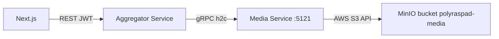

# Обзор высокого уровня

**Media Service** — внутренний **gRPC-only** микросервис для **object storage** (MinIO/S3) и **метаданных Reader Library**. Порт **5121**, HTTP/2 (h2c в Docker).

Сервис **не** является BFF: нет JWT middleware, нет REST controllers для домена (кроме `/healthz`). Клиенты — **AggregatorService** (primary) и потенциально другие internal gRPC callers.

Ключевые паттерны:

- **S3 as sole persistence** — бинарные ключи + JSON индексы
- **Identity via gRPC metadata** — `user_id` от gateway
- **Dual URL model** — public base URL vs server-fetch base URL
- **Fat gRPC messages** — до 1 GB receive для large documents

# 1. Назначение документа

## 1.1 Цель документа

Объяснить архитектуру Media Service: компоненты, КАР, интеграции с MinIO и Aggregator для backend/DevOps.

# 2. Внутренняя структура и компоненты

* **MediaGrpcService:** gRPC handlers, validation, mapping proto ↔ records.
* **S3MediaStorageService:** AWS SDK S3 client → MinIO; PutObject, GetObject, ListObjectsV2.
* **StorageOptions:** endpoint, bucket, credentials, URL bases, presigned TTL.
* **Kestrel:** listen 5121, Http2 only for gRPC.
* **Health:** `MapGet("/healthz")` minimal liveness.

# 3. Ключевые архитектурные решения (КАР)

| КАР | Краткое описание |
| :--- | :--- |
| [[01 - КАР-1 - S3-совместимое хранилище как единый персистентный слой]] | MinIO bucket для media blobs и JSON indices. |
| [[02 - КАР-2 - JSON-индексы Reader Library в object storage]] | Каталог книг/коллекций без PostgreSQL. |
| [[03 - КАР-3 - gRPC-only API и контекст user_id]] | Внутренний контракт; identity из metadata. |
| [[04 - КАР-4 - Двойная модель URL (public vs server-fetch)]] | Browser URLs vs backend HttpClient URLs. |

## Topology

| Caller | Transport | Notes |
| :--- | :--- | :--- |
| AggregatorService | gRPC | `MediaServiceBaseUrl`, metadata `user_id` |
| VocabularyService | — | Использует URLs в cards; не direct library RPC в типичном flow |

## Out of scope (на Aggregator)

| Capability | Where |
| :--- | :--- |
| TTS `generate-audio` | Aggregator `ITtsAudioService` |
| `extract-document-text` | Aggregator `IDocumentTextExtractor` |
| `serve-image` / `serve-document` | Aggregator HttpClient proxy |
| JWT validation | Aggregator + authorization-module |

## Configuration (`Storage:*`)

| Key | Purpose |
| :--- | :--- |
| `Endpoint` | MinIO API URL |
| `Bucket` | Default `polyraspad-media` |
| `PublicBaseUrl` | Browser-facing media path |
| `ServerFetchBaseUrl` | Internal fetch for BFF proxy |
| `PresignedUrlExpirationMinutes` | Fallback when no public URL |
