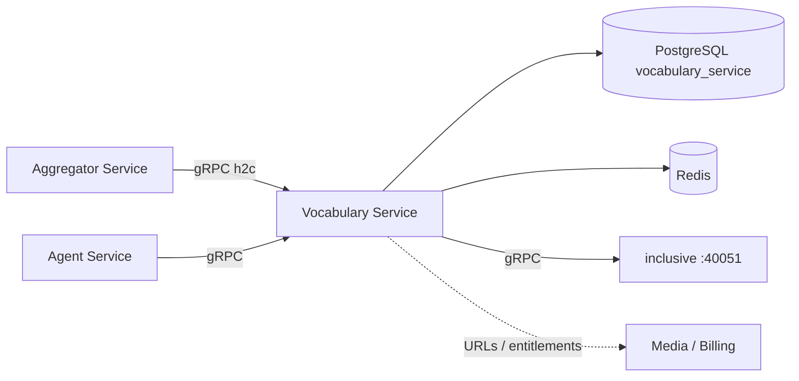

# Обзор высокого уровня

**Vocabulary Service** — ядро домена Polyraspad (.NET 8, gRPC port **5117**): проекты, колоды, карточки, term-first ридер, FSRS-повторения, curriculum CEFR, аналитика, marketplace. Персистентность — **PostgreSQL**; кэш и очереди — **Redis** где применимо; NLP/FSRS — делегирование в **inclusive** (Python gRPC).

Ключевые паттерны:

- **gRPC domain API:** клиенты — Aggregator Service и Agent Service (не публичный REST)
- **Term-first:** статусы, дубликаты и карточки на точных формах (`ProjectTerm`), не на леммах
- **Inclusive delegation:** tokenization/lemmatization и FSRS review через Python-микросервис
- **Project-scoped ownership:** доступ и данные привязаны к `user_id` + project

# 1. Назначение документа

## 1.1 Цель документа

Объяснить архитектуру Vocabulary Service: слои, интеграции, КАР и границы ответственности для backend и DevOps.

# 2. Внутренняя структура и компоненты

* **gRPC Layer:** Content, Card, Term, Text, Study, Analytics, Community, Subscription — validation, mapping, RpcException.
* **Domain Services:** проекты/колоды, карточки и templates, термины и статусы, study queue / FSRS, curriculum, marketplace.
* **Inclusive Client:** gRPC к Python `inclusive` (tokenize, lemmatize, `ReviewCard` FSRS).
* **Integrations:** Media URLs в карточках; Billing entitlements (marketplace); вызовы от Agent Service.
* **Data:** EF Core + Npgsql (`vocabulary_service`); Redis для кэша/очередей по необходимости.

# 3. Ключевые архитектурные решения (КАР)

| КАР | Краткое описание |
| :--- | :--- |
| [[01 - КАР-1 - Term-first модель знаний]] | Exact forms; lemma не база статуса/дубликатов. |
| [[02 - КАР-2 - gRPC domain и Aggregator BFF]] | Внешний REST только на Aggregator; Vocab — внутренний gRPC. |
| [[03 - КАР-3 - Inclusive для NLP и FSRS]] | Токенизация и scheduling вне .NET-процесса. |

## Topology

| Integration | Role |
| :--- | :--- |
| Aggregator Service | Primary REST→gRPC client |
| Agent Service | Threads/tools → Vocabulary project/AI |
| inclusive | NLP + FSRS |
| Media Service | Object URLs для media в карточках / library books |
| Billing Service | Entitlements для marketplace decks |
