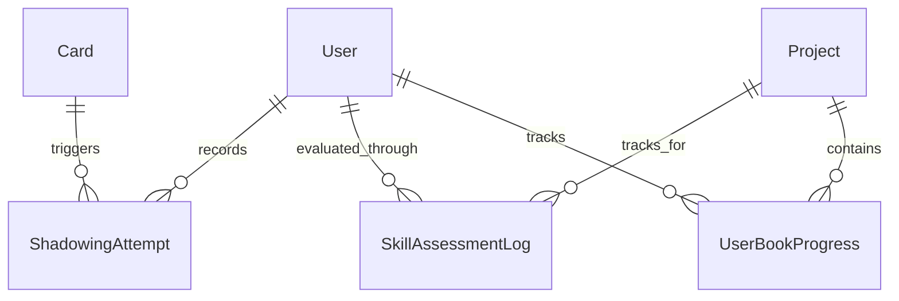

# Основные сущности: Активность и Оценка Навыков (Activity & Assessment)

Данная группа сущностей отвечает за отслеживание активности пользователя по 4 ключевым навыкам (Reading, Listening, Writing, Speaking), расчет уровней навыков и фиксацию результатов оценок от ИИ-репетитора. Сюда же относится сохранение индивидуальных попыток речевой практики (Shadowing).

*Примечание: детальное описание сущностей `SkillType`, `UserSkillActivity` и `UserSkillProgress` можно найти в файле `Skill_Tracking.md`.*

---

## 1. ShadowingAttempt

`ShadowingAttempt` — сущность, фиксирующая отдельную попытку пользователя повторить предложение вслух. Используется как основа для пополнения ежедневной активности по навыку говорения (`speaking`) и для отслеживания прогресса произношения.

**Поля:**
- `Id` (Guid, PK)
- `UserId` (Guid) — идентификатор пользователя.
- `CardId` (Guid?, FK to Card) — связь с изучаемой карточкой (опционально).
- `SourceBookId` (string?) — идентификатор книги или документа, если Shadowing был запущен напрямую из читалки (опционально).
- `SentenceText` (string) — текст исходного предложения.
- `TtsAudioUrl` (string) — ссылка на эталонное аудио (сгенерированное TTS).
- `UserRecordingUrl` (string?) — ссылка на загруженную запись голоса пользователя из MediaService.
- `SelfRating` (int) — оценка пользователя: `1=Bad`, `2=Okay`, `3=Good`.
- `CreatedAt` (DateTime) — когда была совершена попытка.

**Использование:**
Каждая созданная попытка должна увеличивать показатель `Value` для сегодняшней записи `UserSkillActivity` с типом `speaking`.

---

## 2. SkillAssessmentLog

`SkillAssessmentLog` — журнал срезов уровня владения навыками, которые фиксируются в ходе тестирования или ролевых игр с ИИ-агентом.

**Поля:**
- `Id` (Guid, PK)
- `UserId` (Guid) — идентификатор пользователя.
- `ProjectId` (Guid) — идентификатор текущего проекта изучения языка.
- `Skill` (string) — строковый код навыка (`reading`, `listening`, `writing`, `speaking`).
- `Score` (int) — полученный балл (оценка).
- `CreatedAt` (DateTime) — когда был проведен срез.

*(Эта сущность в дальнейшем будет расширяться для поддержки детального фидбэка, связи с `AgentThreadId` и оценки CEFR, см. Gap Analysis).*

---

## 3. UserBookProgress

`UserBookProgress` — сущность, отвечающая за сохранение прогресса пользователя при чтении конкретных книг или документов в ридере. Эта сущность заменяет собой устаревший подход с сохранением ID книги в JSON поле `Metadata` сущности `UserSkillProgress`.

**Поля:**
- `Id` (Guid, PK)
- `UserId` (Guid) — идентификатор пользователя.
- `ProjectId` (Guid, FK to Project) — идентификатор проекта изучения.
- `BookId` (string) — внешний идентификатор книги (например, ID из MediaService).
- `ProgressPercent` (float) — процент прочитанного (0-100).
- `LastPositionLocator` (string?) — строковый локатор последней позиции (например, номер страницы для PDF или EPUB CFI).
- `LastChapter` (string?) — название последней прочитанной главы.
- `IsFinished` (bool) — статус полного прочтения.
- `LastReadAt` (DateTime) — дата и время последнего чтения.
- `CreatedAt` (DateTime) — дата создания записи.

**Использование:**
Сущность обновляется по мере продвижения пользователя по книге. Используется в библиотеке (`/library`) для отображения карточки "Continue reading" и процента прогресса по всем книгам.

---

## Связь сущностей в рамках группы 4

