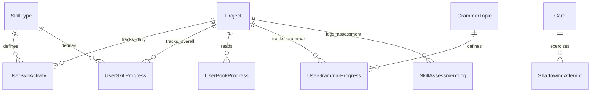

# Группа 4: Активность и Оценка Навыков (Activity & Assessment)

Данный раздел описывает структуру отслеживания ежедневной и накопительной активности по четырем ключевым навыкам (Reading, Listening, Writing, Speaking), прогресс чтения книг, а также результаты ИИ-тестирования произношения (Shadowing) и периодической оценки навыков.

---

## 1. SkillType

`SkillType` — справочник типов навыков с настройками дневной нормы активности для ежедневных миссий.

**Поля:**
- `Id` (int, PK)
- `Code` (string) — уникальный код навыка (`"reading"`, `"listening"`, `"writing"`, `"speaking"`).
- `DisplayName` (string) — локализованное название навыка.
- `Unit` (string) — единица измерения: `"minutes"` (для пассивных) или `"exercises"` (для активных навыков).
- `CompletionThreshold` (int) — дневной порог активности для выполнения миссии (например, 15 минут чтения).

**Предустановленные данные (Seed):**
- 1 | `reading` | Reading | minutes | 15
- 2 | `listening` | Listening | minutes | 10
- 3 | `writing` | Writing | exercises | 1
- 4 | `speaking` | Speaking | exercises | 1

---

## 2. UserSkillActivity

`UserSkillActivity` — ежедневный накопитель активности по навыку (обнуляется в начале суток).

**Поля:**
- `Id` (Guid, PK)
- `UserId` (Guid)
- `ProjectId` (Guid, FK to Project)
- `Date` (DateOnly) — дата активности (UTC).
- `SkillTypeId` (int, FK to SkillType)
- `Value` (int) — набранное значение за день.
- `CreatedAt` (DateTime)
- `UpdatedAt` (DateTime)

**Ограничения:**
- Уникальный составной индекс `(UserId, ProjectId, Date, SkillTypeId)` для атомарных инкрементов.

---

## 3. UserSkillProgress

`UserSkillProgress` — постоянный аккумулятор глобального прогресса и уровней по навыкам за все время.

**Поля:**
- `UserId` (Guid, PK)
- `ProjectId` (Guid, PK, FK to Project)
- `SkillTypeId` (int, PK, FK to SkillType)
- `Level` (int) — расчетный уровень владения навыком (0–100).
- `TotalValue` (int) — суммарная накопленная активность за все время.
- `Metadata` (jsonb?) — специфичные метаданные (например, для чтения `{"lastBookId": "...", "lastPage": 42}`).
- `UpdatedAt` (DateTime)

---

## 4. UserBookProgress

`UserBookProgress` — прогресс чтения конкретной книги/документа в ридере.

**Поля:**
- `Id` (Guid, PK)
- `UserId` (Guid)
- `ProjectId` (Guid, FK to Project)
- `BookId` (string) — внешний идентификатор книги (из MediaService).
- `ProgressPercent` (float) — процент прочтения (0–100).
- `LastPositionLocator` (string?) — локатор последней позиции в читалке (например, epub cfi).
- `LastChapter` (string?) — название последней прочитанной главы.
- `IsFinished` (bool) — статус завершения чтения.
- `LastReadAt` (DateTime)
- `CreatedAt` (DateTime)

---

## 5. ShadowingAttempt

`ShadowingAttempt` — попытка записи устной речи (повторение предложения вслед за диктором).

**Поля:**
- `Id` (Guid, PK)
- `UserId` (Guid)
- `CardId` (Guid?, FK to Card) — связь с карточкой.
- `SourceBookId` (string?) — связь с книгой, откуда взято предложение.
- `SentenceText` (string) — текст предложения.
- `TtsAudioUrl` (string) — ссылка на эталонное аудио.
- `UserRecordingUrl` (string?) — ссылка на запись голоса пользователя в хранилище.
- `SelfRating` (int) — оценка пользователя: `1=Bad`, `2=Okay`, `3=Good`.
- `CreatedAt` (DateTime)

**Интеграция:**
Каждая попытка shadowing автоматически увеличивает показатель ежедневной активности `UserSkillActivity` для типа `speaking`.

---

## 6. SkillAssessmentLog

`SkillAssessmentLog` — срез оценки уровня владения навыками от ИИ-тьютора.

**Поля:**
- `Id` (Guid, PK)
- `UserId` (Guid)
- `ProjectId` (Guid, FK to Project)
- `Skill` (string) — код навыка (`reading`, `listening`, `writing`, `speaking`).
- `Score` (int) — полученный балл/оценка.
- `CreatedAt` (DateTime)

---

## 7. GrammarTopic

`GrammarTopic` — справочник грамматических тем (правил), разбитых по уровням CEFR.

**Поля:**
- `Id` (Guid, PK)
- `Code` (string) — уникальный строковый код темы (например, `"past-simple"`, `"passive-voice"`).
- `Title` (string) — название темы.
- `Description` (string?) — описание грамматического правила.
- `CefrLevel` (string) — уровень сложности темы (A1..C2).

---

## 8. UserGrammarProgress

`UserGrammarProgress` — индивидуальный прогресс освоения конкретного грамматического правила пользователем.

**Поля:**
- `Id` (Guid, PK)
- `UserId` (Guid)
- `ProjectId` (Guid, FK to Project)
- `GrammarTopicId` (Guid, FK to GrammarTopic)
- `Status` (string) — статус изучения (`"NEW"`, `"LEARNING"`, `"MASTERED"`).
- `ConfidenceScore` (float) — степень уверенности владения правилом (0.0..1.0, рассчитывается ИИ на основе анализа речи/письма).
- `UpdatedAt` (DateTime)

---

## Связи сущностей активности и прогресса

