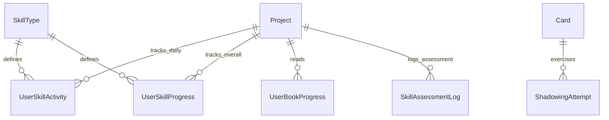

# Группа 4: Активность и Оценка Навыков (Activity & Assessment)

Данный раздел описывает структуру отслеживания ежедневной и накопительной активности по четырём навыкам (Reading, Listening, Writing, Speaking), прогресс чтения книг, результаты Shadowing и периодической оценки навыков.

> **Нет в коде:** сущности `GrammarTopic` / `UserGrammarProgress`. RPC `ExplainGrammar` возвращает объяснение без persistence справочника тем.

---

## 1. SkillType

`SkillType` — справочник типов навыков с настройками дневной нормы активности. Таблица: `internal.SkillTypes`.

**Поля:**
- `Id` (int, PK)
- `Code` (string) — уникальный код навыка (`"reading"`, `"listening"`, `"writing"`, `"speaking"`).
- `DisplayName` (string) — локализованное название навыка.
- `Unit` (string) — единица измерения: `"minutes"` или `"exercises"`.
- `CompletionThreshold` (int) — дневной порог активности.

**Предустановленные данные (Seed):**
- 1 | `reading` | Reading | minutes | 15
- 2 | `listening` | Listening | minutes | 10
- 3 | `writing` | Writing | exercises | 1
- 4 | `speaking` | Speaking | exercises | 1

---

## 2. UserSkillActivity

`UserSkillActivity` — ежедневный накопитель активности по навыку. Таблица: `internal.UserSkillActivities`.

**Поля:**
- `Id` (Guid, PK)
- `UserId` (Guid)
- `ProjectId` (Guid, FK to Project)
- `Date` (DateOnly) — дата активности (UTC).
- `SkillTypeId` (int, FK to SkillType)
- `Value` (int) — набранное значение за день.
- `CreatedAt` (DateTime)
- `UpdatedAt` (DateTime)

**Ограничения:**
- Уникальный составной индекс `(UserId, ProjectId, Date, SkillTypeId)`.

---

## 3. UserSkillProgress

`UserSkillProgress` — постоянный аккумулятор глобального прогресса по навыкам. Таблица: `internal.UserSkillProgresses`.

**Поля:**
- `UserId` (Guid, PK)
- `ProjectId` (Guid, PK, FK to Project)
- `SkillTypeId` (int, PK, FK to SkillType)
- `Level` (int) — расчётный уровень (0–100).
- `TotalValue` (int) — суммарная активность.
- `Metadata` (jsonb?) — специфичные метаданные.
- `UpdatedAt` (DateTime)

---

## 4. UserBookProgress

`UserBookProgress` — прогресс чтения конкретной книги/документа в ридере. Таблица: `internal.user_book_progresses`. Сама книга хранится во внешнем MediaService (`BookId`).

**Поля:**
- `Id` (Guid, PK)
- `UserId` (Guid)
- `ProjectId` (Guid, FK to Project)
- `BookId` (string) — внешний идентификатор книги (MediaService / URL / URN).
- `ProgressPercent` (float) — процент прочтения (0–100).
- `LastPositionLocator` (string?) — локатор позиции (страница PDF / EPUB CFI).
- `LastChapter` (string?) — название последней главы.
- `IsFinished` (bool)
- `LastReadAt` (DateTime)
- `CreatedAt` (DateTime)

---

## 5. ShadowingAttempt

`ShadowingAttempt` — попытка записи устной речи. Таблица: `internal.shadowing_attempts`. Отдельного gRPC CRUD для сущности в текущем коде нет (только EF-модель).

**Поля:**
- `Id` (Guid, PK)
- `UserId` (Guid)
- `CardId` (Guid?, FK to Card)
- `SourceBookId` (string?)
- `SentenceText` (string)
- `TtsAudioUrl` (string)
- `UserRecordingUrl` (string?)
- `SelfRating` (int) — `1=Bad`, `2=Okay`, `3=Good`.
- `CreatedAt` (DateTime)

---

## 6. SkillAssessmentLog

`SkillAssessmentLog` — срез оценки уровня владения навыками. Таблица: `internal.SkillAssessmentLogs`.

**Поля:**
- `Id` (Guid, PK)
- `UserId` (Guid)
- `ProjectId` (Guid, FK to Project)
- `Skill` (string) — код навыка.
- `Score` (int)
- `CreatedAt` (DateTime)

---

## Связи сущностей активности и прогресса

