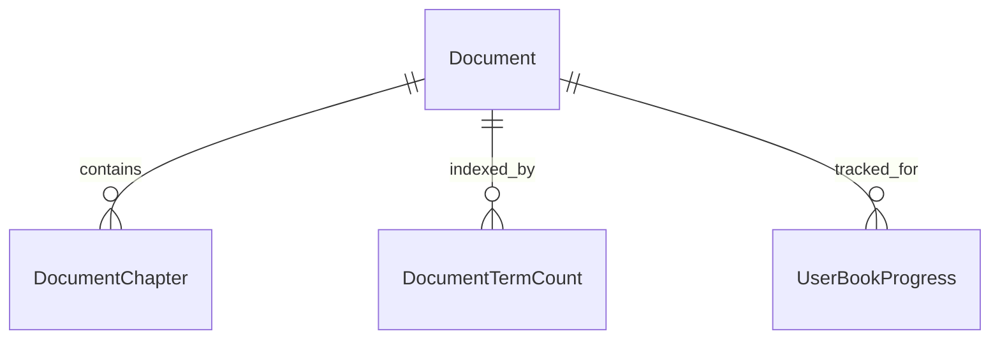

# Группа 7: Документы и Ридер (Documents & Reader)

Этот раздел описывает сущности библиотеки ридера, предназначенные для хранения импортированных документов, разбивки их на главы и ведения частотных словарей для расчета сложности чтения.

---

## 1. Document

`Document` — книга, статья или любой другой текстовый материал, добавленный в библиотеку.

**Поля:**
- `Id` (Guid, PK)
- `UserId` (Guid) — кто добавил документ (если приватный) или null (если системный/публичный).
- `Title` (string) — название.
- `Author` (string?) — автор произведения.
- `CoverImageUrl` (string?) — ссылка на файл обложки.
- `Language` (string) — язык текста (ISO-код).
- `CefrLevel` (string?) — ориентировочный уровень сложности (A1..C2).
- `WordsCount` (int) — общее количество слов в документе.
- `SourceUrl` (string?) — ссылка на источник (например, URL веб-страницы).
- `IsPublic` (bool) — доступен ли документ всем пользователям.
- `CreatedAt` (DateTime)
- `UpdatedAt` (DateTime)

---

## 2. DocumentChapter

`DocumentChapter` — глава или логический фрагмент документа (для порционного рендеринга и быстрой загрузки).

**Поля:**
- `Id` (Guid, PK)
- `DocumentId` (Guid, FK to Document) — ссылка на документ.
- `Title` (string) — название главы (например, "Глава 1").
- `ContentHtml` (string) — сырой размеченный HTML-текст для ридера.
- `OrderIndex` (int) — порядковый номер главы в книге.
- `CreatedAt` (DateTime)

---

## 3. DocumentTermCount

`DocumentTermCount` — частотный индекс лемм документа, используемый для расчета сложности текста перед открытием.

**Поля:**
- `DocumentId` (Guid, PK, FK to Document)
- `LemmaText` (string, PK) — лемма слова (например, "have", "go").
- `PosTag` (string, PK) — часть речи леммы (NOUN, VERB и т.д.).
- `Frequency` (int) — сколько раз данная лемма встречается во всем документе.

---

## Связи сущностей ридера

