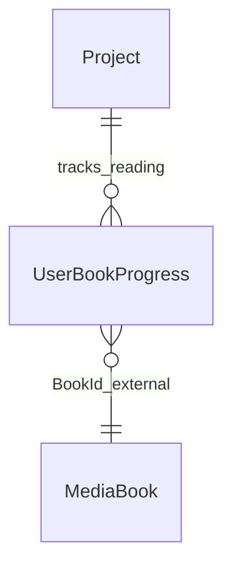

# Группа 7: Прогресс чтения (Reader Progress)

В **Vocabulary Service** нет EF-сущностей библиотеки документов (`Document`, `DocumentChapter`, `DocumentTermCount`). Файлы/метаданные книг и коллекций хранит **MediaService**. Здесь документируется только локальный прогресс чтения, связанный с проектом.

Термины и статусы ридера (`ProjectTerm`, `UserTermStatus`) описаны в [[Entity - Лингвистическая Модель и NLP - Linguistics & NLP]].

---

## 1. UserBookProgress

`UserBookProgress` — прогресс пользователя при чтении книги/документа. Таблица: `internal.user_book_progresses`.

**Поля:**
- `Id` (Guid, PK)
- `UserId` (Guid)
- `ProjectId` (Guid, FK to Project)
- `BookId` (string) — внешний идентификатор книги (Id из MediaService или иной URN/URL).
- `ProgressPercent` (float) — процент прочитанного (0–100).
- `LastPositionLocator` (string?) — локатор позиции (номер страницы PDF, EPUB CFI и т.п.).
- `LastChapter` (string?) — название последней прочитанной главы.
- `IsFinished` (bool)
- `LastReadAt` (DateTime)
- `CreatedAt` (DateTime)

**Связи:**
- `Project` 1—* `UserBookProgress`
- Книга (`BookId`) → внешний объект MediaService (не FK внутри Vocabulary DB)

---

## Связи

> Сущности `Document` / `DocumentChapter` / `DocumentTermCount` **удалены из модели документации** как несуществующие в коде VocabularyService.
