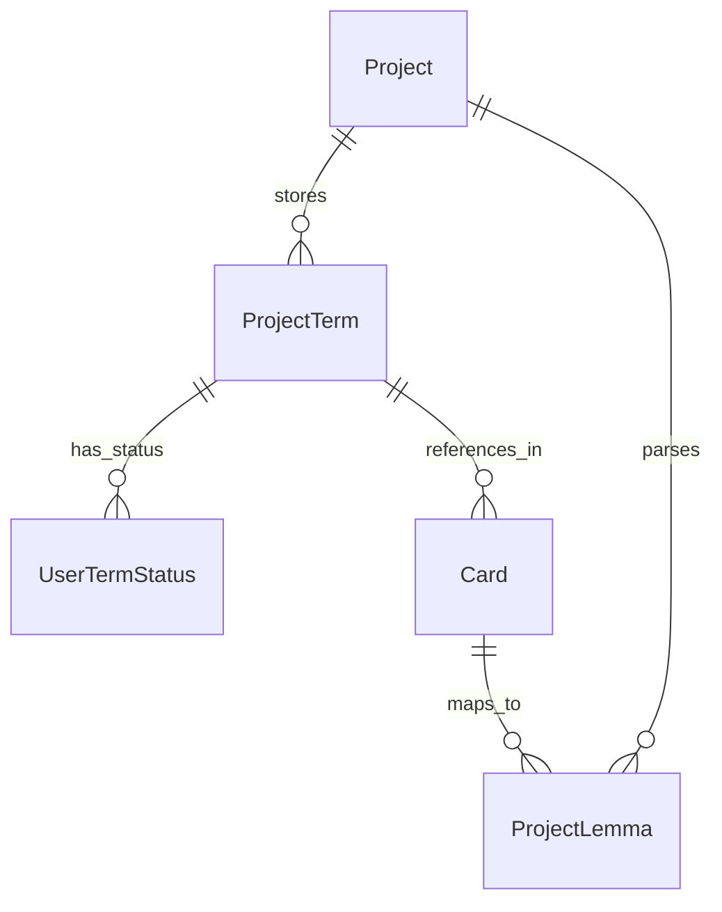

# Группа 2: Лингвистическая модель и NLP (Linguistics & NLP)

Этот раздел описывает сущности, обслуживающие систему Ридера (модель LingQ) и интеграцию с Python-сервисом NLP для токенизации, лемматизации и POS-тэгирования.

---

## 1. ProjectTerm

`ProjectTerm` — точная словоформа или фраза, выделенная при чтении текста в рамках проекта.

**Поля:**
- `Id` (Guid, PK)
- `ProjectId` (Guid, FK to Project)
- `Text` (string) — исходный текст термина (с сохранением регистра первого добавления).
- `NormalizedText` (string) — ключ совпадения: `trim` + `ToLowerInvariant` + схлопывание пробелов (`TermNormalizer`). Знаки препинания **не** удаляются.
- `Type` (string) — тип учебной единицы: `"WORD"` (одиночное слово) или `"PHRASE"` (словосочетание).
- `Language` (string?) — язык термина.
- `CreatedAt` (DateTime)
- `UpdatedAt` (DateTime)

---

## 2. UserTermStatus

`UserTermStatus` — индивидуальный статус изучения термина пользователем.

**Поля:**
- `Id` (Guid, PK)
- `UserId` (Guid)
- `ProjectId` (Guid, FK to Project)
- `ProjectTermId` (Guid, FK to ProjectTerm)
- `Status` (string) — текущий статус: `"NEW"`, `"SAVED"` (сохранённый термин с переводом), `"KNOWN"`, `"IGNORED"`. В старых данных встречаются legacy `"LINGQ"` / `"LEARNING"` — наружу через API нормализуются в `"SAVED"` (`TermApiStatusFormatter`).
- `ReadingLevel` (int) — уровень владения чтением для термина (0–4).
- `ListeningLevel` (int) — уровень владения аудированием (0–4).
- `WritingLevel` (int) — уровень владения письмом (0–4).
- `SpeakingLevel` (int) — уровень владения говорением (0–4).
- `Meaning` (string?) — пользовательский перевод или толкование термина.
- `FirstSentence` (string?) — контекст первого добавления (предложение целиком).
- `FirstSourceTitle` (string?) — название источника контекста (например, название книги).
- `FirstSourceUrl` (string?) — ссылка на источник контекста.
- `LastSeenAt` (DateTime?) — время последнего обнаружения слова при чтении.
- `CreatedAt` (DateTime)
- `UpdatedAt` (DateTime)

---

## 3. ProjectLemma (legacy)

`ProjectLemma` — лемма (начальная словарная форма). Таблица сохранена в EF, но продуктовая модель Polyraspad — **term-first**: статусы, дубликаты и карточки опираются на `ProjectTerm` (точные формы), а не на леммы.

**Поля:**
- `Id` (Guid, PK)
- `ProjectId` (Guid, FK to Project)
- `Text` (string) — текст леммы (например, "go" для "went", "goes").
- `PosTag` (string?) — часть речи (Part-of-Speech tag: NOUN, VERB, ADJ...).
- `Status` (string) — статус леммы.
- `MainCardId` (Guid?, FK to Card) — ссылка на основную карточку, привязанную к этой лемме.
- `UpdatedAt` (DateTime)

---

## Связи сущностей лингвистической модели

