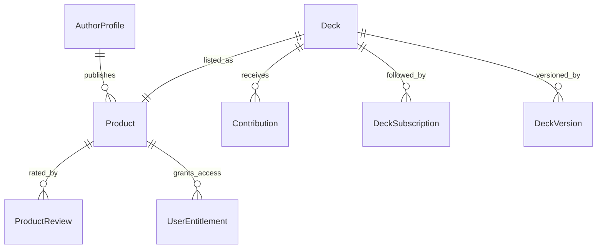

# Группа 5: Магазин Колод и Сообщество (Marketplace & Community)

Данный раздел описывает структуру сущностей для публикации колод в общий каталог (Marketplace), синхронизации версий, подписок и обработки отзывов пользователей.

---

## 1. AuthorProfile

`AuthorProfile` — публичный профиль создателя контента (колод) в магазине.

**Поля:**
- `UserId` (Guid, PK) — идентификатор пользователя (автора).
- `DisplayName` (string?) — отображаемое имя автора.
- `Bio` (string?) — биография или описание деятельности.
- `SocialLinks` (JSONB) — структурированные ссылки на соцсети автора.
- `Badges` (List<string>) — список наград/значков автора.
- `StatsCache` (JSONB) — кэшированные показатели статистики (количество скачиваний, рейтинг).
- `UpdatedAt` (DateTime)

---

## 2. Product

`Product` — публичный товар (колода) в каталоге магазина.

**Поля:**
- `Id` (Guid, PK)
- `AuthorId` (Guid, FK to AuthorProfile) — автор продукта.
- `LinkedDeckId` (Guid, FK to Deck) — ссылка на экспортируемую колоду в системе.
- `Title` (string) — название продукта в магазине.
- `DescriptionHtml` (string?) — форматированное описание товара.
- `CoverImageUrl` (string?) — ссылка на обложку товара.
- `Price` (decimal) — стоимость колоды.
- `Currency` (string) — валюта (например, "USD", "RUB").
- `Status` (string) — статус публикации (`"DRAFT"`, `"PUBLISHED"`, `"ARCHIVED"`).
- `AverageRating` (float) — средняя оценка покупателей.
- `ReviewCount` (int) — количество отзывов.
- `SalesCount` (int) — количество продаж/скачиваний.
- `CreatedAt` (DateTime)
- `UpdatedAt` (DateTime)

---

## 3. ProductReview

`ProductReview` — отзыв и оценка от покупателя о колоде.

**Поля:**
- `Id` (Guid, PK)
- `ProductId` (Guid, FK to Product) — связь с продуктом.
- `UserId` (Guid) — автор отзыва.
- `Rating` (short) — оценка от 1 до 5 звезд.
- `Comment` (string?) — текст отзыва.
- `IsVerified` (bool) — флаг верифицированной покупки.
- `AuthorReply` (string?) — ответ автора колоды на отзыв.
- `CreatedAt` (DateTime)

---

## 4. Contribution

`Contribution` — вклад/предложение изменений в публичную колоду от участников сообщества.

**Поля:**
- `Id` (Guid, PK)
- `TargetDeckId` (Guid, FK to Deck) — целевая колода для изменений.
- `TargetCardId` (Guid?, FK to Card) — конкретная изменяемая карточка (если применимо).
- `AuthorId` (Guid) — автор контрибуции.
- `Type` (string) — тип вклада: `"EDIT"`, `"ADD"`, `"DELETE"` (значения из `CommunityService`).
- `Payload` (JSONB) — сериализованные измененные данные карточки/заметки.
- `Comment` (string?) — комментарий автора к изменениям.
- `Status` (string) — статус модерации (`"PENDING"`, `"APPROVED"`, `"REJECTED"`).
- `ReviewerId` (Guid?) — кто проверил контрибуцию.
- `ResolutionComment` (string?) — вердикт модератора.
- `CreatedAt` (DateTime)
- `UpdatedAt` (DateTime)

---

## 5. DeckSubscription

`DeckSubscription` — подписка пользователя на публичную колоду для получения обновлений.

**Поля:**
- `Id` (Guid, PK)
- `UserId` (Guid)
- `DeckId` (Guid, FK to Deck) — ссылка на подписанную колоду.
- `LastSyncedVersion` (int?) — номер последней синхронизированной версии.
- `SubscribedAt` (DateTime)
- `LastAccessedAt` (DateTime)

---

## 6. DeckVersion

`DeckVersion` — снимок версии структуры колоды для истории изменений и процесса обновлений.

**Поля:**
- `Id` (Guid, PK)
- `DeckId` (Guid, FK to Deck)
- `VersionNumber` (int) — порядковый номер версии.
- `ChangeDescription` (string) — описание изменений в версии.
- `ModifiedByUserId` (Guid) — кто создал данную версию.
- `SnapshotRef` (string) — ссылка на файл-снимок (например, в MediaService).
- `CreatedAt` (DateTime)

---

## Связи сущностей сообщества и магазина

