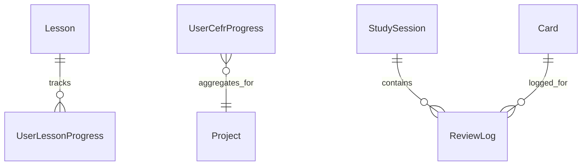

# Группа 3: Обучение и Учебный План (Curriculum & Study)

Этот раздел описывает сущности, предназначенные для ведения пользователя по глобальному учебному плану (CEFR), организации интерактивных ИИ-уроков и фиксации логов интервальных повторений.

---

## 1. Lesson

`Lesson` — системный урок в глобальной программе обучения.

**Поля:**
- `Id` (Guid, PK)
- `Title` (string) — название урока (например, "Greetings").
- `Description` (string) — описание урока.
- `CefrLevel` (string) — уровень сложности по шкале CEFR (A1, A2, B1, B2, C1, C2).
- `OrderIndex` (int) — порядковый номер урока в рамках одного уровня CEFR.
- `SystemPromptTemplate` (string) — шаблон системного промпта для ИИ-агента, проводящего урок.
- `UnlocksAfterLessonId` (Guid?) — ссылка на предыдущий урок, обязательный для разблокировки текущего.

---

## 2. UserLessonProgress

`UserLessonProgress` — индивидуальный прогресс прохождения конкретного урока пользователем.

**Поля:**
- `UserId` (Guid, PK)
- `LessonId` (Guid, PK, FK to Lesson)
- `Status` (string) — статус прохождения: `"NotStarted"`, `"InProgress"`, `"Completed"`.
- `ScorePercent` (int) — оценка успешности от ИИ в диапазоне 0–100%.
- `TimeSpentSeconds` (int) — общее количество секунд, затраченное пользователем.
- `StartedAt` (DateTime) — дата и время начала прохождения.
- `CompletedAt` (DateTime?) — дата и время успешного завершения.
- `AgentThreadId` (Guid?) — идентификатор диалога с ИИ в `AgentService`.

---

## 3. UserCefrProgress

`UserCefrProgress` — агрегированный прогресс освоения уровней CEFR пользователем.

**Поля:**
- `UserId` (Guid, PK)
- `Level` (string, PK) — код уровня (A1, A2...).
- `Status` (string) — статус уровня: `"Locked"`, `"InProgress"`, `"Completed"`.
- `CompletedLessonsCount` (int) — число пройденных уроков на уровне.
- `TotalLessonsCount` (int) — общее число доступных уроков на уровне.

---

## 4. StudySession

`StudySession` — учебная сессия повторения карточек (например, ежедневный проход колоды).

**Поля:**
- `Id` (Guid, PK)
- `UserId` (Guid)
- `ProjectId` (Guid, FK to Project)
- `DeckId` (Guid?, FK to Deck) — колода, по которой запущена сессия (если null, то по всему проекту).
- `StartTime` (DateTime)
- `EndTime` (DateTime)
- `CardsReviewed` (int) — количество карточек, пройденных за сессию.
- `DurationSec` (int) — общая продолжительность в секундах.
- `NewLearned` (int) — количество новых изученных карточек.
- `Status` (string) — статус сессии: `"ACTIVE"` или `"COMPLETED"`.

---

## 5. ReviewLog

`ReviewLog` — детальный лог каждого ответа на карточку. Используется для оптимизации параметров весов FSRS.

**Поля:**
- `Id` (Guid, PK)
- `UserId` (Guid)
- `CardId` (Guid, FK to Card)
- `SessionId` (Guid) — идентификатор сессии `StudySession`.
- `Rating` (short) — оценка пользователя: `1=Again`, `2=Hard`, `3=Good`, `4=Easy`.
- `StateBefore` (short) — FSRS статус карточки до ответа.
- `StateAfter` (short) — FSRS статус карточки после ответа.
- `StepBefore` (int)
- `StepAfter` (int)
- `RepsBefore` (int)
- `RepsAfter` (int)
- `LapsesBefore` (int)
- `LapsesAfter` (int)
- `ElapsedDaysBefore` (int)
- `ElapsedDaysAfter` (int)
- `ScheduledDaysBefore` (int)
- `ScheduledDaysAfter` (int)
- `LastReviewBefore` (DateTime)
- `LastReviewAfter` (DateTime)
- `DueBefore` (DateTime)
- `DueAfter` (DateTime)
- `StabilityBefore` (float)
- `StabilityAfter` (float)
- `DifficultyBefore` (float)
- `DifficultyAfter` (float)
- `ReviewDurationMs` (int) — время размышления над карточкой в миллисекундах.
- `UserAnswer` (string?) — текстовый ответ пользователя (для активных типов карточек).
- `AnswerValidationResult` (string?) — результат проверки ответа ИИ или системой.
- `CreatedAt` (DateTime)

---

## Связи сущностей учебного плана

