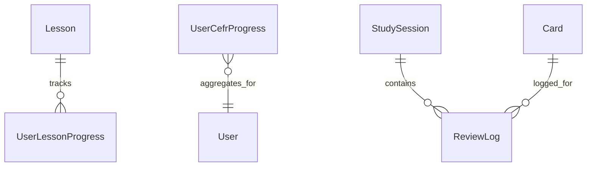

# Группа 3: Обучение и Учебный План (Curriculum & Study)

Этот раздел описывает сущности, предназначенные для ведения пользователя по глобальному учебному плану (CEFR), организации интерактивных ИИ-уроков и фиксации логов интервальных повторений.

---

## 1. Lesson

`Lesson` — системный урок в глобальной программе обучения. Таблица: `Lessons`.

**Поля:**
- `Id` (Guid, PK)
- `Title` (string) — название урока.
- `Description` (string) — описание урока.
- `Category` (string) — категория (например, `"Grammar & Structure"`).
- `Difficulty` (string) — сложность урока.
- `SystemPrompt` (string) — системный промпт для ИИ-агента (поле C#: `SystemPrompt`, не `SystemPromptTemplate`).
- `ContentMarkdown` (string) — markdown-контент урока.
- `ColorCssClass` (string?) — CSS-класс оформления.
- `CefrLevel` (string) — уровень CEFR (`A1`…`C2`).
- `OrderIndex` (int) — порядок внутри уровня.
- `UnlocksAfterLessonId` (Guid?) — предыдущий урок, обязательный для разблокировки.
- `TargetSkills` (string) — целевые навыки, comma-separated (`R`/`L`/`W`/`S`).
- `EstimatedMinutes` (int) — ориентировочная длительность.
- `CreatedAt` (DateTime)
- `UpdatedAt` (DateTime)

---

## 2. UserLessonProgress

`UserLessonProgress` — индивидуальный прогресс прохождения урока. Таблица: `UserLessonProgresses`.

**Поля:**
- `Id` (Guid, PK)
- `UserId` (Guid)
- `LessonId` (Guid, FK to Lesson)
- `Status` (`LessonStatus` enum → int) — `NotStarted = 0`, `InProgress = 1`, `Completed = 2`.
- `AgentThreadId` (Guid?) — идентификатор диалога в `AgentService`.
- `ScorePercent` (int) — оценка 0–100 при завершении.
- `TimeSpentSeconds` (int) — суммарное время в секундах.
- `StartedAt` (DateTime)
- `CompletedAt` (DateTime?)

---

## 3. UserCefrProgress

`UserCefrProgress` — агрегированный прогресс освоения уровней CEFR. Таблица: `UserCefrProgresses`.

**Поля:**
- `Id` (Guid, PK)
- `UserId` (Guid)
- `CefrLevel` (string) — код уровня (`A1`…`C2`).
- `CompletedLessons` (int)
- `TotalLessons` (int)
- `IsLevelCompleted` (bool)
- `LevelCompletedAt` (DateTime?)
- `UpdatedAt` (DateTime)

---

## 4. StudySession

`StudySession` — учебная сессия повторения карточек. Таблица: `internal.study_sessions`.

**Поля:**
- `Id` (Guid, PK)
- `UserId` (Guid)
- `ProjectId` (Guid, FK to Project)
- `DeckId` (Guid?, FK to Deck) — колода сессии (`null` = весь проект).
- `StartTime` (DateTime)
- `EndTime` (DateTime)
- `CardsReviewed` (int)
- `DurationSec` (int)
- `NewLearned` (int)
- `Status` (string) — `"ACTIVE"` или `"COMPLETED"`.

---

## 5. ReviewLog

`ReviewLog` — детальный лог каждого ответа на карточку. Таблица: `internal.review_logs`.

**Поля:**
- `Id` (Guid, PK)
- `UserId` (Guid)
- `CardId` (Guid, FK to Card)
- `SessionId` (Guid) — идентификатор `StudySession`.
- `Rating` (short) — `1=Again`, `2=Hard`, `3=Good`, `4=Easy`.
- `StateBefore` / `StateAfter` (short) — FSRS state.
- `StepBefore` / `StepAfter` (int)
- `RepsBefore` / `RepsAfter` (int)
- `LapsesBefore` / `LapsesAfter` (int)
- `ElapsedDaysBefore` / `ElapsedDaysAfter` (int)
- `ScheduledDaysBefore` / `ScheduledDaysAfter` (int)
- `LastReviewBefore` / `LastReviewAfter` (DateTime)
- `DueBefore` / `DueAfter` (DateTime)
- `StabilityBefore` / `StabilityAfter` (float)
- `DifficultyBefore` / `DifficultyAfter` (float)
- `ReviewDurationMs` (int)
- `UserAnswer` (string?) — текстовый ответ пользователя.
- `AnswerValidationResult` (JSONB?) — структурированный результат проверки ответа (не произвольная строка).
- `CreatedAt` (DateTime)

---

## Связи сущностей учебного плана

