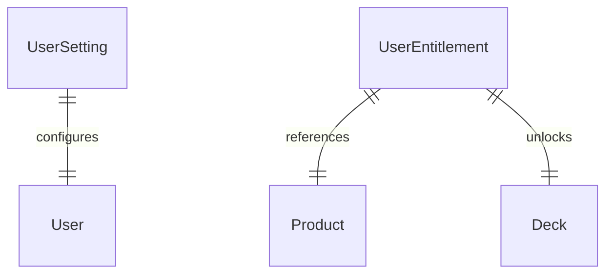

# Группа 6: Системные сущности и Настройки (System & Settings)

Данный раздел описывает служебные сущности: настройки пользователя, доступ к колодам Marketplace и журнал удалений для оффлайн-синхронизации. SaaS-тарифные entitlements живут в **BillingService**, не в этой таблице.

---

## 1. UserSetting

`UserSetting` — глобальные настройки пользователя, параметры ежедневных целей и показатели активности (Streak). Таблица: `internal.user_settings`.

**Поля:**
- `UserId` (Guid, PK)
- `RolloverHour` (int) — час суток (0–23) сброса дневной активности.
- `InterfaceLanguage` (string) — язык интерфейса (`"ru"`, `"en"`…).
- `CurrentStreak` (int) — текущая серия дней.
- `MaxStreak` (int) — максимальная серия.
- `LastStudyDate` (DateOnly?) — дата последнего учебного действия.
- `DailyGoalNew` (int) — дневная цель новых карточек (дефолт в коде при создании: **20**).
- `DailyGoalReview` (int) — дневная цель повторений (дефолт: **100**).
- `UpdatedAt` (DateTime)

> Поля `AutoMarkAsKnownOnPageTurn` **нет**. Page-turn «пометить известными» реализуется клиентом через RPC `BulkMarkKnown`.

---

## 2. UserEntitlement

`UserEntitlement` — право доступа пользователя к конкретной колоде (Marketplace / promo / contribution). Таблица: `internal.user_entitlements`. Это **не** таблица SaaS-лимитов тарифа.

**Поля:**
- `Id` (Guid, PK)
- `UserId` (Guid) — владелец прав.
- `ProductId` (Guid?, FK to Product) — продукт магазина (если применимо).
- `DeckId` (Guid, FK to Deck) — колода, на которую распространяется доступ.
- `Source` (string) — `"FREE"`, `"PURCHASE"`, `"PROMO"`, `"CONTRIBUTION"`.
- `ExternalOrderId` (string?) — внешний идентификатор заказа/транзакции.
- `GrantedAt` (DateTime)
- `IsActive` (bool)

---

## 3. DeletedObject

`DeletedObject` — журнал удаленных объектов, необходимый для организации двусторонней синхронизации с мобильными приложениями и веб-клиентами (особенно в offline-режиме).

**Поля:**
- `Id` (Guid, PK)
- `EntityId` (Guid) — идентификатор удаленной сущности.
- `EntityType` (string) — тип удаленной сущности (например, `"Card"`, `"Note"`, `"Deck"`).
- `UserId` (Guid) — кто удалил сущность.
- `ParentId` (Guid?) — идентификатор родительского элемента (для каскадной логики).
- `DeletedAt` (DateTime) — дата и время удаления.

---

## Связи системных сущностей

