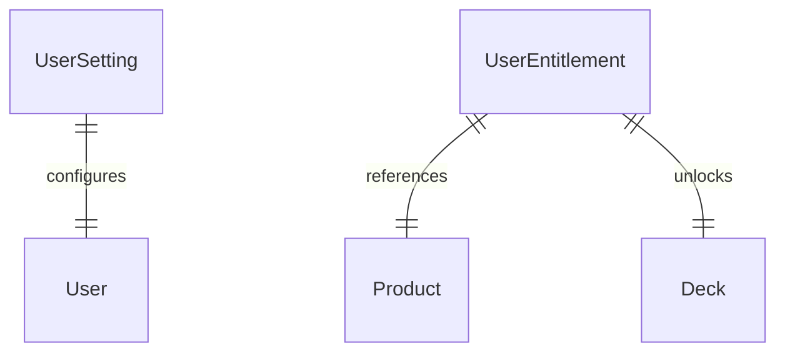

# Группа 6: Системные сущности и Настройки (System & Settings)

Данный раздел описывает служебные и инфраструктурные сущности, обеспечивающие хранение настроек пользователей, прав доступа (лимитов) согласно приобретенным продуктам, а также ведение лога удалений для оффлайн-синхронизации клиентов.

---

## 1. UserSetting

`UserSetting` — глобальные настройки пользователя, параметры ежедневных целей и показатели активности (Streak).

**Поля:**
- `UserId` (Guid, PK)
- `RolloverHour` (int) — час суток (в формате 0–23), когда сбрасывается ежедневная активность (по часовому поясу пользователя).
- `InterfaceLanguage` (string) — язык интерфейса пользователя (например, "ru", "en").
- `CurrentStreak` (int) — текущее количество дней непрерывного обучения (серия).
- `MaxStreak` (int) — максимальное достигнутое количество дней непрерывного обучения.
- `LastStudyDate` (DateOnly?) — дата последнего учебного действия.
- `DailyGoalNew` (int) — ежедневная цель по изучению новых карточек.
- `DailyGoalReview` (int) — ежедневная цель по повторению карточек.
- `UpdatedAt` (DateTime)

---

## 2. UserEntitlement

`UserEntitlement` — права пользователя на владение/доступ к колодам (полученные бесплатно или купленные через Marketplace).

**Поля:**
- `Id` (Guid, PK)
- `UserId` (Guid) — владелец прав.
- `ProductId` (Guid?, FK to Product) — идентификатор купленного продукта (если доступ получен через покупку).
- `DeckId` (Guid, FK to Deck) — колода, на которую распространяется право доступа.
- `Source` (string) — источник получения доступа (`"FREE"`, `"PURCHASE"`, `"PROMO"`).
- `ExternalOrderId` (string?) — идентификатор транзакции из платежной системы (или `BillingService`).
- `GrantedAt` (DateTime) — дата предоставления доступа.
- `IsActive` (bool) — активен ли доступ в текущий момент.

---

## 3. DeletedObject

`DeletedObject` — журнал удаленных объектов, необходимый для организации двусторонней синхронизации с мобильными приложениями и веб-клиентами (особенно в offline-режиме).

**Поля:**
- `Id` (Guid, PK)
- `EntityId` (Guid) — идентификатор удаленной сущности.
- `EntityType` (string) — тип удаленной сущности (например, `"Card"`, `"Note"`, `"Deck"`).
- `UserId` (Guid) — кто удалил сущность.
- `ParentId` (Guid?) — идентификатор родительского элемента (для каскадной логики).
- `DeletedAt` (DateTime) — дата и время удаления.

---

## Связи системных сущностей

