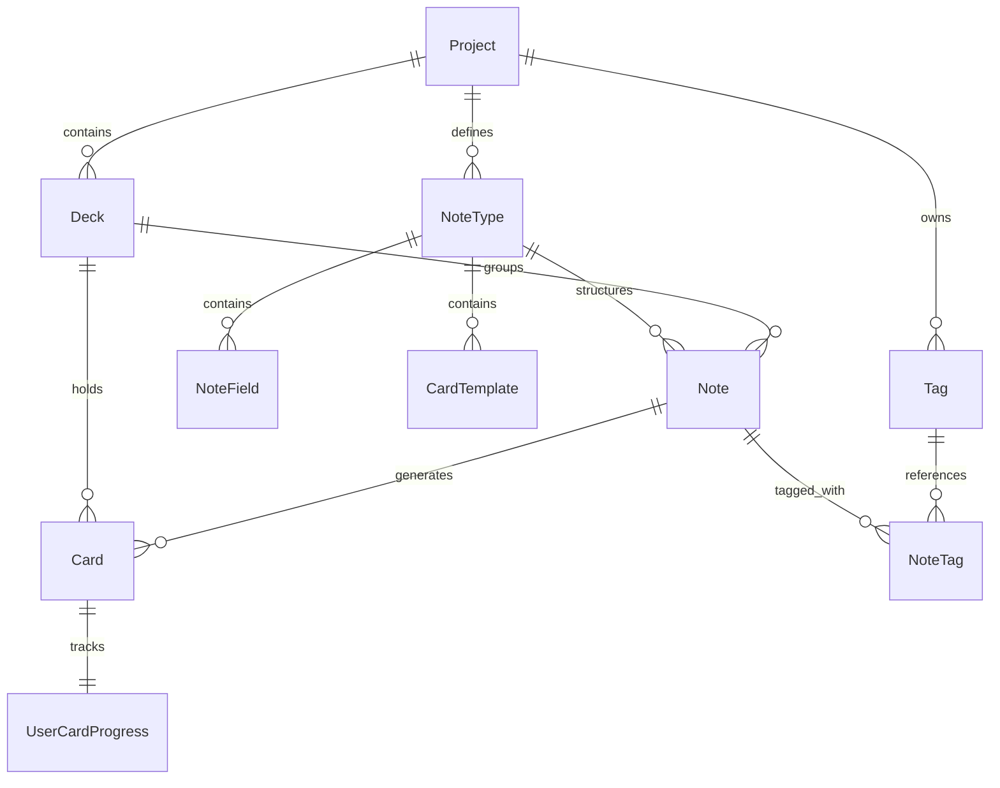

# Группа 1: Ядро Словаря (Vocabulary Core)

Данный раздел описывает структуру хранения базовых доменных сущностей для пользовательского словаря, колод, заметок и карточек, а также отслеживания их прогресса с использованием алгоритма FSRS.

---

## 1. Project

`Project` — базовая сущность, определяющая языковое пространство пользователя. Все колоды, заметки и карточки привязаны к конкретному проекту.

**Поля:**
- `Id` (Guid, PK)
- `UserId` (Guid) — идентификатор владельца проекта.
- `Name` (string) — название (например, "English").
- `TargetLanguage` (string) — изучаемый (целевой) язык (ISO код).
- `NativeLanguage` (string) — родной язык пользователя (ISO код).
- `IsActive` (bool) — флаг активного в данный момент проекта.

---

## 2. Deck

`Deck` — колода для группировки карточек. Поддерживает иерархическую структуру (вложенные колоды).

**Поля:**
- `Id` (Guid, PK)
- `ProjectId` (Guid, FK to Project)
- `ParentDeckId` (Guid?, FK to Deck) — ссылка на родительскую колоду (для построения дерева).
- `Title` (string) — название колоды.
- `Description` (string?) — описание колоды.

---

## 3. NoteType

`NoteType` — тип заметки в стиле Anki, определяющий схему полей и правила генерации карточек.

**Поля:**
- `Id` (Guid, PK)
- `ProjectId` (Guid, FK to Project)
- `Name` (string) — название типа (например, "Basic", "Cloze").
- `Version` (int) — версия схемы.
- `Css` (string?) — стили для отображения карточек этого типа.
- `CreatedAt` (DateTime)
- `UpdatedAt` (DateTime)

---

## 4. NoteField

`NoteField` — определение конкретного поля в рамках `NoteType` (например, "Word", "Translation").

**Поля:**
- `Id` (Guid, PK)
- `NoteTypeId` (Guid, FK to NoteType)
- `FieldKey` (string) — стабильный ключ для обращения в шаблонах (например, `{{Expression}}`).
- `Label` (string) — человекочитаемая метка поля.
- `FieldType` (string) — тип поля (`text`, `textarea`, `tags`, `image`, `audio`, `url`).
- `SortOrder` (int) — порядок сортировки при вводе.
- `Required` (bool) — обязательно ли заполнение.
- `Archived` (bool) — архивный статус поля.
- `ConfigJson` (string?) — произвольные настройки в формате JSON.
- `CreatedAt` (DateTime)
- `UpdatedAt` (DateTime)

---

## 5. CardTemplate

`CardTemplate` — шаблон генерации карточек из полей заметки. Определяет лицевую и оборотную стороны.

**Поля:**
- `Id` (Guid, PK)
- `NoteTypeId` (Guid, FK to NoteType)
- `TemplateKey` (string) — стабильный уникальный ключ шаблона.
- `Name` (string) — название шаблона (например, "Forward", "Reverse").
- `FrontTemplate` (string) — HTML-шаблон лицевой стороны (с плейсхолдерами вида `{{FieldKey}}`).
- `BackTemplate` (string) — HTML-шаблон обратной стороны.
- `TargetSkill` (string) — целевой навык для тренировки (по умолчанию "Reading").
- `SortOrder` (int) — порядок отображения/генерации.
- `Enabled` (bool) — включен ли данный шаблон.
- `CreatedAt` (DateTime)
- `UpdatedAt` (DateTime)

---

## 6. Note

`Note` — запись, содержащая фактические сырые данные полей. Из одной заметки на основе шаблонов генерируются карточки (`Card`).

**Поля:**
- `Id` (Guid, PK)
- `DeckId` (Guid, FK to Deck) — целевая колода по умолчанию.
- `CreatorId` (Guid) — создатель заметки.
- `NoteTypeId` (Guid, FK to NoteType) — используемая схема полей.
- `FieldValues` (JSONB / Dictionary) — словарь значений полей (ключ - `FieldKey`).
- `ProjectTermId` (Guid?, FK to ProjectTerm) — опциональная связь с ридером.
- `CreatedAt` (DateTime)
- `UpdatedAt` (DateTime)

---

## 7. Card

`Card` — конкретная интерактивная карточка для изучения. Ссылается на родительскую заметку (`Note`) и содержит поисковый индекс.

**Поля:**
- `Id` (Guid, PK)
- `DeckId` (Guid, FK to Deck) — колода, в которой лежит карточка.
- `CreatorId` (Guid)
- `NoteId` (Guid, FK to Note)
- `CardTemplateId` (Guid?, FK to CardTemplate) — шаблон, по которому сгенерирована карточка.
- `ProjectTermId` (Guid?, FK to ProjectTerm) — связь с изучаемой единицей из ридера.
- `ExternalId` (string?) — идентификатор при импорте.
- `SearchDocument` (string) — денормализованный текст для полнотекстового поиска.
- `SearchVector` (tsvector) — поисковый вектор PostgreSQL.
- `CreatedAt` (DateTime)
- `UpdatedAt` (DateTime)

---

## 8. UserCardProgress

`UserCardProgress` — параметры прогресса интервального повторения карточки по алгоритму FSRS. Связана с карточкой 1:1 в рамках проекта.

**Поля:**
- `Id` (Guid, PK)
- `UserId` (Guid)
- `CardId` (Guid, FK to Card)
- `ProjectId` (Guid, FK to Project)
- `State` (short) — FSRS состояние (`0=New`, `1=Learning`, `2=Review`, `3=Relearning`).
- `Step` (int) — шаг изучения (внутри сессии повторений).
- `Stability` (float) — стабильность памяти (прогноз удержания).
- `Difficulty` (float) — сложность карточки.
- `Due` (DateTime) — UTC-время следующего планового повторения.
- `ElapsedDays` (int) — интервал времени (в днях) с прошлого повторения.
- `ScheduledDays` (int) — интервал времени (в днях) до следующего повторения.
- `Reps` (int) — суммарное число повторений.
- `Lapses` (int) — количество ошибок (забываний).
- `IsSuspended` (bool) — временно отстранена ли карточка от повторений (отложена).
- `LastReview` (DateTime) — дата и время последнего ответа.

---

## 9. Tag

`Tag` — сущность для гибкого тегирования и категоризации заметок в рамках проекта.

**Поля:**
- `Id` (Guid, PK)
- `ProjectId` (Guid, FK to Project)
- `Name` (string) — название тега.
- `CreatedAt` (DateTime)

---

## 10. NoteTag

`NoteTag` — связующая таблица для реализации отношения многие-ко-многим между заметками и тегами.

**Поля:**
- `NoteId` (Guid, PK, FK to Note)
- `TagId` (Guid, PK, FK to Tag)

---

## Связи сущностей ядра

