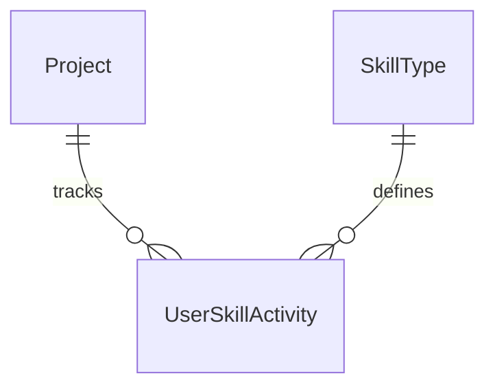

# Основные сущности: Отслеживание активности и навыков (Skill Tracking)

Раздел описывает сущности, предназначенные для ежедневного отслеживания активности пользователя по различным языковым навыкам (чтение, аудирование, письмо, говорение) и расчета прогресса выполнения ежедневных миссий (Daily Missions).

## 1. SkillType

`SkillType` — справочник типов языковых навыков, содержащий глобальные настройки порогов активности для выполнения миссий.

**Поля:**
- `Id` (int, PK) — инкрементный идентификатор.
- `Code` (string) — уникальный строковый код навыка (`"reading"`, `"listening"`, `"writing"`, `"speaking"`).
- `DisplayName` (string) — локализованное название навыка для отображения в интерфейсе (например, "Reading").
- `Unit` (string) — единица измерения активности (`"minutes"` — для пассивных навыков, `"exercises"` — для активных).
- `CompletionThreshold` (int) — дневной порог активности, при достижении которого миссия по данному навыку считается выполненной (например, 15 минут для чтения).

**Сид-данные по умолчанию:**
| Id | Code | DisplayName | Unit | CompletionThreshold |
|:---|:---|:---|:---|:---|
| 1 | `reading` | Reading | minutes | 15 |
| 2 | `listening` | Listening | minutes | 10 |
| 3 | `writing` | Writing | exercises | 1 |
| 4 | `speaking` | Speaking | exercises | 1 |

---

## 2. UserSkillActivity

`UserSkillActivity` — сущность, аккумулирующая ежедневную активность пользователя по конкретному навыку. Обновляется инкрементально в течение дня (через паттерн upsert).

**Поля:**
- `Id` (Guid, PK) — уникальный идентификатор записи.
- `UserId` (Guid) — идентификатор пользователя.
- `ProjectId` (Guid, FK to Project) — идентификатор текущего проекта изучения языка.
- `Date` (DateOnly) — UTC-дата активности (без времени).
- `SkillTypeId` (int, FK to SkillType) — ссылка на тип навыка.
- `Value` (int) — накопленное за день значение (минуты или количество выполненных упражнений).
- `CreatedAt` (DateTime) — дата создания записи.
- `UpdatedAt` (DateTime) — дата последнего обновления активности.

**Индексы и ограничения:**
- Уникальный составной индекс `(UserId, ProjectId, Date, SkillTypeId)`. Обеспечивает возможность безопасного атомарного сложения активности при повторных вызовах API в один и тот же день.

---

## Связь сущностей

