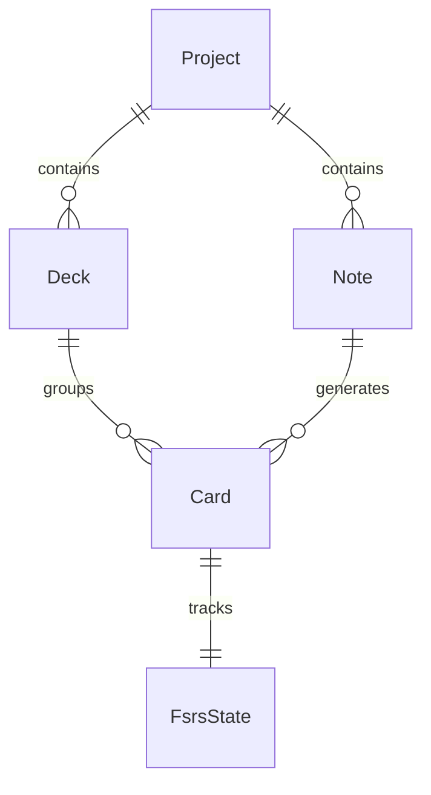

# Основные сущности: Ядро Словаря (Vocabulary Core)

Раздел описывает базовые доменные сущности для хранения словаря, колод и карточек, а также их связь с алгоритмом интервального повторения (FSRS).

## 1. Project

`Project` — базовая сущность, определяющая пространство для изучения целевого языка. Все колоды и карточки привязаны к конкретному проекту пользователя.

**Поля:**
- `Id` (Guid, PK)
- `UserId` (Guid) — владелец.
- `Name` (string) — название (например, "Английский").
- `TargetLanguage` (string) — целевой язык (iso код).
- `NativeLanguage` (string) — родной язык (iso код).
- `IsActive` (bool) — выбран ли проект в данный момент.

---

## 2. Deck

`Deck` — колода для группировки карточек. Поддерживает иерархию (вложенные колоды).

**Поля:**
- `Id` (Guid, PK)
- `ProjectId` (Guid, FK)
- `ParentDeckId` (Guid?, FK) — родительская колода.
- `Title` (string)
- `Description` (string?)

---

## 3. Note

`Note` — абстрактная запись, содержащая "сырые" данные (например, слово, перевод, пример), из которой генерируются конкретные карточки (Cards).

**Поля:**
- `Id` (Guid, PK)
- `ProjectId` (Guid, FK)
- `ModelName` (string) — тип модели (например, "Basic", "Reverse").
- `FieldValues` (Dictionary<string, string>) — значения полей (например, `{ "Word": "apple", "Translation": "яблоко" }`).

---

## 4. Card

`Card` — конкретная карточка для изучения, сгенерированная из `Note`. Привязывается к `Deck`. Карточка содержит состояние для интервального повторения.

**Поля:**
- `Id` (Guid, PK)
- `NoteId` (Guid, FK)
- `DeckId` (Guid, FK)
- `CardTemplateName` (string) — например, "Forward", "Reverse".
- `SrsStatus` (Enum: `New`, `Learning`, `Review`, `Relearning`) — текущий статус в системе интервального повторения.

### Отношение 1:1 с FsrsState
Каждая `Card` имеет связанную запись `FsrsState`, которая содержит данные алгоритма FSRS (Free Spaced Repetition Scheduler).

**Поля FsrsState:**
- `CardId` (Guid, PK, FK to Card)
- `Due` (DateTime) — когда карточку нужно повторить.
- `Stability` (float) — устойчивость памяти.
- `Difficulty` (float) — сложность карточки.
- `ElapsedDays` (int) — дней с прошлого повторения.
- `ScheduledDays` (int) — дней до следующего повторения.
- `Repetitions` (int) — количество повторений.
- `Lapses` (int) — количество забываний (провалов).
- `State` (int) — внутреннее состояние FSRS (0=New, 1=Learning, 2=Review, 3=Relearning).
- `LastReview` (DateTime?) — время последнего ответа.

---

## Связь сущностей

