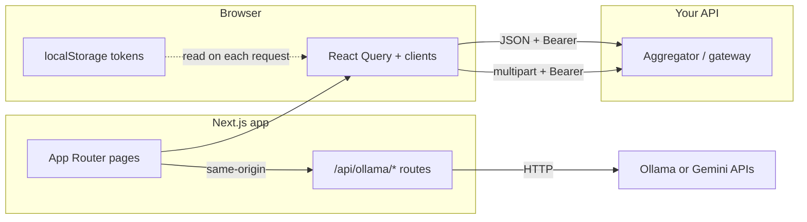

# Polyraspad frontend — guide for backend developers

This document describes how the **polyraspad-frontend** app (Next.js) talks to your HTTP API, what it expects from responses, and which parts are **not** the .NET backend. Use it when changing contracts, CORS, auth, or error shapes.

**Canonical REST contract** for routes and payloads remains in `Docs/Описание REST API.md` (and related specs). This file is the **integration view** from the browser app.

---

## Repository and stack

| Item | Detail |
|------|--------|
| Location | Git submodule `polyraspad-frontend/` at monorepo root |
| UI framework | Next.js **16** (App Router), React **19**, TypeScript |
| Styling | Tailwind CSS |
| Server state | TanStack React Query (`@tanstack/react-query`) — caching, refetch, mutations |
| Build | `output: "standalone"` in `next.config.ts` (container-friendly production build) |

The frontend is a **separate origin** from the API in typical setups (e.g. `http://localhost:3000` vs `http://localhost:5000`). All vocabulary/product calls are made **from the browser** with `fetch`, unless noted otherwise.

---

## Traffic flow



- **Business API**: browser → `NEXT_PUBLIC_API_URL` + path (see below).
- **Editor AI**: browser → Next.js **Route Handlers** under `src/app/api/ollama/` (and Gemini via server env). These calls **do not** go to the .NET stack by default.

---

## Environment variables

### Required for API integration (browser)

| Variable | Role |
|----------|------|
| `NEXT_PUBLIC_API_URL` | Base URL for the REST API (no trailing slash required in code; paths are appended as `/api/...`). Default in code: `http://localhost:5000`. |

`NEXT_PUBLIC_*` is embedded at **build time** and visible in the client bundle.

### Editor AI only (server-side Next)

| Variable | Role |
|----------|------|
| `EDITOR_AI_PROVIDER` | `ollama` \| `gemini`; if unset, Gemini is used when `GEMINI_API_KEY` is set, else Ollama. |
| `OLLAMA_BASE_URL` | Ollama HTTP base (default `http://127.0.0.1:11434`). |
| `OLLAMA_MODEL` | Default model name for generate. |
| `GEMINI_API_KEY` / `GEMINI_MODEL` | Optional Google Gemini path for editor assistance. |

Backend developers can ignore these unless you replace editor AI with a first-party API later.

---

## HTTP client architecture

- **Base class**: `src/lib/api/base-api-client.ts` — `fetch`, headers, 401 handling, JSON parse, error normalization.
- **Feature clients**: `src/lib/api/*-client.ts` (auth, projects, decks, cards, study, marketplace, etc.), re-exported from `src/lib/api/index.ts`.
- **Endpoints**: single source of path strings in `src/lib/constants.ts` → `API_ENDPOINTS` (use this when searching the frontend for a route).

### Authentication

- **Storage**: `accessToken` and `refreshToken` in **`localStorage`** (not HttpOnly cookies for API calls).
- **Header**: `Authorization: Bearer <accessToken>` on API requests (JSON and multipart upload).
- **401**: client clears both tokens and redirects to `/auth`.

Implications for backend:

- CORS must allow the frontend origin and **`Authorization`** (and usual headers) if the API is cross-origin.
- Short-lived access tokens + refresh flow should match what `AuthClient` implements (`/api/Auth/refresh-token`, logout with refresh token, etc. — see `API_ENDPOINTS.AUTH` in `constants.ts`).

### Successful responses

- JSON bodies are parsed with `response.json()` (after a text read in `BaseApiClient` for the main `request()` path).
- **204 No Content** / empty body: treated as success; some study helpers return `null` on 204 (session finished).

### Error responses (important)

The UI centralizes parsing in `BaseApiClient`. Backend should prefer consistent shapes, but the client **tries** to adapt:

| Shape | Handling |
|-------|----------|
| `{ "detail": "..." }` | ProblemDetails-style; used as message. |
| `{ "error": "..." }` | Mapped to `detail` (Aggregator-style). |
| `{ "Errors": [{ "ErrorMessage": "..." }] }` | First error message → `detail` (authorization-module style). |
| `{ "errors": { "Field": ["msg"] } }` | First field error → `detail`. |
| `{ "title": "..." }` without `detail` | `title` used as message. |
| Non-JSON body | Text or status line used as message. |

Some Aggregator exception strings are post-processed into **Russian** user-facing messages in the client (login failures). Prefer stable, structured error codes or `detail` from the API to avoid relying on substring matching.

### Multipart (media)

- **Endpoint**: `POST /api/Media/upload-image` (see `API_ENDPOINTS.MEDIA`).
- **Client**: `src/lib/api/media-client.ts` — does **not** set `Content-Type` (browser sets `multipart/form-data` + boundary).
- **Auth**: same Bearer token as JSON calls.

---

## API surface used by the frontend (path reference)

Paths below are exactly as in `src/lib/constants.ts` (`API_ENDPOINTS`). They are relative to `NEXT_PUBLIC_API_URL`.

**Auth** — `/api/Auth/login`, `register`, `me`, `refresh-token`, `logout`, `username`, `password`, `confirm-email`.

**Projects** — `/api/Projects`, `/api/Projects/{id}`.

**Decks** — `/api/Decks/tree/{projectId}`, `/api/Decks`, `/api/Decks/{id}`.

**Cards** — `/api/Cards`, `capture`, `search`, `/{id}`, `import` (bulk).

**Media** — `/api/Media/upload-image`.

**User settings** — `/api/settings`.

**Analytics** — `/api/analytics/vocabulary?projectId=…`, `heatmap`, `daily` (query params as built in code).

**Text** — `/api/text/analyze`.

**Study** — `/api/study/session`, `/api/study/session/{sessionId}/next`, `review`, `undo`.

**Marketplace** — `/api/marketplace/products`, `…/products/{id}`, `preview`, `reviews`.

**Subscriptions** — `/api/subscriptions`, `/api/subscriptions/{deckId}`.

**Automation** — `/api/automation/autopilot`, `recommendations`, `notifications/preferences`, `jobs`, `jobs/{id}`, `retry`, `resume`, `mining/suggest`, `mining/approve`, `copilot/review-feedback`, `experiments/assignment`, `experiments/events`.

If you add or rename a route, update **`API_ENDPOINTS`** and the corresponding `*-client.ts` / React Query hooks, or the UI will keep calling the old path.

---

## Types and domain naming

Shared TypeScript DTO shapes used by the UI live mainly in `src/lib/api/types.ts`. When the API contract changes, frontend types and any mapping in clients should be updated to avoid silent drift.

---

## Routing vs. backend

- **App routes** (dashboard, library, study, marketplace, etc.) are internal to Next.js; they do not require backend routes except for data loaded via the API clients.
- **`src/proxy.ts`**: middleware-style helper; **not** the same as Next.js `middleware.ts`. Do not assume server-side auth gating for API traffic based on this file alone — **authorization for API calls is Bearer tokens from the client.**

---

## Quick checklist when you change the API

1. Update OpenAPI / `Docs/Описание REST API.md` (or your source of truth).
2. Ensure **CORS** and **401** behavior still match SPA expectations.
3. Prefer **JSON errors** with `detail` (or ProblemDetails) so `BaseApiClient` does not depend on fragile string parsing.
4. Align **204 / 202** semantics with study and other flows that expect empty bodies.
5. Search the frontend for the old path in `constants.ts` and `src/lib/api/`.

---

## Local run (reference)

From `polyraspad-frontend/`:

```bash
npm install
npm run dev
```

App default: `http://localhost:3000`. Point `NEXT_PUBLIC_API_URL` at your running gateway/API (e.g. `http://localhost:5000`).
