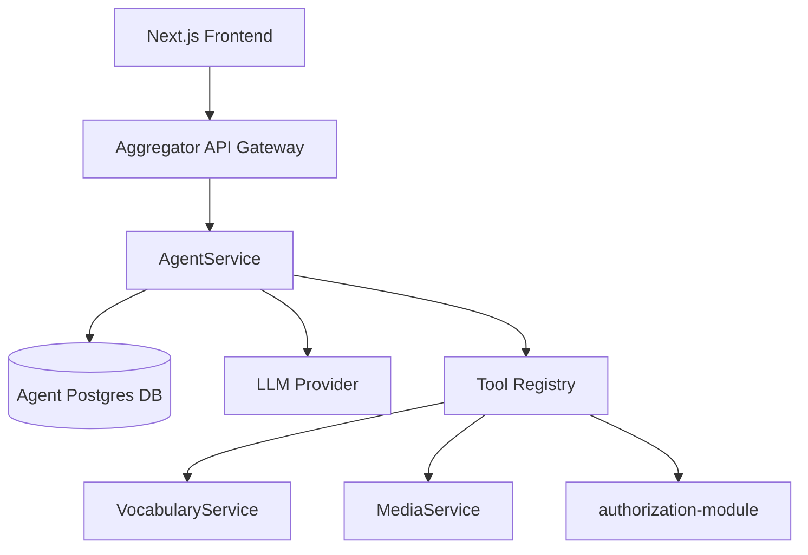

# AgentService Boundary

Decision date: 2026-05-24

## When to create AgentService

Do **not** create a separate microservice until agent behavior becomes orchestration, not just chat UI.

Create `AgentService` when at least two of these are true:

- multi-step workflows (import → analyze → suggest terms → card drafts);
- async/resumable runs with background workers;
- cross-device persistent threads are required in production;
- tool execution needs centralized audit logs;
- agent memory/preferences must survive beyond one thread;
- evaluation/observability becomes a product requirement.

Until then, keep agent persistence and routing behind Aggregator endpoints.

## Service ownership

### AgentService owns

- chat threads and message history;
- agent runs and statuses;
- tool call audit log;
- domain decisions (`allowed` / `out_of_scope`);
- artifacts (editor drafts, import drafts, study plans);
- orchestration loop (intent → tools → response);
- LLM provider abstraction for agent-specific prompts;
- optional agent memory and preferences.

### AgentService does NOT own

- vocabulary terms/statuses → `VocabularyService`;
- cards/decks/study SRS → `VocabularyService`;
- files/PDF/audio → `MediaService`;
- auth/users → `authorization-module`;
- analytics aggregates → existing analytics in `VocabularyService` (AgentService may read via API).

## Recommended architecture

## API boundary

Public contract through Aggregator:

- `/api/agent/threads`
- `/api/agent/threads/{id}/messages`
- `/api/agent/threads/{id}/runs`
- `/api/agent/threads/{id}/artifacts`

Internal gRPC between Aggregator and AgentService is acceptable once the surface stabilizes.

## Domain guardrails (must stay in AgentService)

PolyGuide is **language-learning only**:

- allowed: vocabulary, grammar, translation, reading, cards, study, progress, navigation;
- allowed with material override: use code/text/errors as learning input;
- refused: code generation, general programming, homework, business/legal/medical, generic chat.

Every run should persist an `AgentDomainDecision` so refusals are auditable.

## Term-first vocabulary rules

Agent tools must respect Polyraspad's term-first model:

- exact surface forms and phrases are learning units;
- different forms (`sleep` vs `slept`) are different terms;
- no lemma labels as status or duplicate identity;
- mutations require preview/confirmation.

## Rollout order

1. Frontend domain gate (shipped in MVP boundary work).
2. Aggregator thread/message persistence.
3. Server-side runs + tool call logging.
4. Extract `AgentService` when orchestration complexity justifies its own deployable unit.

## Related docs

- [`agent-persistence-model.md`](./agent-persistence-model.md)
- [`agent-home-dashboard-followup.md`](./agent-home-dashboard-followup.md)
